\newpage

\tableofcontents

\newpage

# OpenMediaVault

Una vez descarga de la imágen de instalación desde la página Web del Proyecto, seguiremos los pasos siguientes para su instalación:

[Página OpenMediaVault](https://www.openmediavault.org/)

## Página del Proyecto y Descripción

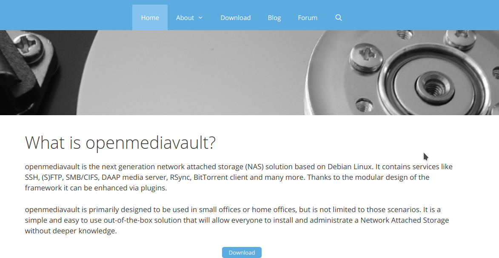
\

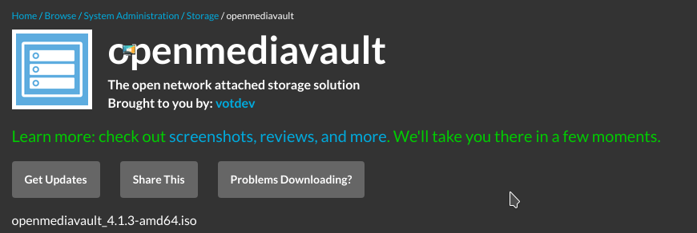
\

## Característas VM

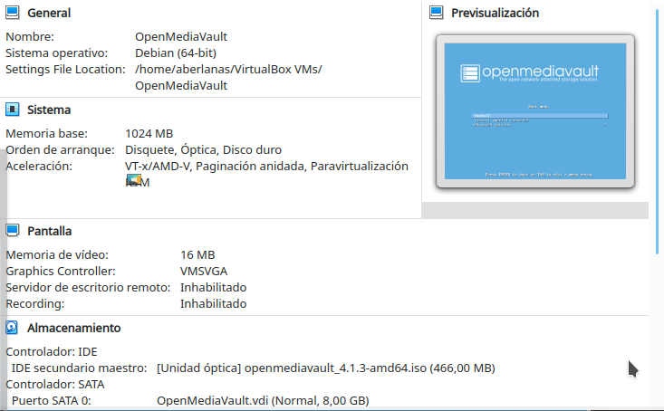
\

## Arranque

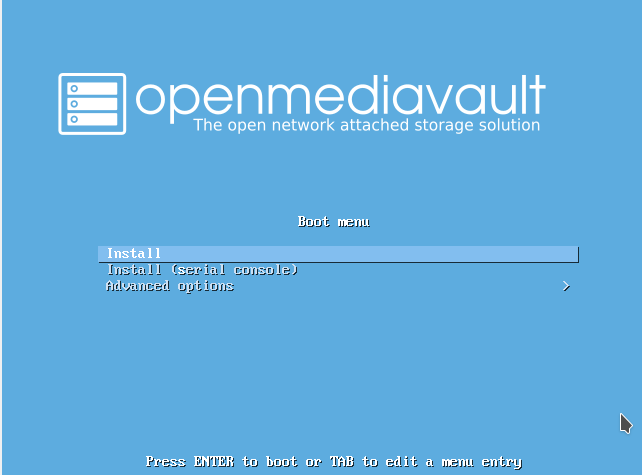
\

## Instalación: Selección de Idioma

\

## Instalación: Nombre de la máquina

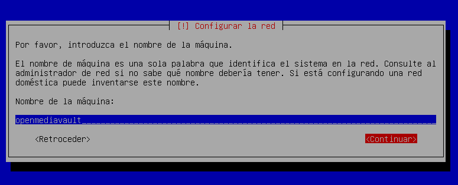
\

## Instalación: Dominio 

Por ahora poner este dominio, lo utilizaremos en unidades posteriores.

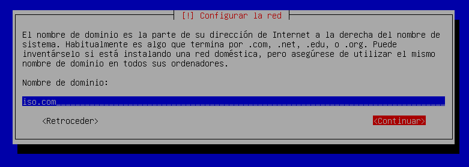
\

## Instalación: Creación del administrador

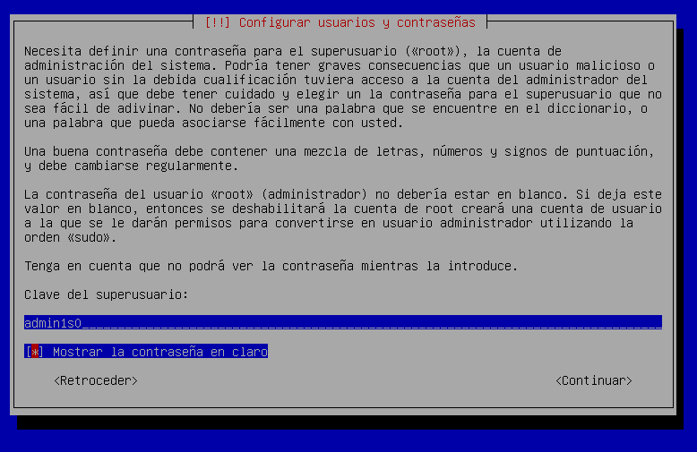
\

## Instalación: Configurar fecha y hora

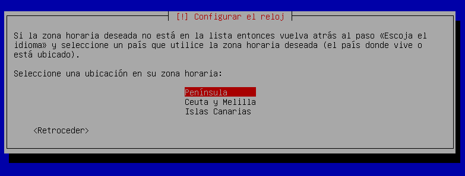
\

## Instalación: Proceso de instalación

\

## Instalación: Selección del repositorio

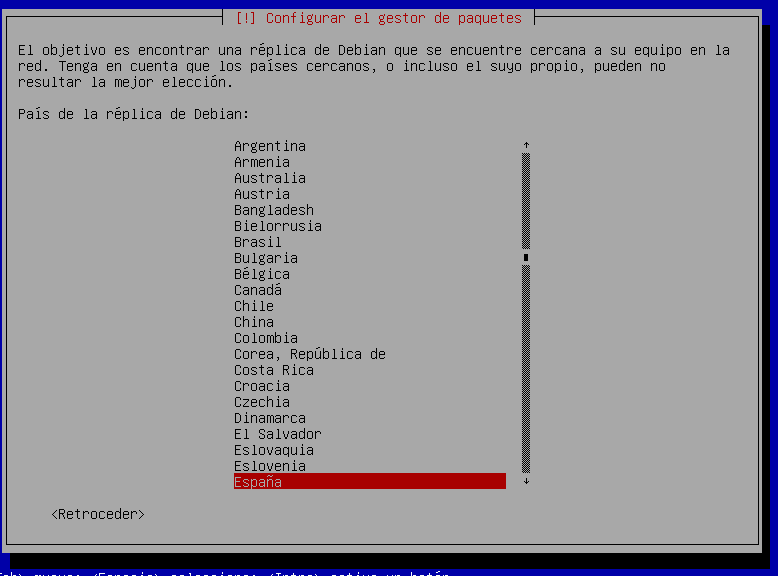
\

## Instalación: Instalación de GRUB

\

## Instalación: Configuración de la red

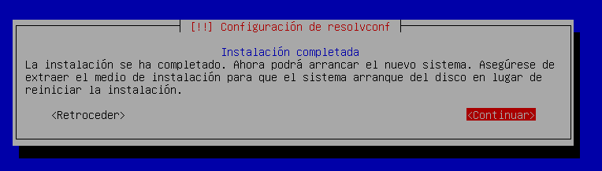
\

## Ventana de arranque

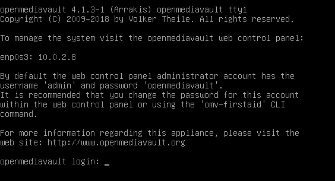
\

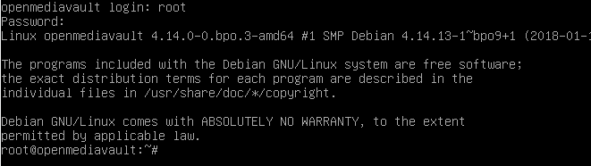
\

