\newpage

\tableofcontents

\newpage

# Instalación de Windows 2016
	
Vamos a ver todo el proceso de instalación de Windows 2016, así como el primer arranque y puesta en marcha del sistema.

# Requisitos de Instalación
	
En la página web de microsoft nos indican algunas consideraciones que debemos tener en cuenta a la hora tanto de instalar como de actualizar desde versiones anteriores de Windows.

[Requisitos de Windows 2016 Server](https://docs.microsoft.com/en-us/windows-server/get-started/system-requirements)

Crearemos una máquina virtual que se ajuste a estos requisitos.

# Creación de la máquina Virtual

Crearemos ahora la máquina virtual de Windows en la que luego instalaremos utilizando la imágen que ya hemos descagado.

## Nombre de la máquina virtual

\ 

Seleccionaremos el tipo como Windows 2016 (64 bit).

## Memoria RAM

Asignaremos la memoria RAM recomendada en los requisitos (2048).

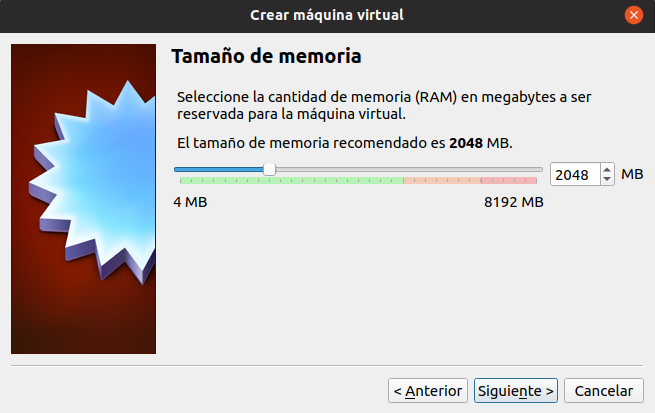
\ 

## Disco Duro

En el siguiente paso crearemos el disco duro que utilizaremos para instalar Windows 2016.

No utilizaremos uno anterior.

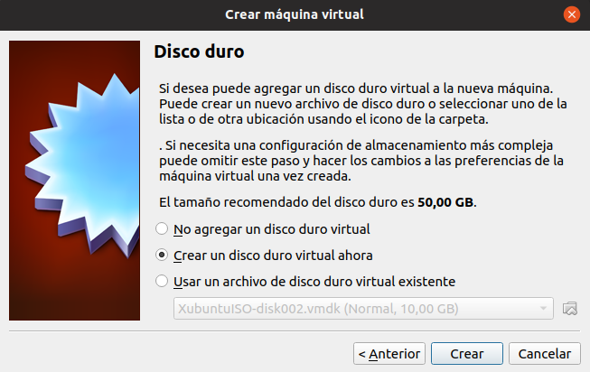
\ 

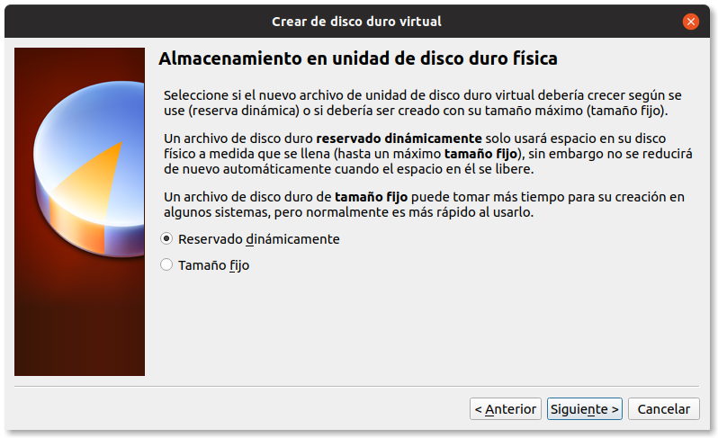
\ 

\ 

## Red 

Pondremos la red en NAT por ahora, ya que no vamos a conectar esta máquina a ninguna otra, tan solo queremos realizar tareas de configuración básicas.

\ 

## Imágen ISO de Instalación

En el apartado de almacenamiento estableceremos que la imágen que nos hemos descargado de Windows 2016 es la que vamos a utilizar para arrancar la máquina.

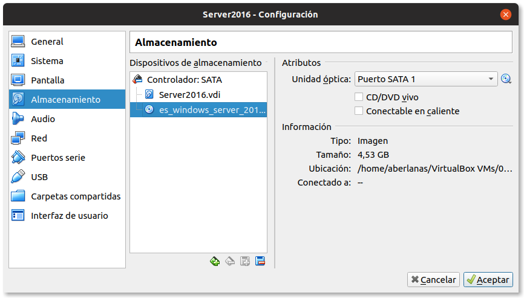
\ 

Con estos pasos ya tendremos preparada la MV para que instalemos Windows 2016.

# Instalación de Windows 2016

Arrancaremos la máquina virtual, y comenzará el proceso de instalación. Cabe destacar que al igual que nos ocurrió con Windows 10 y Xubuntu, VirtualBox directamente sabe que no hay nada en el Disco Duro que tiene **conectada** la MV y nos lanza el proceso de instalación. Si esto lo hicieramos en una máquina Física, o cuando volvamos a arrancar una MV del VirtualBox que tiene discos duros instalados, aparece un mensaje que nos indica que debemos pulsar una tecla si queremos continuar el proceso de arranque desde el CD/DVD.

## Selección de idioma

Debemos seleccionar el idioma en el que se va a instalar Windows.

\ 

## Instalación

En la siguiente seleccionaremos la opción de Instalar Ahora, pero si estuvieramos realizando tareas de rescate de Windows (arrancando con un DVD un ordenador que ya tuviera Windows Instalado), deberemos pulsar el botón que aparece en la parte inferior izquierda que nos permitirá *Reparar el equipo*.

## Activación de Windows

El siguiente paso es la activación de Windows, si tenemos una clave del Sistemas Operativo este es el momento de ponerla, en caso de que no la tengamos podemos seleccionar **No tengo clave de producto**. En caso de que pongamos una clave incorrecta, o que ya tengamos registrada en Microsoft, luego desde el panel de configuración del sistema podremos cambiarla o agregar una nueva.

\ 

## Contrato de licencia de Usuario Final

Esto es el CLUF (*Contrato de Licencia de Usuario Final*) o en inglés *EULA* (*End User License Agreement*). Debemos leerlo al menos alguna vez...

## Particionado de discos

A continuación se nos muestran los discos y particiones que tenemos disponibles para la instalación de Windows. En este caso, al tener un disco totalmente vacio, basta con que seleccionemos el disco y pulsemos siguiente.

En esta ventana, si estamos haciendo una instalación dual debemos tener en cuenta que particiones están en uso, que tamñano tiene, etc.

Esto lo veremos más adelante en el módulo. 

\ 

## Progreso de la instalación

A continuación nos aparecerá una ventana que nos va indicando los distintos pasos que debe realizar el proceso de instalación para completarse. 

Esta ventana es totalmente *desatendida*, y podemos ir haciendo otras cosas.

\ 

A continuación el sistema se reiniciará.

## Primer arranque

Durante la instalación Windows se han copiado los ficheros desde el DVD/ISO al disco duro de nuestro equipo, sin embargo hay que configurar una serie de servicios y el usuario que será el administrador local del equipo. 

El proceso de configuración difiere del de los Sistemas Operativos que estamos más habituados, ya que se trata de un servidor. 

El nombre del usuario administrador en el caso de un Servidor Windows no puede ser decidido por el que lo instala, sino que viene predeterminado de *fábrica*. 

> Administrador

Podemos decidir la contraseña. En este caso, ya que la que habiamos preparado antes no sirve por motivos de falta de seguridad en la contraseña se propone la siguiente:

> #admin1s0#

\ 

Una vez establecido el usuario, al iniciar sesión se nos muestra el *Escritorio* como en Windows 10.

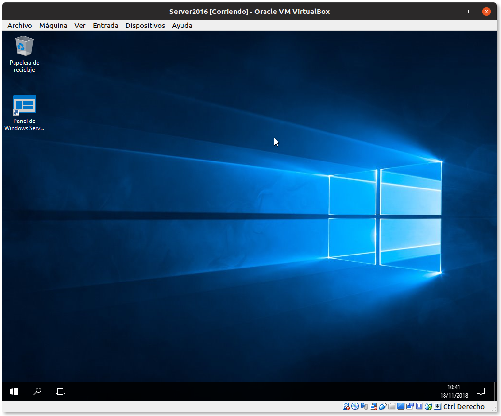
\ 

Pero el asistente de configuración de servidor en seguida se ejecuta y nos muestra la siguiente ventana.

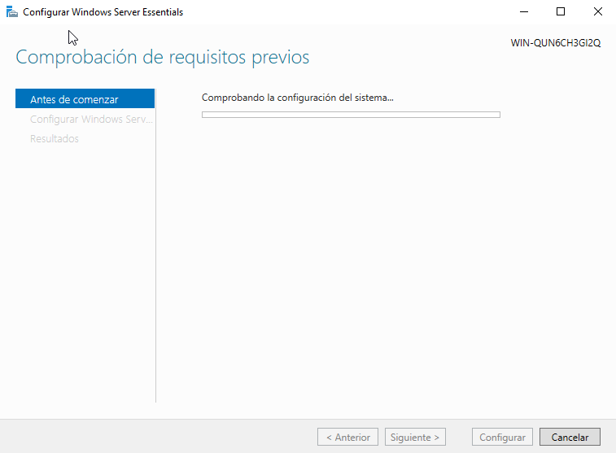

## Configuración básica de Windows Server Essentials

En este asistente se creará la configuración básica para un pequeño servidor que utilizaremos más adelante para unir máquinas al dominio, pero vamos a realizar ahora el proceso, y nos dejaremos esta máquina configurada y lista para cuando la necesitemos.

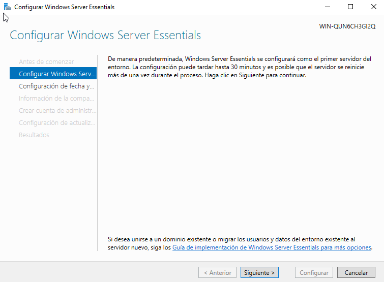
\ 

Configuraremos la hora del equipo, esto es más importante de lo que parece, ya que cuando estemos utilizando *kerberos*, una desincronización de la hora nos impedirá acceder a las máquinas.

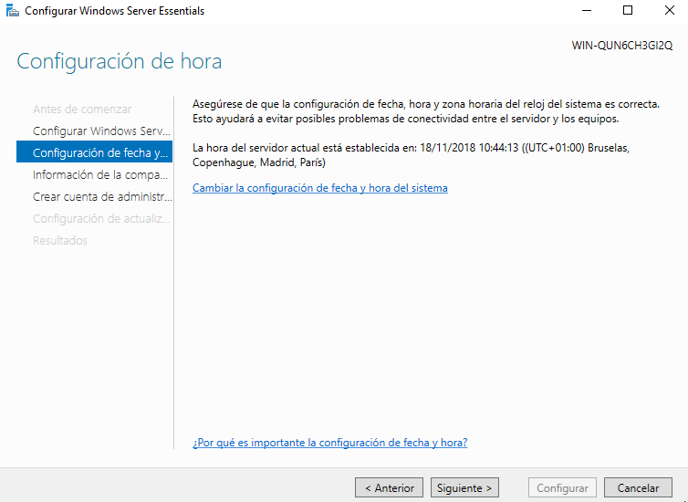
\ 

### Configuración de la compañia

Vamos a establecer en esta pantalla la configuración del dominio (grupo de ordenadores) que trabajarán compartiendo recursos.

No hemos sido muy originales en el ejemplo.

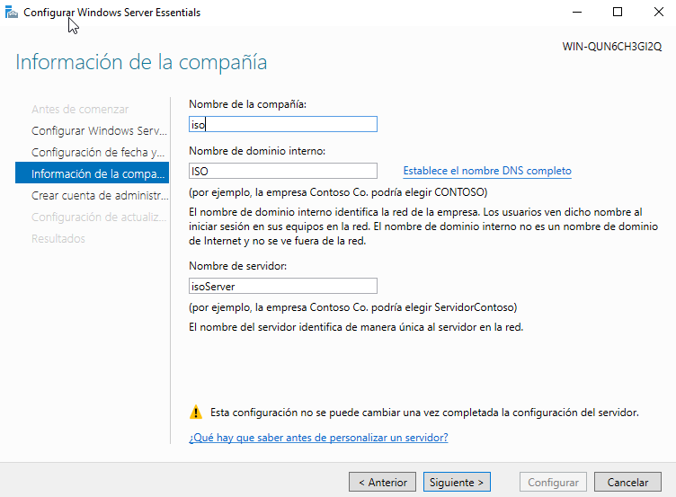
\ 

### Configuración del Administrador de la red

Hay que configurar un usuario que será el administrador de todo el dominio, de todas las máquinas que configuremos en la red.

Para diferenciarlo del Administrador *local* lo llamaremos: 

> netadminiso

Y usaremos la contraseña

> #netadmin1s0#

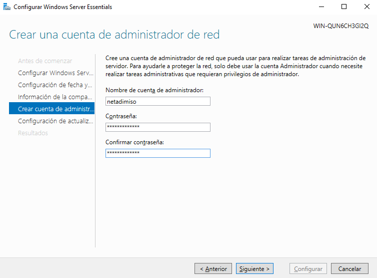
\

### Configuración Recomendada

En la siguiente pantalla nos pedirá que configuremos lo básico de las actualizaciones, en nuestro caso marcaremos: *Usar la configuración recomendada*.

\ 

### Proceso de configuración

A continuación el sistema se configurará, este proceso puede ser lento y tardar bastantes minutos.

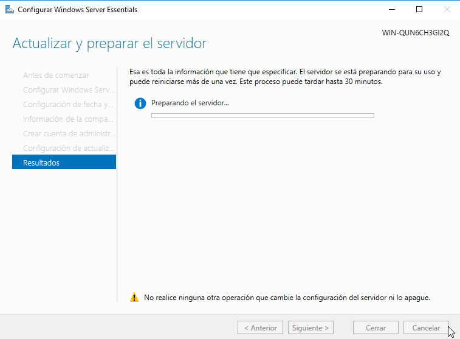
\ 

Una vez finalizado, es conveniente reiniciar el servidor. 

Al ser un sistema operativo preparado para servidores, no se nos permite apagarlo o reiniciarlo sin establecer un motivo, debemos indicarle cual es en cada reinicio. En este caso se puede marcar : Otros (*no planeado*).

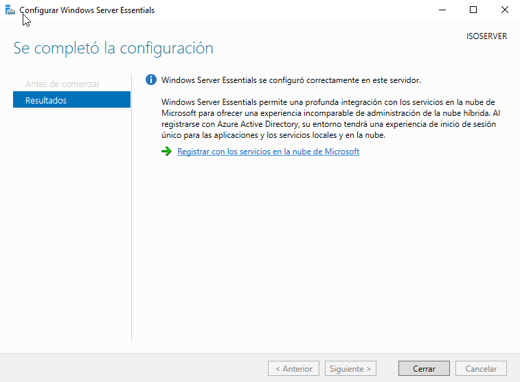
\ 

### Ultimos pasos

Si al reiniciar e intentar navegar (si, utilizando *Internet explorer*), no nos permite navegar, es debido a que al crear el dominio, hemos inicializado el servidor DNS a nosotros mismos. Y debemos añadir un servidor de nombres que sí sepa resolver las peticiones DNS que generemos.

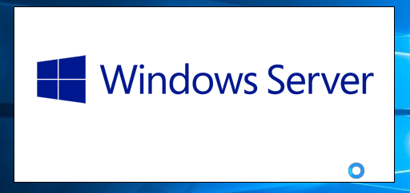
\ 

Para ello, entraremos en las herramientas de Administración y en el **Panel** haremos clic en *Configurar este servidor local*.

\ 

Se nos mostrarán los detalles del servidor, esto lo veremos más adelante con mucho más detalle, pero ahora en la pestaña **Tareas**, seleccionaremos la Opcion *Administrador de DNS*  y en el apartado **Reenviadores**, añadiremos la un servidor DNS:

> 1.1.1.1

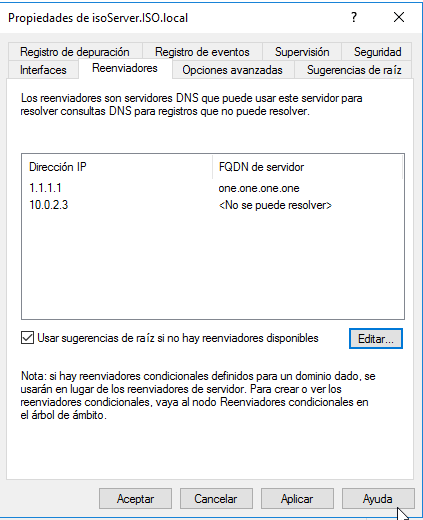
\ 

Ahora si que podremos *resolver* nombres de fuera de nuestro dominio.

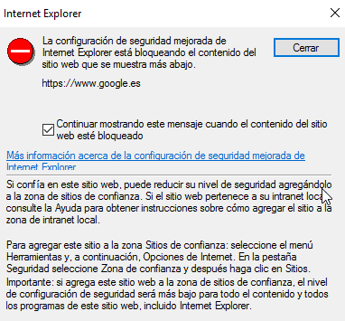
\ 

