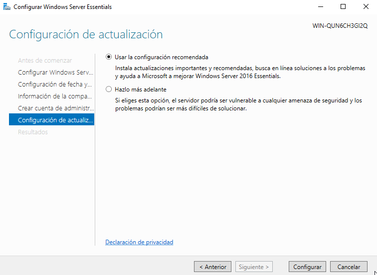
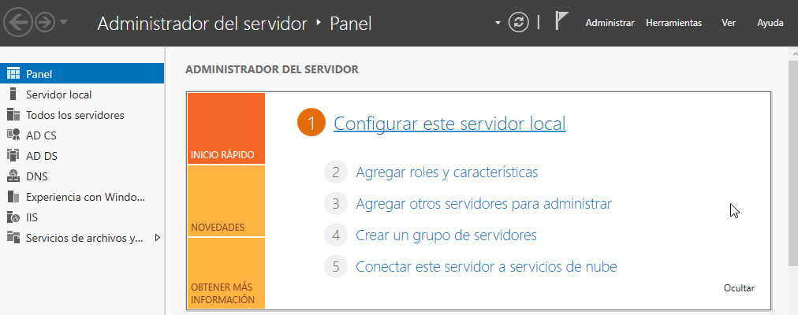

# Configuración básica de Windows Server Essentials

En este asistente se creará la configuración básica para un pequeño servidor que utilizaremos más adelante para unir máquinas al dominio, pero vamos a realizar ahora el proceso, y nos dejaremos esta máquina configurada y lista para cuando la necesitemos.

\ 

Configuraremos la hora del equipo, esto es más importante de lo que parece, ya que cuando estemos utilizando *kerberos*, una desincronización de la hora nos impedirá acceder a las máquinas.

\ 

# Configuración de la compañia

Vamos a establecer en esta pantalla la configuración del dominio (grupo de ordenadores) que trabajarán compartiendo recursos.

No hemos sido muy originales en el ejemplo.

\ 

# Configuración del Administrador de la red

Hay que configurar un usuario que será el administrador de todo el dominio, de todas las máquinas que configuremos en la red.

Para diferenciarlo del Administrador *local* lo llamaremos: 

> netadminiso

Y usaremos la contraseña

> #netadmin1s0#

\

# Configuración Recomendada

En la siguiente pantalla nos pedirá que configuremos lo básico de las actualizaciones, en nuestro caso marcaremos: *Usar la configuración recomendada*.

\ 

# Proceso de configuración

A continuación el sistema se configurará, este proceso puede ser lento y tardar bastantes minutos.

\ 

Una vez finalizado, es conveniente reiniciar el servidor. 

Al ser un sistema operativo preparado para servidores, no se nos permite apagarlo o reiniciarlo sin establecer un motivo, debemos indicarle cual es en cada reinicio. En este caso se puede marcar : Otros (*no planeado*).

\ 

# Ultimos pasos

Si al reiniciar e intentar navegar (si, utilizando *Internet explorer*), no nos permite navegar, es debido a que al crear el dominio, hemos inicializado el servidor DNS a nosotros mismos. Y debemos añadir un servidor de nombres que sí sepa resolver las peticiones DNS que generemos.

\ 

Para ello, entraremos en las herramientas de Administración y en el **Panel** haremos clic en *Configurar este servidor local*.

\ 

Se nos mostrarán los detalles del servidor, esto lo veremos más adelante con mucho más detalle, pero ahora en la pestaña **Tareas**, seleccionaremos la Opcion *Administrador de DNS*  y en el apartado **Reenviadores**, añadiremos la un servidor DNS:

> 1.1.1.1

\ 

Ahora si que podremos *resolver* nombres de fuera de nuestro dominio.

\ 