\newpage

\tableofcontents

\newpage

# VirtualBox

Para la realización de esta guia hemos utilizado el VirtualBox 5.2 descargado desde la página oficial del proyecto.

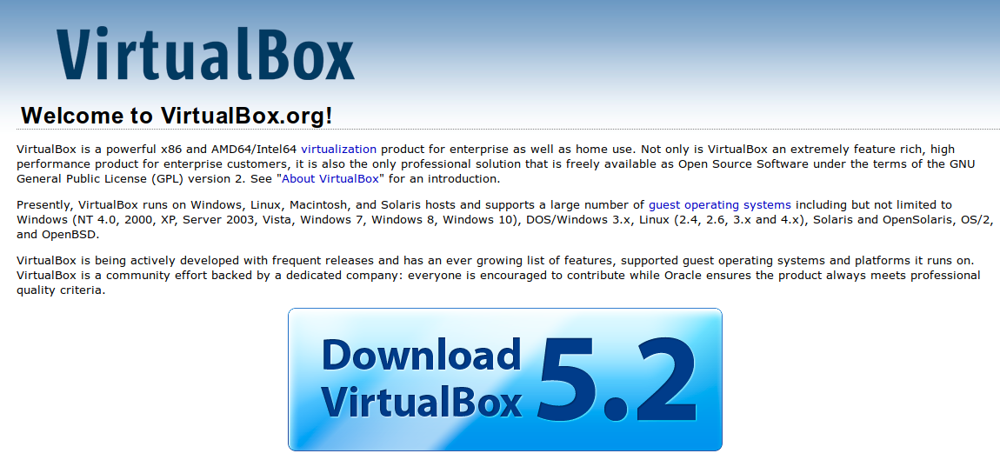

En el menú inicial

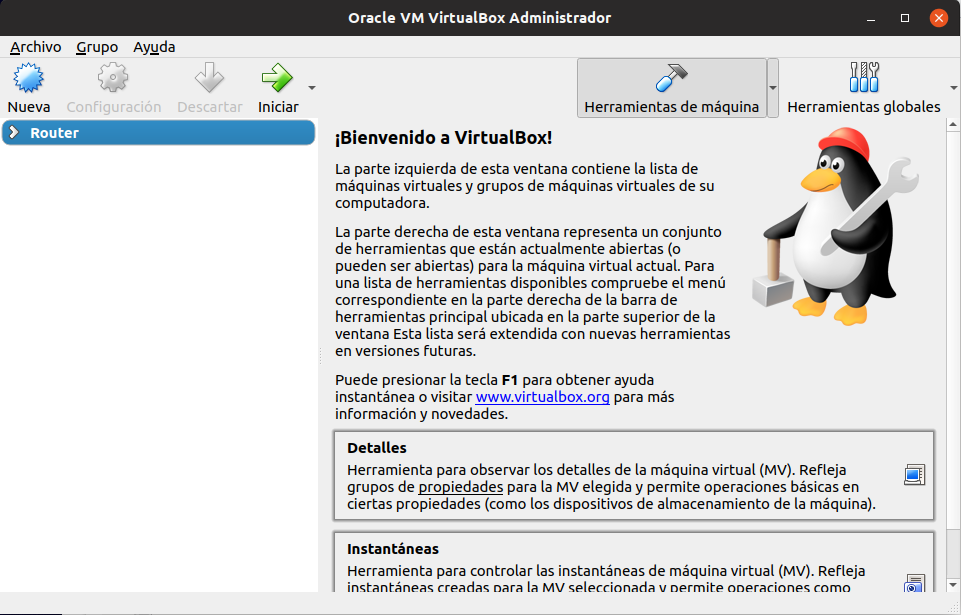

# Obtener Xubuntu

Xubuntu es una distribución GNU/LinuX basada en Ubuntu, así que podemos encontrar fácilmente su imagen de instalación (*.ISO*) de manera gratuita desde la página web del [proyecto Xubuntu](https://xubuntu.org/).

Hemos elegido este *sabor* de Ubuntu porque ofrece un entorno sencillo y de alto rendimiento, que no se ve afectado por los requisitos de gráficos de sistemas más visualmente impactantes.

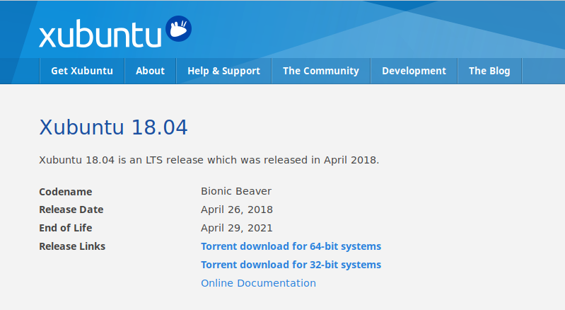

\newpage

## Que archivo de instalación elegir

Durante este curso trabajaremos con la última versión **LTS** publicada hasta ahora: 18.04 (*Bionic Beaver*).

Como vamos a instalarla en un VirtualBox instalado en una máquina de 64 bits, que además tiene las extensiones de Virtualización activadas en la BIOS, podremos instalar la versión de 64bits.

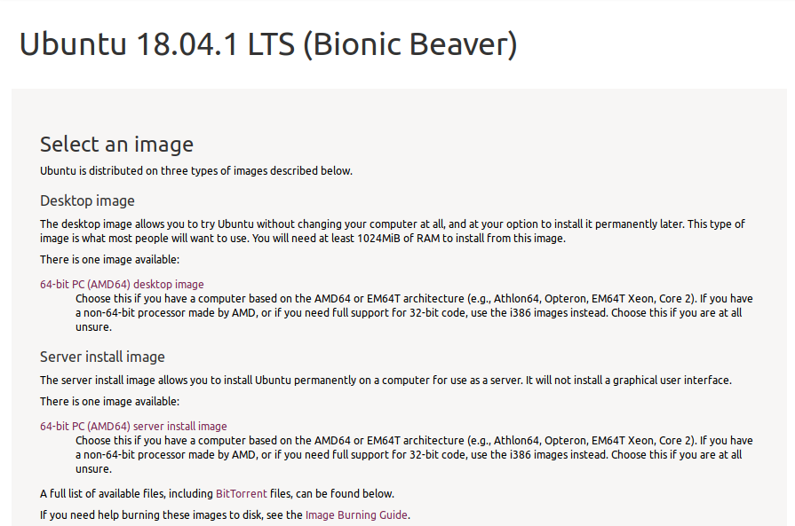

\newpage

En la parte inferior de la página de descargas aparecen algunos enlaces adicionales, tales como el enlace para descargar con *bittorrent*, etc. Por ahora descargaremos el archivo **.iso**

Esperaremos a que se descargue. Dependiendo de la conexión y de la imágen elegida esto tardará más o menos tiempo.

En caso de que os encontreis en el aula, recordar que teneis disponible todas las imágenes de instalación en : *http://172.29.0.254/*

\newpage

# Creación de la Máquina Virtual

Lo primero que necesitamos es establecer el Nombre que le daremos al equipo y cual será la familia de los Sistemas Operativos del que vamos a instalar.

*NOTA: Si en este desplegable tan solo nos aparecen opciones de 32bits y estamos trabajando sobre una máquina con 64bits, lo más probable es que tengamos las extensiones de virtualización deshabilitadas en la BIOS/EFI*

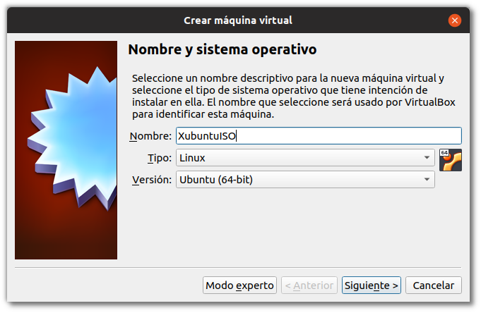

Establecemos la RAM máxima que podrá utilizar de la máquina hypervisora nuestro sistemas virtualizado. Tened en cuenta que si lanzamos varias máquinas virtuales a la vez el rendimiento baja drásticamente.

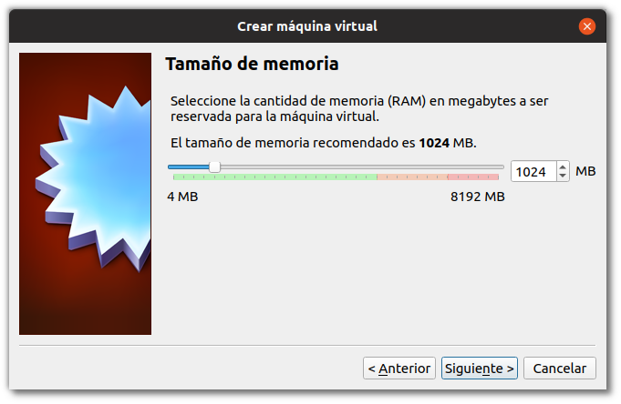

El siguiente paso es configurar el espacio de almacenamiento (*disco duro*) de la máquina virtual.

VirtualBox nos permite:

* No configurar ahora el almacenamiento
* Crear un nuevo disco (Recomendado en esta ocasión)
* Utilizar uno que ya teníamos.

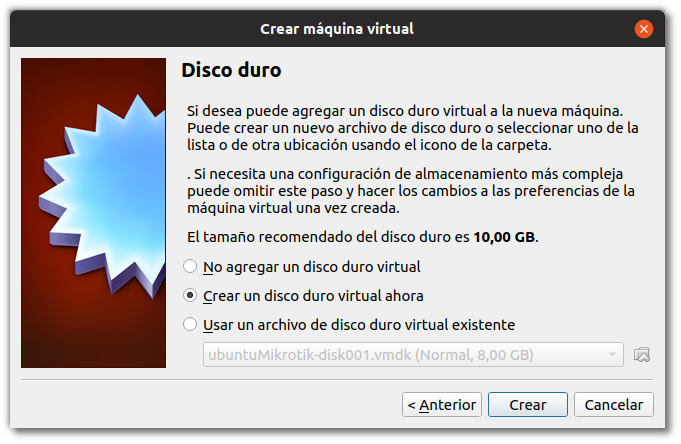

\newpage

## Creación de un disco duro para máquinas virtuales

Este disco duro se trata de un fichero grande, que nuestro hypervisor irá rellenando con los datos del sistema operativo virtualizado. Existen multitud de formatos de fichero, por ahora seleccionaremos el formato del VirtualBox y marcaremos que sea creado de manera dinámica.

\newpage

## Reservado dinámico vs tamaño fijo

El tamaño dinámico consiste en crear un fichero que tiene un límite interno para el VirtualBox y que irá creciendo de tamaño para el sistema del hypervisor a medida que lo vayamos utilizando y almacenando datos. En caso contrario el fichero no crecerá hasta el tamaño indicado en el sistema hypervisor, dando lugar a máquinas virtuales más ligeras. Sin embargo para determinadas operaciones, tales como *RAIDS*, acceso a múltiples ficheros, es necesario que creemos un disco duro de **tamaño fijo**.

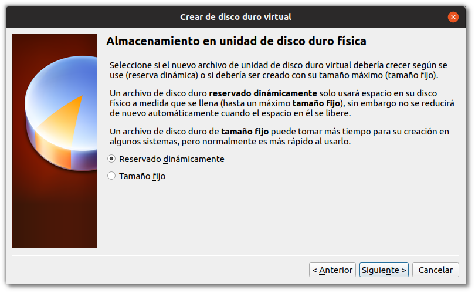

A continuación establecemos el tamaño del disco duro.

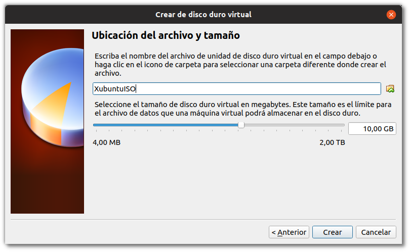

Con esto ya tendríamos la máquina virtual preparada.

\newpage

# Configuración básica y arranque

Una vez ya tenemos la máquina lista, si pulsamos botón derecho sobre la misma podemos acceder a su configuración. Ahora revisaremos la configuración básica y la conectividad de la máquina, la conectividad la trabajaremos a lo largo del módulo muchas veces así que vale la pena detenerse un momento a entender los conceptos.

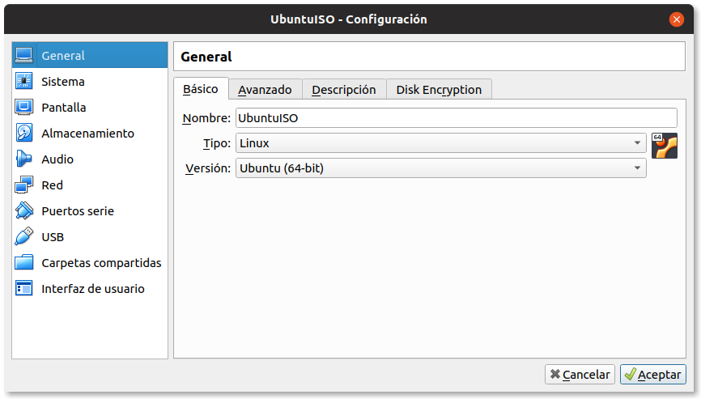

\newpage

## Networking en VirtualBox

En el apartado de **Red** de la configuración del VirtualBox podemos configurar como la máquina virtual estará conectada con el resto de máquinas de nuestro entorno. Por ahora seleccionaremos el *Adaptador 1*, lo habilitaremos y lo conectaremos a *NAT*.

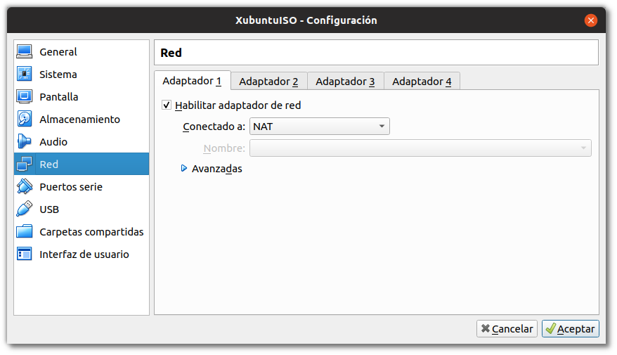

> NOTA : Otra posibilidad sería dejarlo en *adaptador puente*, en este caso es interesante que por ahora conectemos el adaptador de **Ethernet**(tarjeta de red cableada) de nuestro equipo hypervisor.

\newpage

## Almacenamiento e imagen de instalación

Una vez tenemos la red configurada es el momento de arrancar la máquina con el medio de instalación conectado. Para ello iremos a la pestaña **Almacenamiento** y en **Controlador IDE** - **Unidad Optica** seleccionaremos la imágen ISO que hemos descargado de Xubuntu.

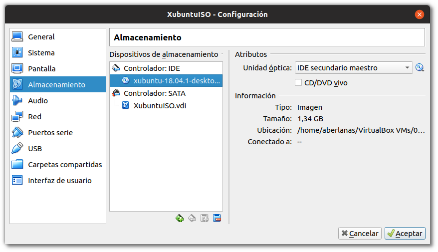

> [NOTA] : En caso de que arranquemos una máquina virtual sin configurar ni instalar, el VirtualBox detecta que se trata de una máquina recién creada y nos ofrece la posibilidad de conectar una imágen en ese momento.

\newpage

# Arranque de Ubuntu

Nada más arrancar la máquina virtual, vemos que se muestra el logo de VirtualBox y a continuación en caso de que estemos instalando una Ubuntu o derivadas aparece un fondo morado-marrón y un pequeño logo que indica que pulsemos un teclado si queremos cambiar de idioma, si no se pulsa nada, el sistema arranca a los pocos segundos automáticamente en Inglés, y más adelante podremos cambiar el idioma durante el proceso de arranque.

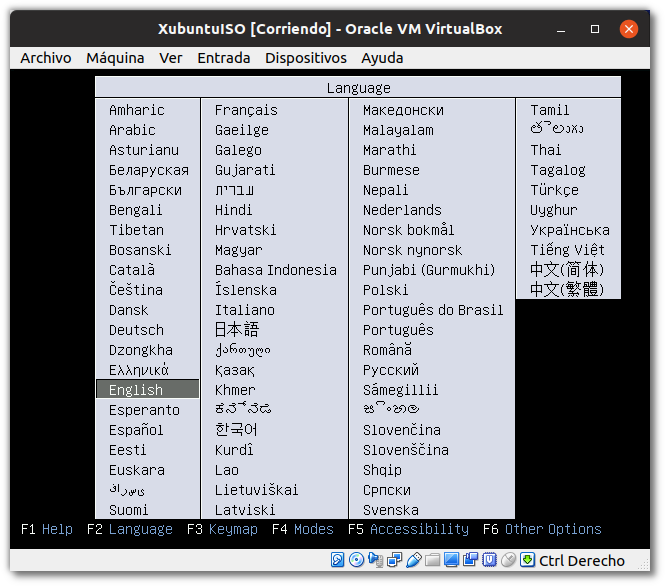

En el caso de que deseemos realizar una operacion que no sea *Probar el sistema sin instalar*, debemos de pulsar la tecla y seleccionar la opción deseada.

> [NOTA] : Esto puede ser interesante si estamos utilizando el medio de instalación para recuperar particiones, datos perdidos, testeo de hardware, etc.

\newpage

# Proceso de Instalación

En el caso de que estemos instalando, ahora deberemos de realizar los pasos típicos de una instalación de Sistema Operativo.

## Selección de Idioma

En un primer momento se selecciona el idioma con el que se instalará el Sistema, en caso los basados en GNU/LinuX, podemos tener multitud de idiomas instalados, siendo el usuario en cada sesión el que puede elegir el idioma (si así se lo configuramos).

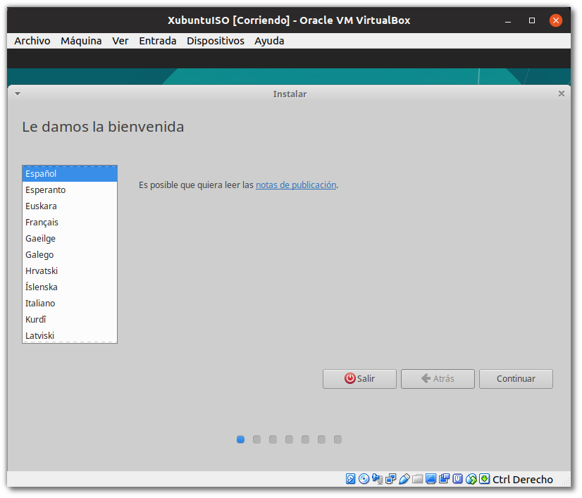

\newpage

## Disposición de teclado

Una vez elegido el idioma, debemos seleccionar nuestra disposición de teclado *(ES-es)*.

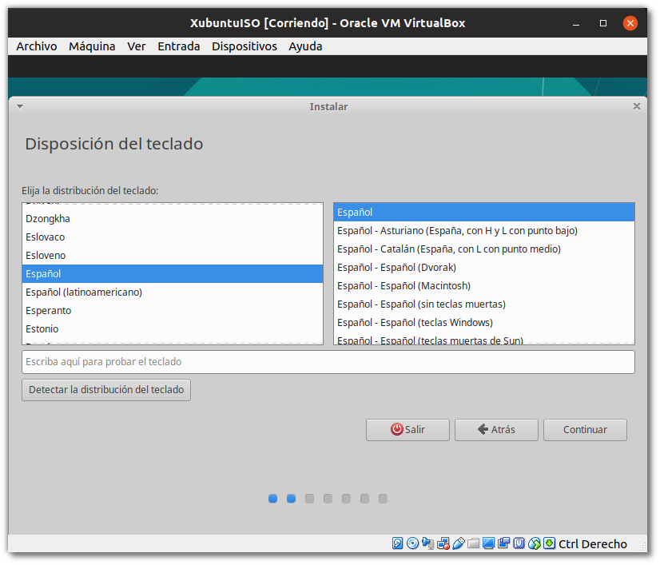

\newpage

## Selección de software y actualizaciones

La opción de **instalar programas de terceros** puede ser interesante si va a ser usado como opción de Escritorio, y/o estamos teniendo problemas con algunas tarjetas de Red Wifi. 

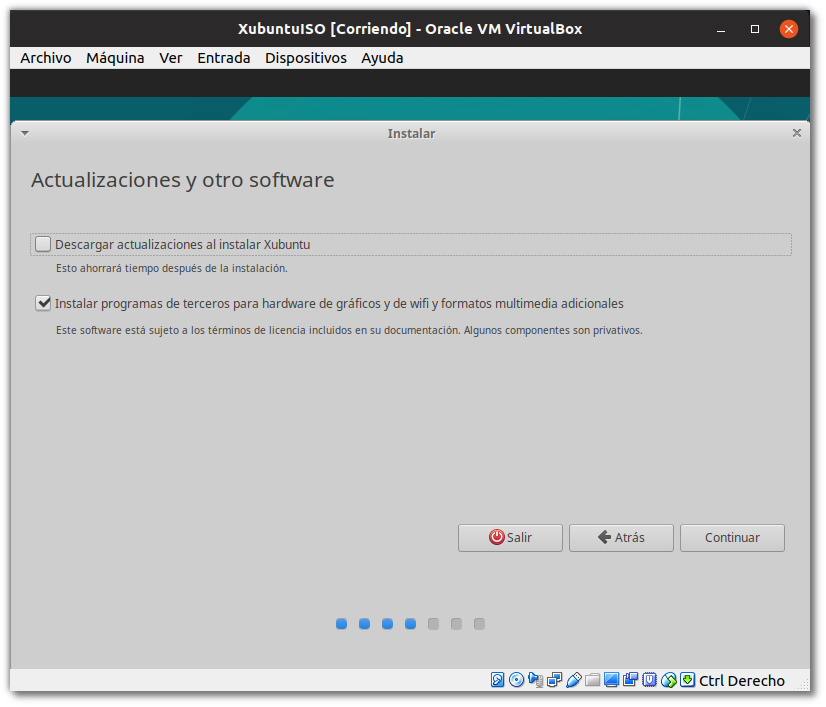

\newpage

## Particionado

Ahora seleccionaremos en que partición/es del disco instalaremos el sistema, en nuestro caso ya que se trata de un disco duro virtual que acabamos de crear, seleccionaremos la opción:

* Borrar disco e instalar Xubuntu

No marcaremos ninguna de las otras casillas.

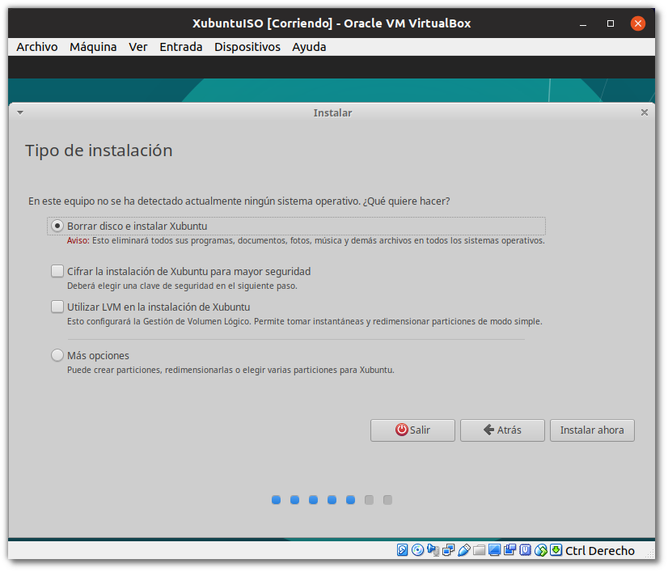

A continuación el sistema nos pregunta si estamos seguros de que queremos realizar estas operaciones sobre el disco, en este momento no hay peligro ya que se trata de una máquina virtual recién creada, pero en caso de que en el proceso de instalación tengamos que *redimensionar* o cambiar el formato de particiones, es un buen momento para comprobar que todas las operaciones que se van a aplicar son las correctas.

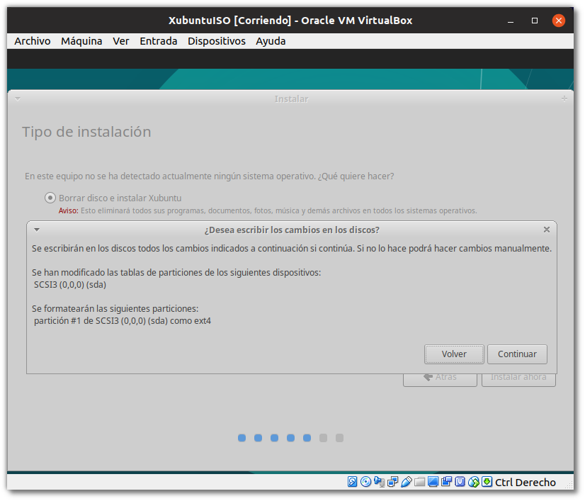

\newpage

## Configuración zona Horaria

Mientras se copian los archivos, el sistema de instalación nos hace una serie de preguntas que debemos contestar, como la zona horaria en la que el Sistema Operativo estará.

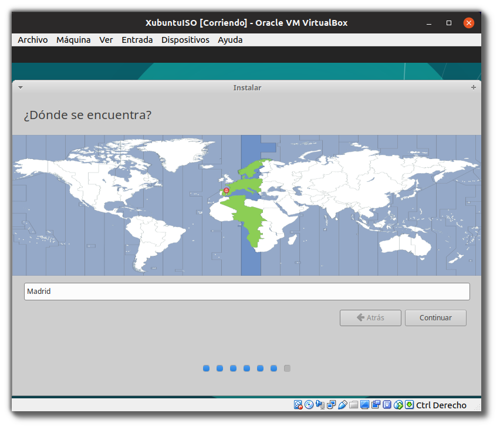

## Creación del usuario de instalación

A continuación nos pregunta por el usuario de la instalación. Es importante en este punto tener en cuenta algunos detalles:

* **Su Nombre**: El nombre completo del usuario con apellidos y mayúsculas (Pedro García García) 
* **Nombre del equipo**: Como se llamará la máquina: pc02, servidorImpresión, servidorDNS,...
* **Nombre de usuario**: Se trata del identificador que utilizaremos para iniciar sesión en el equipo como ese usuario. Se trata de un *nickname* o *nick* . Algunos ejemplos serían: *adminiso*,*usuario*,...
* **Contraseña**: La contraseña que utilizaremos para identificarnos.
* En el apartado **Iniciar sesión automáticamente** o **Solicitar la contraseña** dejaremos marcada esta última, para permitir más adelante el cambio entre los distintos usuarios que creemos.

> [NOTA] : El password que propongo para el administrador es : **admin1s0**

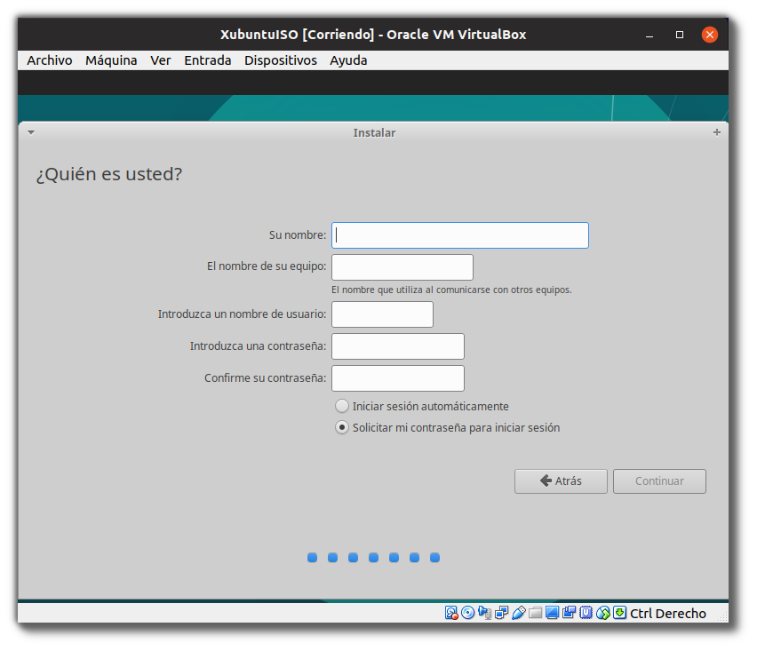

> [NOTA] : El usuario que creemos ahora estará en *sudo* y *adm*, es decir, será nuestro usuario de *Administración Local*, esto lo veremos más adelante en el módulo con mayor profundidad, pero es importante tenerlo en cuenta desde el inicio.

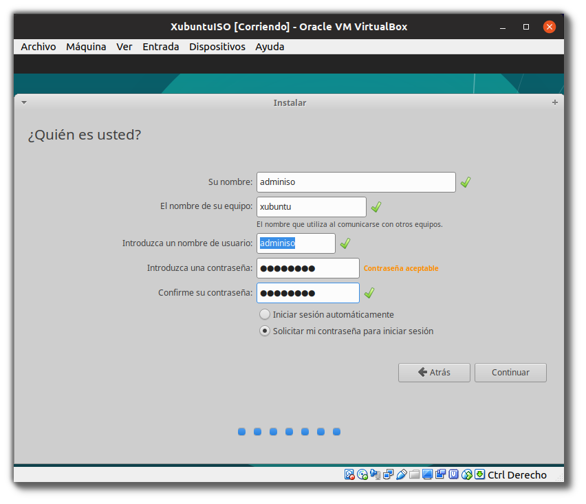

\newpage

## Proceso de la instalación

Durante el proceso, ahora ya sin preguntas, Xubuntu nos muestra un carrusel mostrándonos las aplicaciones que vienen en Xubuntu para las acciones más comunes.

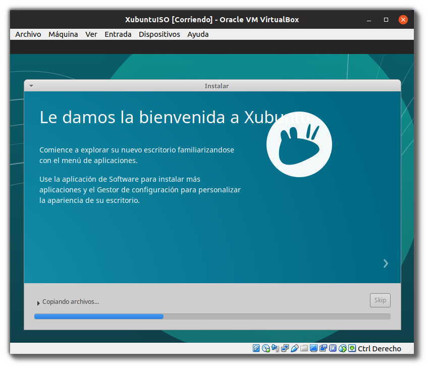

Una vez completada la instalación, debemos reiniciar, atentos al último mensaje de **Remove the installation medium, then press Enter** , que muchas veces si el monitor no se ha detectado como toca no se nos muestra.

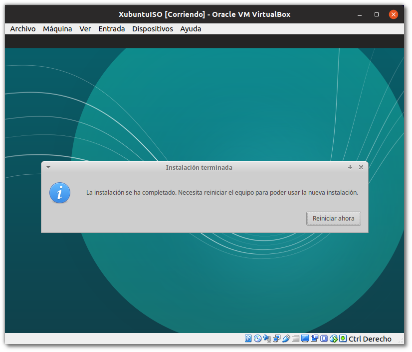

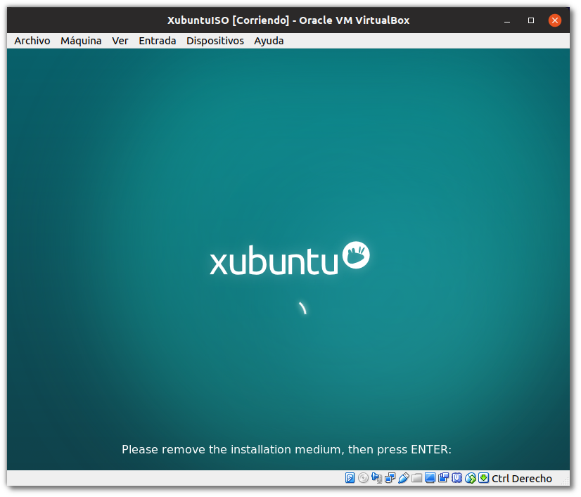

\newpage

# 1er Arranque

Una vez instalado realizaremos el primer arranque, en el que acabaremos de configurar lo básico y actualizaremos.

## Ventana de inicio de sesión (*lightdm*)

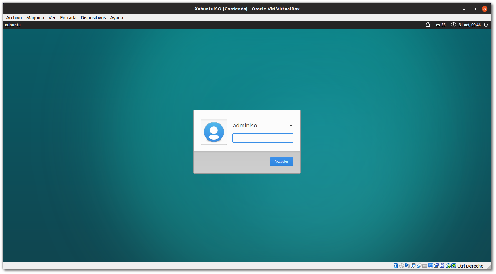

Aquí se muestran los usuarios que pueden iniciar sesión en el equipo, en este momento tan solo tenemos al usuario de la instalación. Al pulsar sobre el icono nos preguntará la contraseña que nos permitirá entrar como ese usuario.

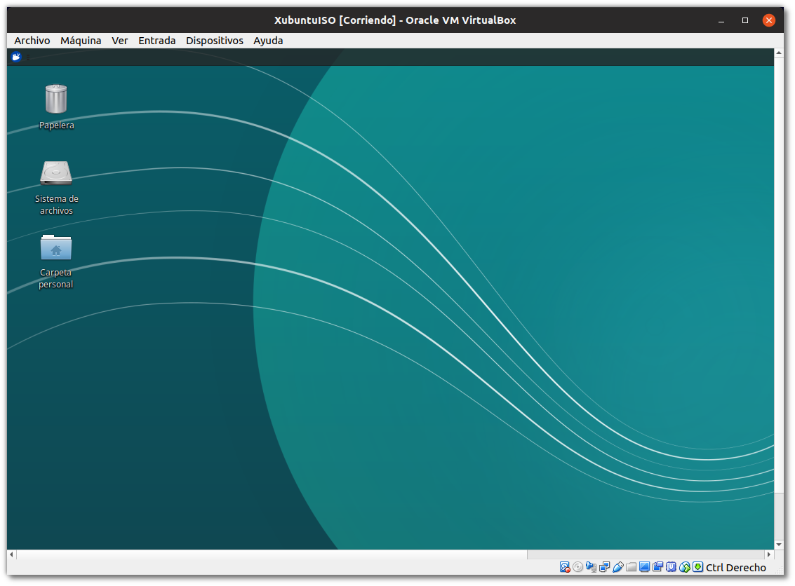

\newpage

## Actualizaciones y apagado

Tenemos bastantes actualizaciones por aplicar, ya que la comunidad de Ubuntu ha sacado muchas actualizaciones desde el lanzamiento de la 18.04 (Abril 2018), es muy importante que mantengamos el software actualizado, así que *Instalaremos ahora* todas las actualizaciones.

Para realizar la instalación y actualización de paquetes debemos tener permisos de adminstrador. El usuario de la instalación los tiene, así que bastará con que introduzcamos el password nuestro.

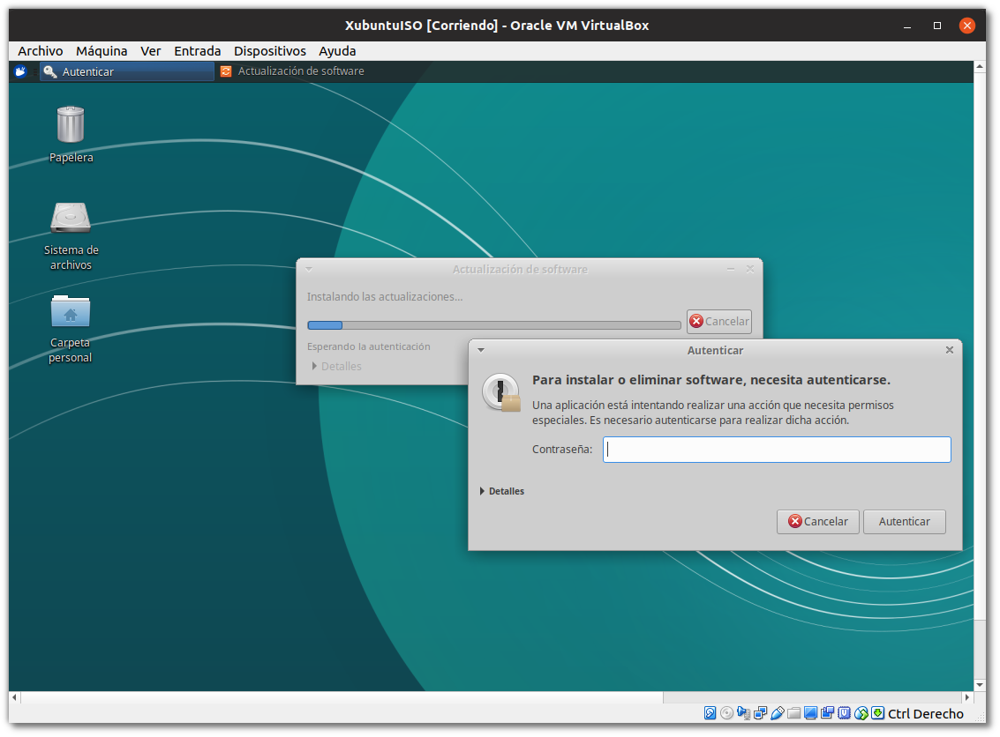

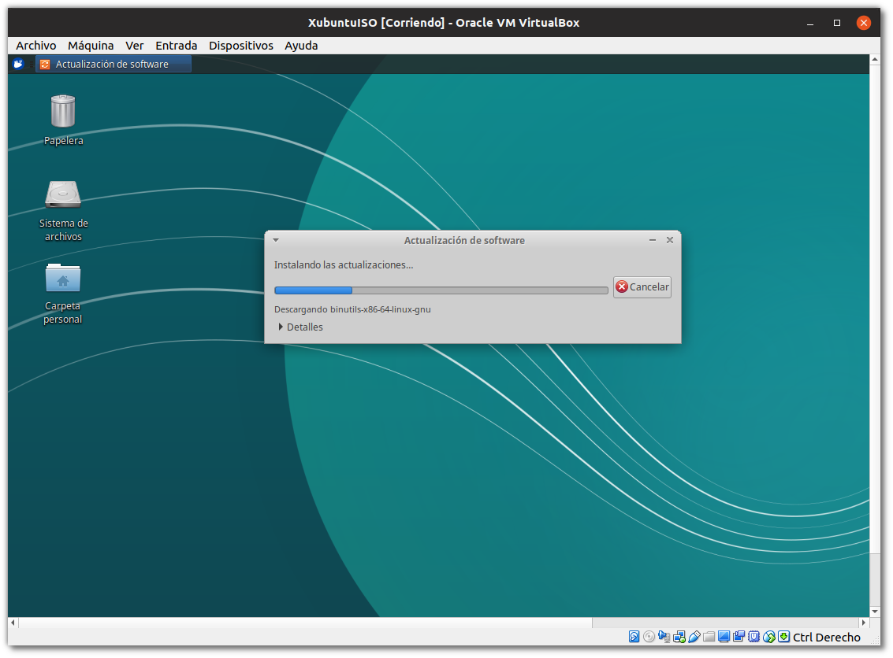

Una vez actualizado, podremos apagar. En caso de que haya actualizaciones pendientes se nos muestra un mensaje para aplicarlas en el apagado.
