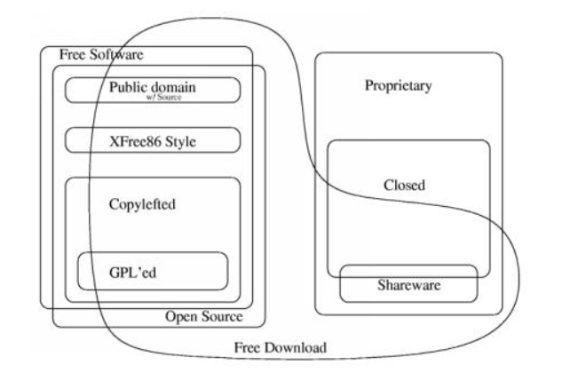
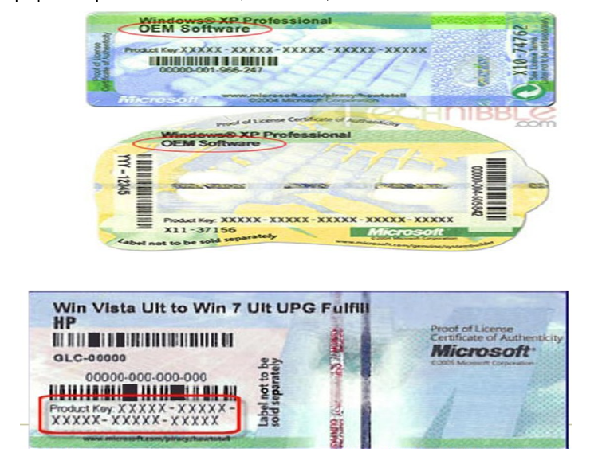

\newpage

# Licencias

## Licencia

Contrato entre el desarrollador de un software sometido a propiedad intelectual y a derechos de autor y el usuario, en el cual se definen con precisión los derechos y deberes de ambas partes. Es el desarrollador, o aquél a quien éste haya cedido los derechos de explotación, quien elige la licencia según la cual distribuye el software.

## Patente

Conjunto de derechos exclusivos garantizados por un gobierno o autoridad al inventor de un nuevo producto (material o inmaterial) susceptible de ser explotado industrialmente para el bien del solicitante por un periodo de tiempo limitado.

## Derecho de autor o copyright

Forma de protección proporcionada por las leyes vigentes en la mayoría de los países para los autores de obras originales incluyendo obras literarias, dramáticas, musicales, artísticas e intelectuales, tanto publicadas como pendientes de publicar.

## Software libre

Proporciona la libertad de:

* Ejecutar el programa, para cualquier propósito;
* Estudiar el funcionamiento del programa, y adaptarlo a sus necesidades;
* Redistribuir copias;
* Mejorar el programa, y poner sus mejoras a disposición del público, para beneficio de toda la comunidad.

## Software de fuente abierta

Sus términos de distribución cumplen los criterios de

* Distribución libre;
* Inclusión del código fuente;
* Permitir modificaciones y trabajos derivados en las mismas condiciones que el software original;
* Integridad del código fuente del autor, pudiendo requerir que los trabajos derivados tengan distinto nombre o versión;
* No discriminación a personas o grupos;
* Sin uso restringido a campo de actividad;
* Los derechos otorgados a un programa serán válidos para todo el software redistribuido sin imponer condiciones complementarias;
* La licencia no debe ser específica para un producto determinado;
* La licencia no debe poner restricciones a otro producto que se distribuya junto con el software licenciado;
* La licencia debe ser tecnológicamente neutral.

## Estándar abierto

Según Bruce Perens, el basado en los principios de

* Disponibilidad;
* Maximizar las opciones del usuario final;
* Sin tasas sobre la implementación;
* Sin discriminación de implementador;
* Permiso de extensión o restricción;
* Evitar prácticas predatorias por fabricantes dominantes

## Software de dominio público

Aquél que no está protegido con copyright

## Software con copyleft

Software libre cuyos términos de distribución no permiten a los redistribuidores agregar ninguna restricción adicional cuando lo redistribuyen o modifican, o sea, la versión modificada debe ser también libre

## Software semi libre

Aquél que no es libre, pero viene con autorización de usar, copiar,
distribuir y modificar para particulares sin fines de lucro

## Freeware

Se usa comúnmente para programas que permiten la redistribución pero no la
modificación (y su código fuente no está disponible)

## Shareware

Software con autorización de redistribuir copias, pero debe pagarse cargo por licencia de uso continuado.

## Software privativo

Aquél cuyo uso, redistribución o modificación están prohibidos o
necesitan una autorización.

## Software comercial

El desarrollado por una empresa que pretende ganar dinero por su
uso.

\newpage

## Tipos de licencias

El siguiente gráfico puede expresar los distintos conjuntos de licencias, de donde se puede deducir que software libre y de fuente abierto no son estrictamente similares y que la cualidad del copyleft no es una condición indispensable en todas estas licencias.

\

El software no se vende, se *licencia*. Una licencia es aquella autorización formal con carácter contractual que un autor de un software da a un interesado para ejercer *actos de explotación legales*. Es decir, el software no se compra, sino que se adquieren una serie de derechos sobre el uso que se le puede dar. En las licencias de software libre esos derechos son muy abiertos y permisivos, apenas hay restricciones al uso de los programas. De ahí que ayude al desarrollo de la cultura. Pueden existir tantas licencias como acuerdos concretos se den entre el autor y el licenciatario. Desde el punto de vista del software libre, existen distintas variantes del concepto o grupos de licencias:

### Licencias GPL

Una de las más utilizadas es la Licencia Pública General de GNU (GNU GPL). El autor conserva los derechos de autor (copyright), y permite la redistribución y modificación bajo términos diseñados para asegurarse de que todas las versiones modificadas del software permanecen bajo los términos más restrictivos de la propia GNU GPL. Esto hace que sea imposible crear un producto con partes no licenciadas GPL: el conjunto tiene que ser GPL (**virica**)

Es decir, la licencia GNU GPL posibilita la modificación y redistribución del software, pero únicamente bajo esa misma licencia. Y añade que si se reutiliza en un mismo programa código "A" licenciado bajo licencia GNU GPL y código "B" licenciado bajo otro tipo de licencia libre, el código final "C", independientemente de la cantidad y calidad de cada uno de los códigos "A" y "B", debe estar bajo la licencia GNU GPL.

En la práctica esto hace que las licencias de software libre se dividan en dos grandes grupos, aquellas que pueden ser mezcladas con código licenciado bajo GNU GPL (y que inevitablemente desaparecerán en el proceso, al ser el código resultante licenciado bajo GNU GPL) y las que no lo permiten al incluir mayores u otros requisitos que no contemplan ni admiten la GNU GPL y que por lo tanto no pueden ser enlazadas ni mezcladas con código gobernado por la licencia GNU GPL.

En el sitio web oficial de GNU hay una lista de licencias que cumplen las condiciones impuestas por la GNU GPL y otras que no.

Aproximadamente el 60% del software licenciado como software libre emplea una licencia GPL o de manejo.

### Licencias AGPL

La Licencia Pública General de Affero (en inglés Affero General Public License, también Affero GPL o AGPL) es una licencia copyleft derivada de la Licencia Pública General de GNU diseñada específicamente para asegurar la cooperación con la comunidad en el caso de software que funcione en servidores de red.

La Affero GPL es íntegramente una GNU GPL con una cláusula nueva que añade la obligación de distribuir el software si éste se ejecuta para ofrecer servicios a través de una red de ordenadores.

La Free Software Foundation recomienda que el uso de la GNU AGPLv3 sea considerado para cualquier software que usualmente corra sobre una red.

### Licencias estilo BSD

Llamadas así porque se utilizan en gran cantidad de software distribuido junto a los sistemas operativos BSD. El autor, bajo tales licencias, mantiene la protección de copyright únicamente para la renuncia de garantía y para requerir la adecuada atribución de la autoría en trabajos derivados, pero permite la libre redistribución y modificación, incluso si dichos trabajos tienen propietario. Son muy permisivas, tanto que son fácilmente absorbidas al ser mezcladas con la licencia GNU GPL con quienes son compatibles. Puede argumentarse que esta licencia asegura “verdadero” software libre, en el sentido que el usuario tiene libertad ilimitada con respecto al software, y que puede decidir incluso redistribuirlo como no libre. Otras opiniones están orientadas a destacar que este tipo de licencia no contribuye al desarrollo de más software libre (normalmente utilizando la siguiente analogía: "una licencia BSD es más libre que una GPL si y sólo si se opina también que un país que permita la esclavitud es más libre que otro que no la permite").

### Licencias estilo MPL y derivadas (Mozilla Public License)

Esta licencia es de Software Libre y tiene un gran valor porque fue el instrumento que empleó Netscape Communications Corp. para liberar su Netscape Communicator 4.0 y empezar ese proyecto tan importante para el mundo del Software Libre: Mozilla. Se utilizan en gran cantidad de productos de software libre de uso cotidiano en todo tipo de sistemas operativos. La MPL es Software Libre y promueve eficazmente la colaboración evitando el efecto "viral" de la GPL (si usas código licenciado GPL, tu desarrollo final tiene que estar licenciado GPL). Desde un punto de vista del desarrollador la GPL presenta un inconveniente en este punto, y lamentablemente mucha gente se cierra en banda ante el uso de dicho código. No obstante la MPL no es tan excesivamente permisiva como las licencias tipo BSD. Estas licencias son denominadas de copyleft débil. La NPL (luego la MPL) fue la primera licencia nueva después de muchos años, que se encargaba de algunos puntos que no fueron tomados en cuenta por las licencias BSD y GNU. En el espectro de las licencias de software libre se la puede considerar adyacente a la licencia estilo BSD, pero perfeccionada.
Copyleft

El titular de los derechos de autor (copyright) de un software bajo licencia copyleft puede también realizar una versión modificada bajo su copyright original, y venderla bajo cualquier licencia que desee, además de distribuir la versión original como software libre. Esta técnica ha sido usada como un modelo de negocio por una serie de empresas que realizan software libre (por ejemplo *MySQL*); esta práctica no restringe ninguno de los derechos otorgados a los usuarios de la versión copyleft.

En España, toda obra derivada está tan protegida como una original, siempre que la obra derivada parta de una autorización contractual con el autor. En el caso genérico de que el autor retire las licencias "copyleft", no afectaría de ningún modo a los productos derivados anteriores a esa retirada, ya que no tiene efecto retroactivo. En términos legales, el autor no tiene derecho a retirar el permiso de una licencia en vigencia. Si así sucediera, el conflicto entre las partes se resolvería en un pleito convencional.

\

\newpage

## Sistemas Operativos Libres

Son sistemas que pueden usarse libremente, ser distribuidos, permiten que se acceda a su código fuente y permiten que esté sea modificado de la forma que queramos. El sistema operativo que estamos usando (**Debian**) es un buen ejemplo de Sistema Operativo Libre.

No hay que confundir el hecho de que sean libres con el hecho de que sean gratuitos.

## Licencias de los Sistemas Operativos propietarios

Dentro de los sistemas operativos comerciales, propietarios y privativos, nos podemos
encontrar con diversos tipos de licencia de uso:

### O.E.M.

OEM (abreviatura del inglés original equipment manufacturer, en español sería fabricante de equipamiento original). Este tipo de licencias se las otorga el desarrollador del sistema operativo al fabricante de hardware, de modo que cuando nosotros compramos uno de sus productos, este viene con una licencia de uso del sistema operativo de tipo OEM. La particularidad de este tipo de licencias, es el que el sistema operativo viene preparado para ese hardware específicamente, de modo que no tenemos realmente una licencia de uso del sistema operativo, sino una licencia de uso del sistema operativo únicamente para ese hardware en concreto.

Estas licencias son las más económicas, y suelen poseer restricciones especiales, aparte
de venir sin manuales ni caja.

### RETAIL

Es la licencia que compramos directamente del desarrollador. Somos propietarios de la licencia, podemos instarlo en cualquier tipo de hardware compatible, podemos revender la licencia o cederla, etc.

Normalmente solo permiten su uso en una sola maquina a la vez. Vienen con su caja y manuales.

En las licencias de tipo retail, normalmente podemos elegir entre una licencia completa, o una licencia de actualización, que permite actualizar un sistema anterior al nuevo, por un coste algo más reducido.

### VLM (LICENCIAS POR VOLUMEN)

Para una empresa con cientos de ordenadores, es complicado controlar las licencias individuales de cada una de sus máquinas. Existe la posibilidad de contratar un tipo de licencia especial con el desarrollador, de modo que con una única clave de licencia, podemos utilizar varias máquinas a la vez.
Es habitual que existan licencias de 25 usos concurrentes, 50, etc.
Son las licencias más caras evidentemente, aunque son bastante más económicas que comprar cada una de las licencias individualmente.

### MSDN (LICENCIAS DE EDUCACIÓN.)

Son unas licencias especiales de Microsoft que permiten su uso únicamente para actividades educativas y de formación. Cualquier uso de estas licencias en equipos que desarrollen actividades fuera de este ámbito, es ilegal. Existen también licencias de este tipo para empresas de desarrollo, academias, etc.

\ 
