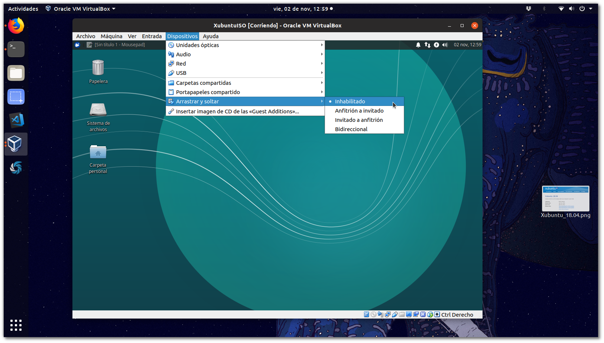
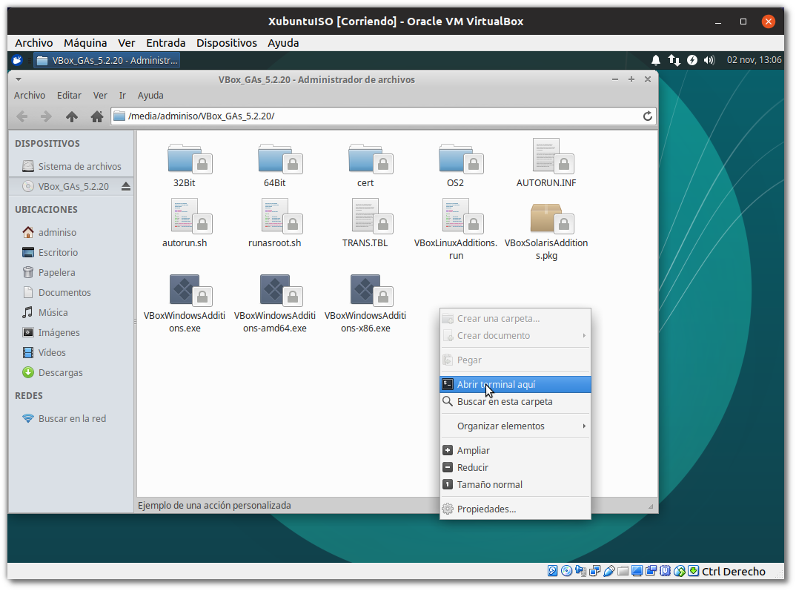
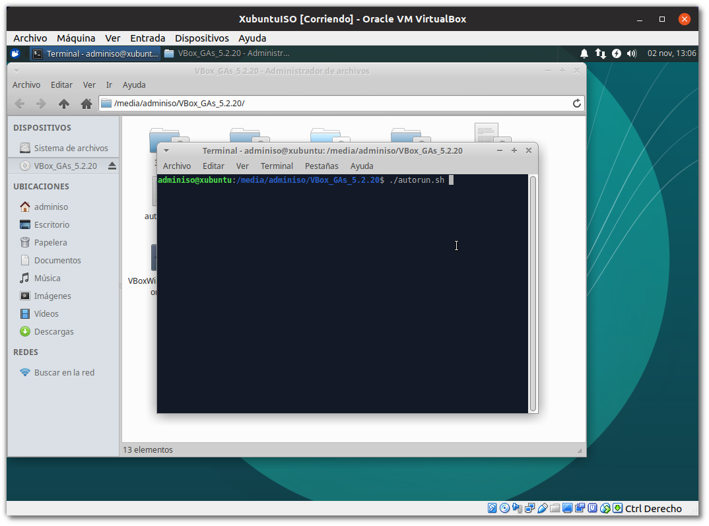
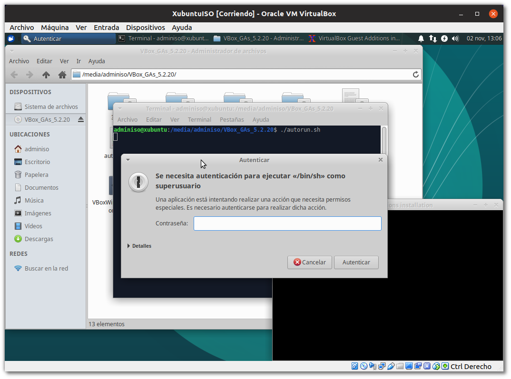
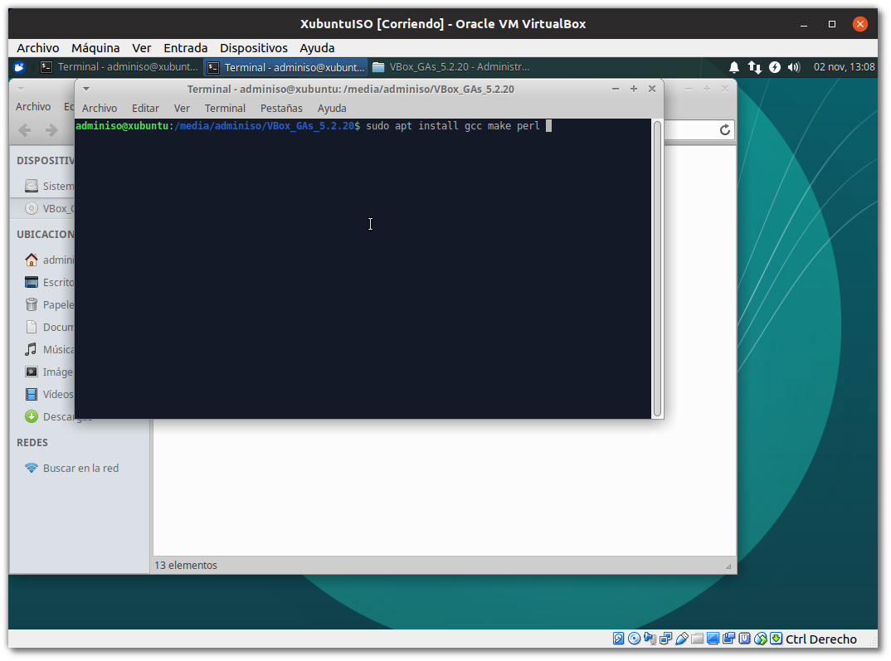
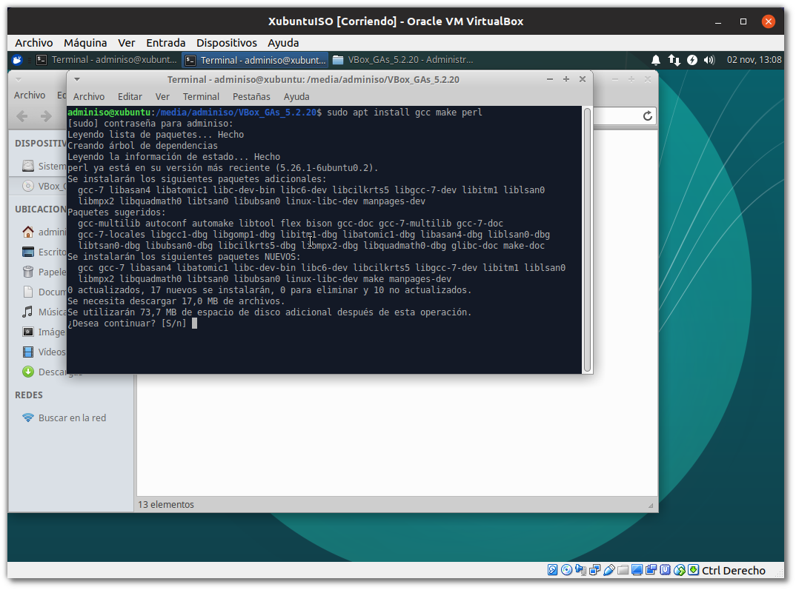
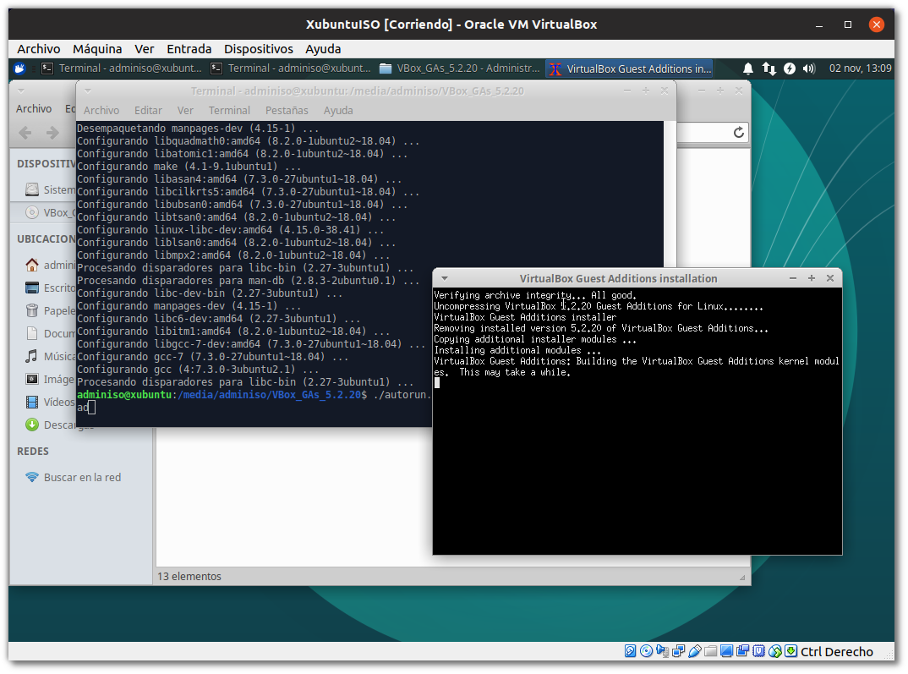
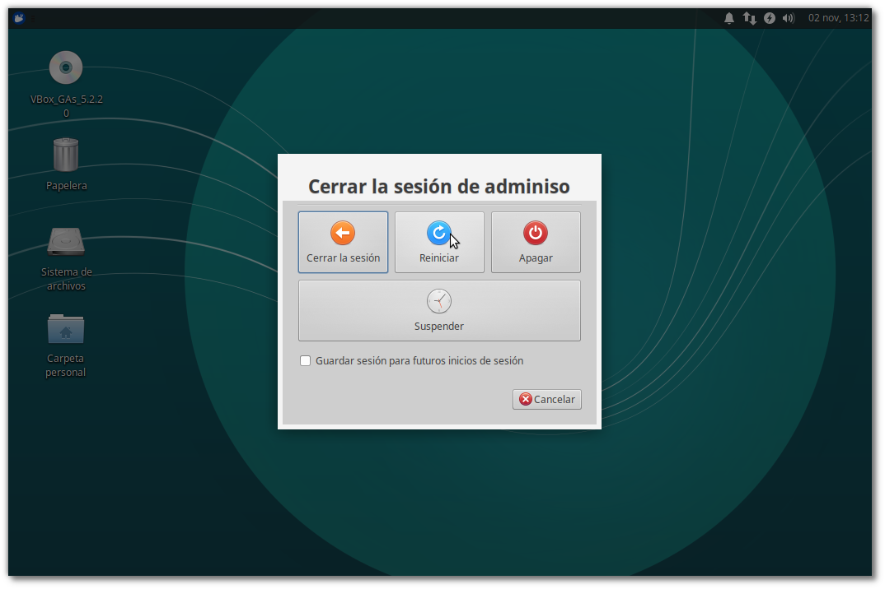
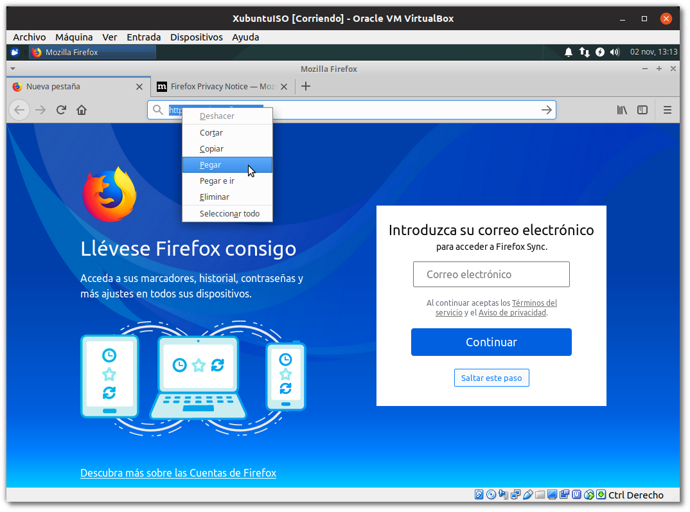

# Tarea: Compartir Recursos I

Vamos a realizar una tarea en la que configuraremos una máquina Xubuntu para que podamos compartir una serie de recursos entre el Hipervisor y la máquina virtual.

Hemos visto en teoría que existen una serie de herramientas que nos permiten mecanismos de comunicación entre la máquina virtual y el hipervisor. No solo a través de la configuración de la red, sino también herramientas útiles para el trabajo diario con estas máquinas virtuales:

* Establecer carpetas compartidas entre el _Hipervisor_ y la MV
* La posibilidad de añadir texto/enlaces/... en el hipervisor y pegar ese contenido en el sistema virtualizado (y *viceversa*).
* Permitir el uso de *arrastrar y soltar* ficheros entre el Hipervisor y la MV.
 

\


\

Para poder utilizar todas las posibilidades que nos ofrece VirtualBox para trabajar con las máquinas virtuales, utilizar memorias USBs en nuestras máquinas, pasarnos ficheros, copiar y pegar del portapapeles entre máquinas, etc. Necesitamos instalar en el sistema virtualizado una serie de programas que le indican al sistema operativo virtualizado como debe interactuar con esos recursos que le van a ser ofrecidos desde el hipervisor.

Estos programas se denominan las *Guest Additions* y a continuación veremos una serie de pasos que se deben seguir para su instalación en los sistemas GNU/LinuX. En el caso de los sistemas Microsoft Windows, basta con que ejecutemos el *autorun* que nos aparecerá cuando insertemos el CD en nuestro sistema virtualizado.

## Instalación de las Guest Additions

En el menú *Dispositivos* del VirtualBox y con la máquina virtual encendida y con la sesión iniciada, activamos la opción:

```shell
Insertar imagen de CD de las <<Guest Additions>>...
```


\

Cuando lo hacemos en el sistema virtualizado nos aparece en el Escritorio el icono del CD que acabamos de insertar (*montar*), esto es un comportamiento habitual en los Escritorios de GNU/LinuX. 

Abrimos el CD y vemos el contenido de ese CD, podemos observar que hay distintos ficheros, cada uno preparado para ser instalado en los diferentes sistemas y arquitecturas habituales que se virtualizan:

 * Windows (**32 bits**)
 * Windows (**64 bits**)
 * GNU/LinuX 
 * Solaris
 
Lo que haremos será abrir una terminal aquí y ejecutaremos el instalador para GNU/LinuX. Como funciona la terminal lo veremos más adelante en el módulo, así como una explicación más detallada de las acciones que vamos a realizar ahora, sin embargo son un buen punto de partida para establecer un entorno de trabajo y pruebas más eficiente y cómodo.

## Instalando desde el terminal

Para abrir un terminal, pulsaremos botón derecho en el explorador de ficheros y seleccionaremos la opción: **Abrir un terminal aquí**.


\

Una vez abierto ejecutaremos el script de *autorun.sh* que se encuentra en la carpeta, para ello escribiremos en la terminal:

```shell
./autorun.sh
```


\

Esta ejecución requiere de privilegios de administración, no sin motivo, ya que en realidad estaremos configurando una serie de drivers que tienen que ver directamente con nuestro Kernel (*núcleo*) y con como van a interactuar con ese hardware. 

Introduciremos la contraseña de administrador (en nuestro caso *admin1s0*).


\

Al ejecutarlo, nos aparece una pequeña terminal que nos muestra una serie de mensajes acerca del progreso de la instalación, si leemos los mensajes (y sí...toca leer este tipo de cosas, más vale que nos vayamos acostumbrando ya...), nos daremos cuenta de que nos pide *Por favor* que instalemos : *gcc, make y perl* para nuestra distribución. 

## Instalando paquetes requeridos

Por ahora lo que haremos será ejecutar una orden en la terminal que nos descarga los paquetes desde los repositorios y nos los instala. Esto lo veremos con mucho más detalle en temas futuros, pero lo vamos a necesitar ahora.

```shell
sudo apt install gcc make perl
```


\

A continuación nos muestra que se van a instalar una serie de paquetes y nos pide confirmación, tal y como vemos en la imágen.


\

## Continuamos la instalación

Ahora si volvemos a ejecutar el script de *autorun.sh* no nos dará ningún mensaje de error.


\

Una vez realizado este paso, es conveniente reiniciar el sistema virtualizado.


\

# Portapapeles

Ahora ya tenemos el portapapeles compartido habilitado entre nuestro hipervisor y la máquina virtual, podemos decidir, la direccionalidad de este portapapeles.

 * Inhabilitado
 * Hipervisor -> MV
 * MV -> Hipervisor
 * MV <-> Hipervisor

Esto nos será muy útil para seguir manuales, buscar errores en Internet cuando la máquina virtualizada no tenga conexión o cuando no tengamos el navegador abierto, para la elaboración de documentación, etc.


\

# Ejercicio

Realiza todas las configuraciones que hemos visto en la tarea y avisa al profesor para que compruebe que todo funciona.
