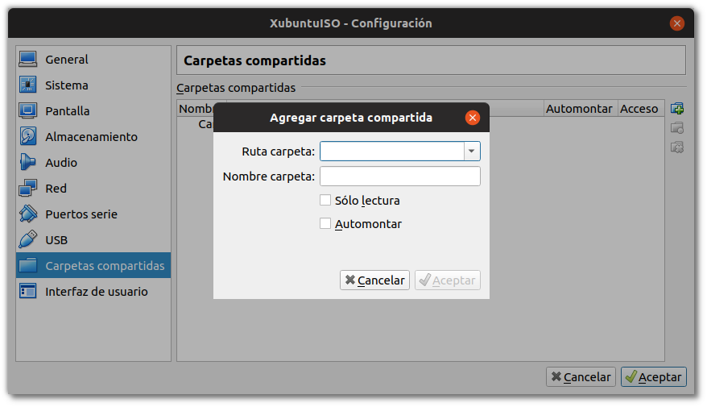
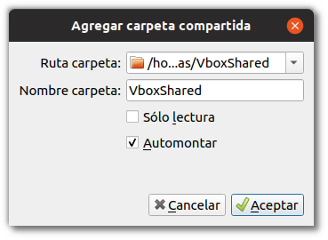
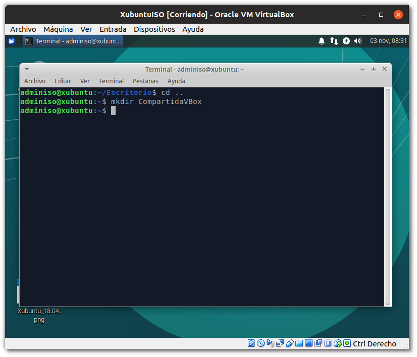
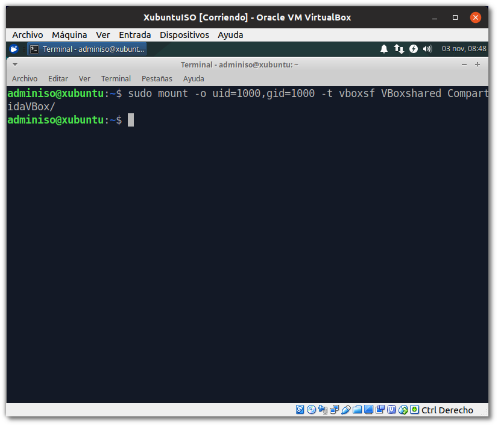
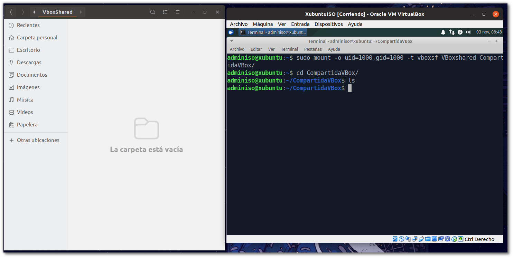
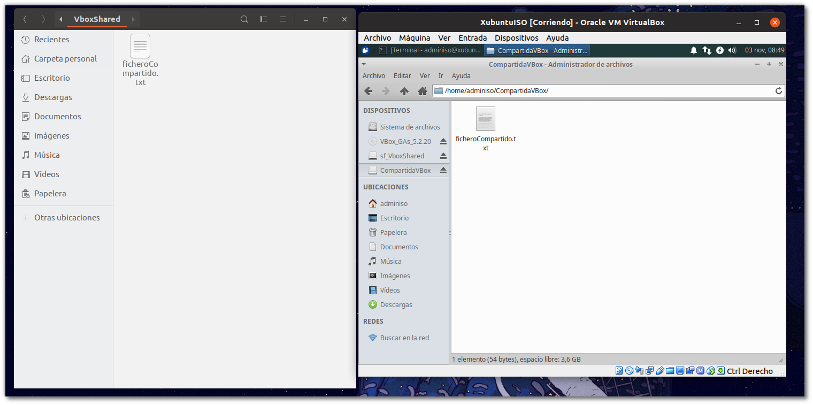

# Tarea: Compartir Recursos III

Vamos a configurar en nuestro hipervisor una carpeta que montaremos desde nuestra máquina virtual. Esta nos servirá para compartir ficheros entre el hipervisor y el sistema virtual. Nos permitirá pasar enunciados, software, scripts y todo lo que necesitemos compartir en forma de fichero.

## Creación de la carpeta en el Hipervisor

Lo primero será crea una carpeta en nuestra máquina hipervisora que será donde coloquemos los ficheros para ser compartidos. 

Es una buena práctica que pertenezca a nuestro usuario y se encuentre en una ruta accesible y cómoda para trabajar.

Por ejemplo, en nuestra carpeta personal:

```shell
/home/alumno/
```

Crearemos una carpeta cuyo nombre será:

```shell
VBoxShared
```

Una vez creada, vamos al VirtualBox y en el menú de carpetas compartidas seleccionamos esa carpeta que acabamos de crear.


\ 


\ 
 

## Creación del punto de montaje en el Sistema Virtualizado

 Ahora arrancamos la máquina virtual, y en una ruta cómoda, tal y como hemos realizado en el hipervisor, crearemos una carpeta que será nuestro *punto de montaje* para la carpeta compartida. Este concepto de *punto de montaje* así como los permisos de usuario y grupo que veremos en esta práctica serán desarrollados más adelante en el módulo.
 
 La ruta elejida en el ejemplo es :
 
```shell
/home/adminiso/CompartidaVBox
```

> Las he llamado de manera diferente para ilustrar el ejemplo, pero no habría ningún problema en que ambas tuvieran exactamente el mismo nombre.

La creamos mediante la terminal con la orden:

```shell
mkdir CompartidaVBox
```



\newpage 

## Montaje de la carpeta compartida

Para realizar el montaje debemos ejecutar un comando en la terminal que nos *monta* la carpeta compartida desde el hipervisor en la ruta especificada. Este comando es 

```shell
mount
```

Veremos muchos ejemplos de este comando a lo largo del curso, pero por ahora comprobaremos que es capaza de *enlazar* o *montar* en nuestra carpeta de la máquina virtual el sistema de ficheros que está siendo ofrecido por el hipervisor. Además, en el comando vemos algunos parámetros que nos ofrecen información acerca de como funcionan los montajes de unidades. 

```shell
sudo mount -o uid=1000,gid=1000 -t vboxsf VBoxshared CompartidaVBox
```



Si la terminal no nos muestra ningún mensaje, entonces es que la operación ha sido efectuada con éxito. 

Si ejecutamos :

```shell
cd CompartidaVBox/
```

Y luego el comando :

```shell
ls
```

Comprobamos que no existe ningún fichero en la carpeta, al igual que desde el hipervisor.



\newpage

## Comprobación del resultado

Ahora podemos crear un pequeño fichero desde la máquina virtual y comprobar que aparece en nuestro anfitrión (hipervisor) en la carpeta que estamos compartiendo.

Para realizar esta operación, utilizaremos *nano* un pequeño editor de texto en GNU/LinuX que encontraremos en la inmensa mayoria de sistemas GNU/LinuX, ya sean sistemas embebidos, raspberrys, servidores, estaciones de escritorio, etc.

La orden que debemos ejecutar es:

```shell
nano ficheroCompartido.txt
```

Y dentro escribiremos un texto como el que aparece en la captura.

Para guardar, *nano* nos ofrece un pequeño menú de opciones en la parte inferior de la ventana que nos indica que pulsando  **^o** podemos **Guardar**, esto signfica que si pulsamos *Ctrl+o* podremos acceder a esa opción, entonces nos pide confirmación del nombre del fichero que estamos editando. Para aceptar pulsamos *Enter*. Una vez guardado, el fichero ya está disponible desde nuestro hipervisor, y aparece en el navegador de ficheros. 

Para salir de *nano* hay que pulsar **^x**(*Ctrl+x*).

El fichero ahora está accesible desde los dos sistemas.



## Consideraciones adicionales

Estas dos consideraciones no son obligatorias, pero pueden ser realizadas si las consideramos interesantes. 

### mount

Si ejecutamos la orden *mount* sin parámetros, nos muestra todos los puntos de montaje **activos** del sistema. Si en esa lista vemos la carpeta compartida, es que hemos realizado de manera correcta su montaje.


### /etc/fstab

Si quisieramos realizar esta compartición de carpetas de manera persistente deberíamos indicarlo en el fichero de puntos de montaje del equipo. Esto también se verá en temas posteriores.

Se puede añadir la línea:

```shell
VBoxshared	/home/adminiso/CompartidaVBox	vboxsf	uid=1000,gid=1000 0	1 
```
al final del fichero /etc/fstab.

Para realizar esta operación hay que abrir el fichero con privilegios de superusario :

```shell
sudo nano /etc/fstab
```

Para comprobar que todo ha ido bien, podemos ejecutar : 

```shell
sudo mount -a 
```

que repasa el fichero de */etc/fstab* y monta todas las rutas indicadas. Si hubiera algún error, nos lo diría ahora.

> **Importante**: el fichero /etc/fstab es uno de los más importantes en un sistema GNU/LinuX, y su edición ha de realizarse con cuidado. Si dejamos un fichero con errores y reiniciamos la máquina, lo más probable es que no consigamos arrancar de manera exitosa. Debemos de asegurarnos que todo está bien antes de reiniciar.

## Ejercicio

Realiza los pasos que se han descrito en la práctica y adjunta una captura de pantalla que muestre el contenido del mismo fichero accediendo desde desde ambos sistemas (*Guest* y *Host*)
