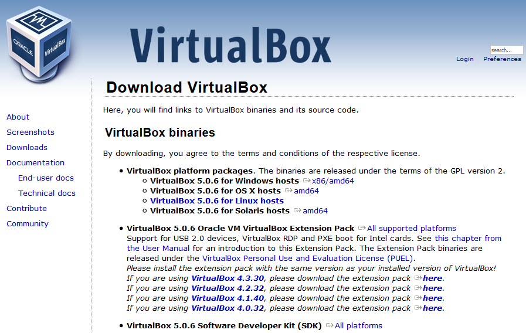
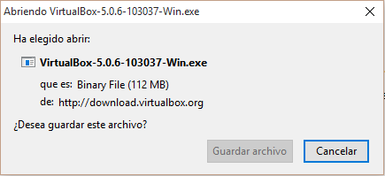

\newpage

# Instalación de VirtualBox

## Importante

* Saber que instalador debemos elegir dependiendo de nuestro sistema.
* Ventajas de los repositorios de software en GNU/LinuX.

Vamos a describir los métodos de instalación del Sistema de Virtualización VirtualBox.


\ 

## En Windows

Para la instalación de VirtualBox iremos a la página del proyecto: [Virtualbox](http://virtualbox.org) y seleccionaremos el instalador correcto para nuestro sistema (*x86*/*amd64*).


\ 


\ 

Una vez descargado, si lo ejecutamos se nos abrirá un asistente que nos guiará a lo largo del proceso de instalación.

## En GNU/LinuX

### Modo *Windows*

En GNU/LinuX podemos instalar VirtualBox de varias maneras, la primera, tal y como vimos en clase, descargando el fichero de instalación (*.deb*)  y ejecutando la orden:

`dpkg -i ruta_al_fichero.deb`

En el caso de que tengamos paquetes en conflicto, debemos desinstalar los paquetes que den problemas y luego reintentar la instalación.

### Repositorios (*Debian/++*)

En los sistemas que tienen repositorios soportados por VirtualBox, bastaría con añadir al fichero

  `/etc/apt/sources.list`

La línea de VirtualBox:


``` shell
  deb https://download.virtualbox.org/virtualbox/debian <mydist> contrib
```

Toca sustituir la palabra **<mydist>** de la linea anterior por la distribución soportada que estemos usando como distro base. Para saber que distribución de GNU/LinuX tenemos instalada el comando es:

  `lsb_release -a`

Las opciones pueden ser:

Basadas en Ubuntu:

* cosmic
* bionic
* xenial
* trusty

Basadas en Debian:

* stretch
* jessie

A continuación debemos añadir a la lista de repositorios *confiables* el repositorio de **Virtualbox**:

  `wget -q https://www.virtualbox.org/download/oracle_vbox.asc -O- | sudo apt-key add -`

Una vez realizados estos pasos:

  `sudo apt update`
  `sudo apt install virtualbox-5.2`

### Virtualbox vs Virtualbox-OSE

En Ubuntu podemos encontrar un paquete de VirtualBox en los repositorios (*multiverse*), pero no se recomienda utilizar esta versión, ya que algunos de los componentes (extension-pack), que utilizaremos más adelante para la creación de redes internas e instalaciónes por red, funcionan mejor sobre la versión oficial del Software.

### Ventajas de los repositorios software

Si añadimos VirtualBox a la lista de repositorios, cuando ejecutemos el comando de actualización del sistema, *apt* comprobará si hay una nueva versión de VirtualBox y lo actualizará sin necesidad de que nos tengamos que descargar el *.deb* de la página y realizar el proceso anterior.
