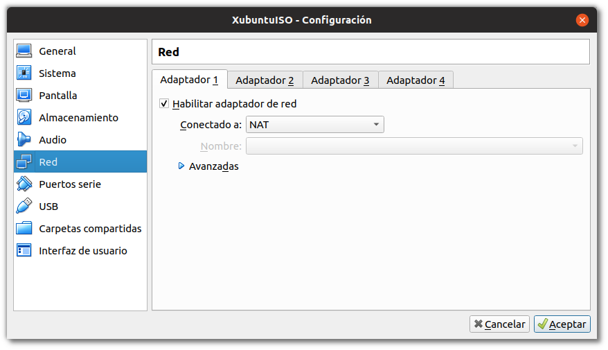
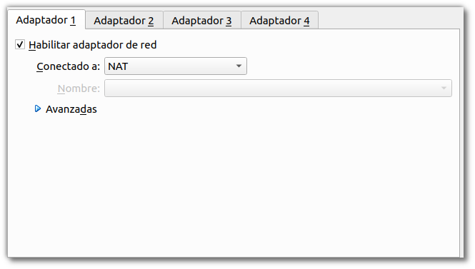
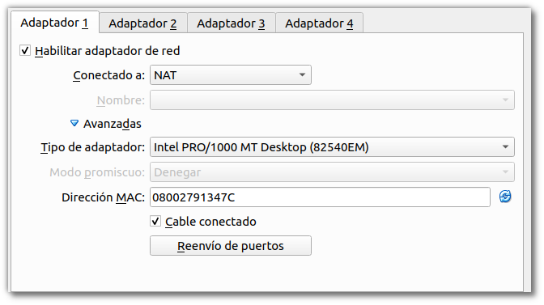
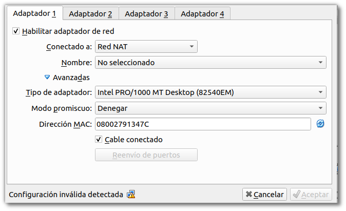
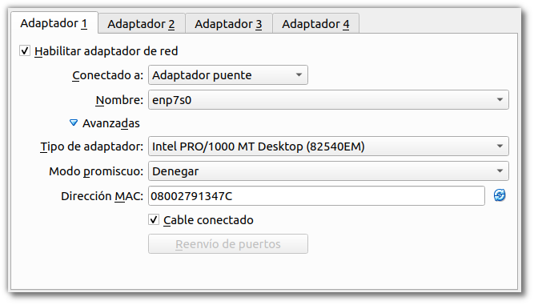
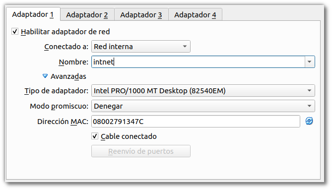
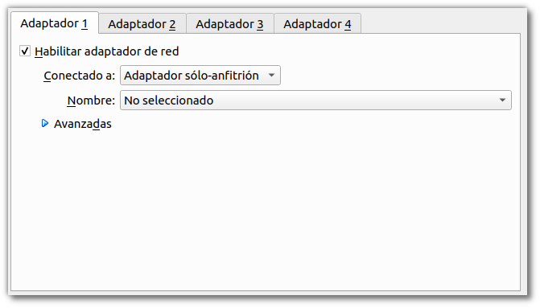
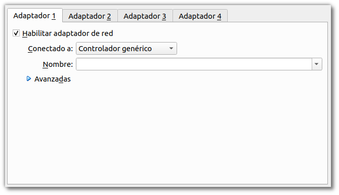

\newpage

# Configuración de la red en los entornos virtuales

En los sistemas de virtualización, sean cuales sean, uno de los recursos más importantes que tendremos que administrar es la red. En los sistemas de información, los servidores y los recursos compartidos entre las máquinas se comunican a través de la red en la mayoría de los casos. Para una correcta configuración de los Sistemas Operativos, es necesario que adquiramos las destrezas y conocimientos que nos permitiran ajustar la configuración de la red de nuestras máquinas. Ya sean Virtuales o físicas.
 
Las posibilidades que veremos a continuación son aquellas que nos permite VirtualBox, sin embargo estos mecanismos los podremos aplicar a casi todos los sistemas de Virtualización (*Hyper-V,Proxmox,Docker,...*). La manera de configurarlos será distinta pero los conceptos son muy parecidos.

Cuando preparamos una máquina virtual, uno de los menús que nos muestra Virtualbox es el de la red.


\

En este menú podemos configurar cual va a ser el modo en el que esa máquina virtual podrá  interactuar con la red a la que pertenece el Hypervisor. Tal y como veremos a continuación existen varios nodos y múltiples opciones, y deberemos seleccionar el que más se adecue a cada uno de los casos en los que nos podremos encontrar. 

## Hardware de Red Virtualizado

Para cada una de las tarjetas de red que podemos conectar a nuestras MVs, podemos seleccionar cual es *modelo* de tarjeta que utilizaremos. 

Los modelos disponibles son estos:

* AMD PCNet PCI II (Am79C970A);
* AMD PCNet FAST III (Am79C973);
* Intel PRO/1000 MT Desktop (82540EM) [*Por defecto*];
* Intel PRO/1000 T Server (82543GC);
* Intel PRO/1000 MT Server (82545EM);
* Paravirtualized network adapter (virtio-net)

El modelo *Paravirtualized network adapter* es especial ya que requiere de un software adicional para la gestión de la red. Dejaremos el que viene por defecto en la mayoria de los casos de este módulo.

### VirtualBox y los JumboFrames

Si estamos utilizando *Jumbo Frames* en nuestra red, es necesario que utilizemos los modelos basados en Intel, ya que no tenemos soporte para los mismos en el hardware Virtualizado de AMD. Sin embargo, esto lo veremos más adelante en el tema de compartición de recursos en la red (**NFS y SAMBA**) y estableceremos algunos parámetros que nos permitirán trabajar con los recursos de la manera deseada.

\newpage 

## No conectado

En este modo VirtualBox le dirá al SO Virtualizado (*Guest*) que tiene una tarjeta de red pero esta no se encuentra **CONECTADA**, es decir es como si no tuviera cable conectado. Esto será util para simular que la red se ha desconectado, nuestro Switch se ha caido, o diferentes ejercicios de simulación que podremos realizar.


\

## NAT 

Network Address Translation (**NAT**) es el modo de conexión que viene por defecto cuando creamos una máquina virtual. Si estamos configurando una máquina para instalar cierto software, comprobar que todo funciona, o para realizar pruebas que no tienen que ver con servicios de la red, esta es la configuración más sencilla de utilizar. 

En este modo, la IP asignada por defecto a la máquina es la : 

```shell
10.0.2.15
```


\


\


Debemos tener en cuenta que en este modo tenemos algunas limitaciones que pueden afectar a nuestras máquinas/pruebas. Podemos comprobarlo en la página oficial del proyecto:

 * [ VirtualBox : Limitaciones de NAT](https://www.virtualbox.org/manual/ch06.html#nat-limitations)

\newpage

## Red NAT

Este servicio funciona de una manera similar a como funciona nuestro Router en casa o en una pequeña empresa. Se agrupan los sistemas en una red y se impide que los sistemas ajenos a ella (más allá del router) puedan acceder directamente a ellos. Los sistemas que se encuentran conectados mediante esta red pueden utilizar TCP y UDP sobre IPv4 e IPv6 para comunicarse.

Todas las máquinas que conectemos de esta manera serán capaces de comunicarse entre ellas tal y como acabamos de comentar. La configuración de esta red se realiza cuando se crea por primera vez.

 * [ VirtualBox : Red NAT](https://www.virtualbox.org/manual/ch06.html#network_nat_service)


\

\newpage 

## Adaptador puente

La configuración de adaptador puente nos permite interactuar con el entorno de red del Hipervisor como si la Máquina Virtual se encontrara en la misma Red. Genera una nueva interfaz de red por software, accediendo a la red de manera física.

Si en nuestra red del Hipervisor tenemos un servidor de DHCP este le asignará IPs a las máquinas que se encuentren conectadas de este modo, permitiendo trabajar de manera conjunta a todas las máquinas, estén virtualizadas o no, ya que para la red se encontrarán todas al mismo nivel.


\

\newpage 

## Red interna

Cuando configuramos las máquinas virtuales en este modo, lo que generamos es un *switch* virtual al cual podemos ir conectando máquinas, pero no podemos interactuar desde fuera del Hipervisor con esta red. Servicios como DHCP no están en este modo por defecto, teniendo que configurar todos los servicios de la red desde 0. 

Podemos generar varias redes internas, que se crean automáticamente cuando les cambiamos el nombre en el menú de configuración. Por defecto el nobmre de la red interna es **intnet**. 

Este será el modo de conexión cuando tengamos que configurar los diferentes servicios que van asociados al dominio.


\

\newpage 

## Solo anfitrion

Se trata de una configuración de red que es un híbrido entre el modo de *Adaptador puente* y *Red Interna*: 

*  Como *Adaptador puente* las máquinas virtuales pueden hablar entre ellas y con el hipervisor como si estuvieran conectadas mediante el mismo cable físico.
* Como *Red Interna* , la interfaz de red interna no existe fuera del hipervisor y no es posible contactar con las máquinas virtuales desde fuera.
	
Cuando se utiliza este modo, VirtualBox crea una interfaz de red mediante Software, que parece estar al lado de la tarjeta de red real del hipervisor. Se trata de una dirección de red al estilo de **loopback**.

Este modo es particularmente útil cuando estamos preconfigurando sistemas que contienen un servicio o varios. Por ejemplo, una máquina virtual podría contener un Servidor Web y otra un servidor de Base de Datos, entre ambas deben poder comunciarse, el despliegue puede incluir ordenes para el VirtualBox para que genere una red de *Solo anfitrión* que comunique ambas máquinas. Una segunda conexión de red mediante *Adaptador Puente* conectada a la máquina que tiene el Servidor Web, nos permitirá acceder a esta desde cualquier máquina de la red del mundo exterior al hipervisor, sin embargo no podremos acceder a la máquina con el servidor de la Base de Datos.


\

\newpage

## Adaptador Genérico

Se trata de un modo similar al *Adaptador Puente* pero permite al usuario seleccionar el Driver que debe ser utilizado para emular esta tarjeta.


\

\newpage

## Enlaces sobre la red

 * [Manual de VirtualBox](https://www.virtualbox.org/manual/ch06.html)
