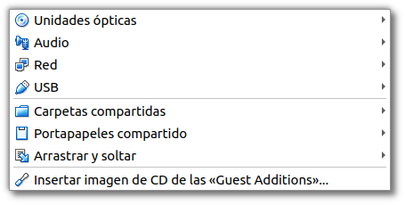
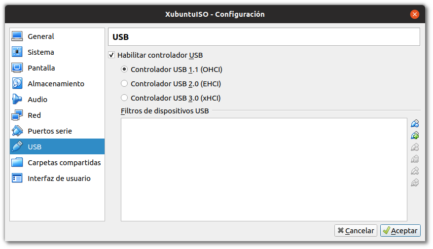
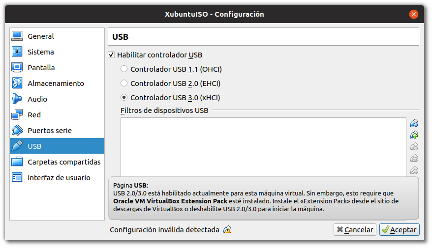

\newpage

# Recursos compartidos

Hemos visto como se gestiona la red y los recursos de red en los sistemas de virtualización. Además de la red, existen otros como discos duros USB, Carpetas Compartidas entre máquinas, audio de los sistemas virtualizados, portapapeles, etc. que debemos saber configurar ya que nos permitirán trabajar mejor y establecer mejores soluciones entre sistemas. 


\

## Permisos y vboxusers

En GNU/LinuX el acceso a los diferentes dispositivos hardware por parte de los usuarios (ya veremos más adelante todo esto en profundidad) está gestionado mediante pertenencia a grupos de usuarios. 

Cuando instalamos VirtualBox en GNU/Linux, este añade un grupo de usuarios que es **vboxusers**, todos los usuarios que vayan a utilizar el VirtualBox, si queremos tener acceso a todas las prestaciones y operaciones posibles, debemos añadir ese grupo a los usuarios. Para ello, bastará con que ejecutemos en el terminal:

```shell
sudo adduser NOMBRE_USUARIO vboxusers
```

donde **NOMBRE_USUARIO** es el *login* del usuario que va a utilizar el VirtualBox. 

Una vez realizada esta operación es necesario reiniciar, ya que los grupos y permisos son comprobados y establecidos durante el arranque de la máquina.

## Audio

VirtualBox nos permite configurar el sistema de audio de la Máquina Virtual para que suene a través del sistema de sonido del anfitrión (Hipervisor). 

## Puertos Serie

Los puertos serie también pueden ser emulados dentro de las máquinas virtuales, esto puede ser usado para hacer *debug* o interactuar con algunos sistemas cuyo mecanismo de comunicación no es el habitual. 

## USB 

Muchas veces cuando estemos trabajando con las máquinas virtuales necesitaremos copiar algo *dentro* o *desde* una memória USB que conectamos al hipervisor, así como configurar ciertos dispositivos hardware dentro del sistema virtualizado. 

En el menú de USB de la configuración de la MV podremos habilitar la compatibilidad con los dispositivos USB. Por defecto el modo de compatibilidad es 1.1, y este modo no nos dará ningún problema ya que viene por defecto en todos los VirtualBox, sin embargo si deseamos habilitar el USB 2.0 o el 3.0, se nos indica que debemos instalar el *Extension Pack* de VirtualBox para permitir el uso de este tipo de dispositivos. 


\

En caso de que no lo tengamos instalado en el hipervisor e intentemos arrancar una máquina que si que tiene estas características habilitadas, lo que ocurrirá es que no arrancará y nos mostrará un mensaje de error acerca del USB.


\

Los dispositivos USB que conectemos al VirtualBox, se dejarán de ver en el hipervisor, ya que el módulo del VirtualBox se *hará cargo* de los dispositivos y no le permitirá al hipervisor administrarlos. Esto lo tendremos que indicar en cada arranque de la máquina virtual, o establecer un filtro. Esto lo veremos una práctica.

## Carpetas compartidas

Las carpetas compartidas es uno de los recursos más útiles que encontraremos en el VirtualBox, ya que nos permitirá el paso de ficheros cómodamente entre el hipervisor y el sistema virtualizado.

Veremos en una práctica como configurarlas, así como los permisos necesarios para poder hacer uso de las carpetas en los sistemas virtualizados.

Estas carpetas pueden estar configuradas para permitir tan solo operaciones de lectura en los sistemas virtualizados, o configuradas en modo lectura-escritura (bidireccional) de tal manera que nos permiten pasar ficheros entre ambos sistemas, o más en el caso de que tengamos la carpeta compartida entre varias máquinas virtuales en el mismo hipervisor.
