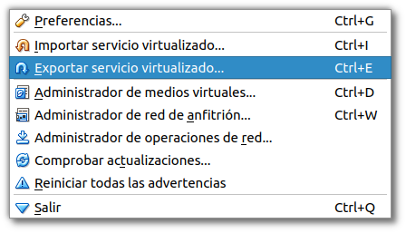
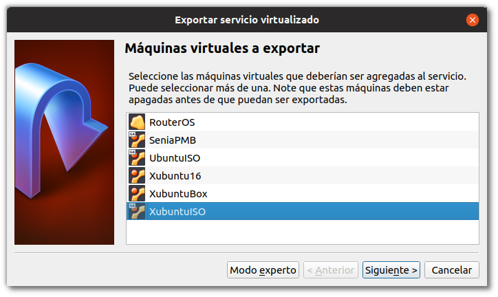
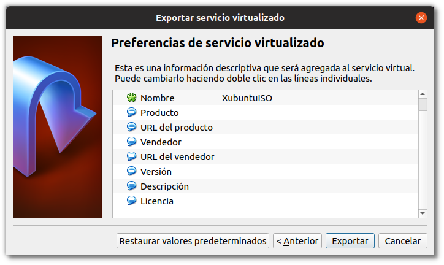
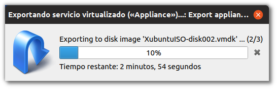

\newpage

# Exportación de Servicios Virtualizados

Ya conocemos el uso básico de VirtualBox, somos capaces de instalar un Sistema Operativo Virtualizado, prepararlo para realizar determinadas acciones, compartir el portapapeles, montar carpetas compartidas,...

Ahora vamos a ver como se exportan las máquinas virtuales de tal manera que todo lo que hemos configurado en un hipervisor pueda ser importado por otro/s. Esto lo utilizaremos muchas veces a lo largo del curso, ya que cuando tengamos determinadas configuraciones instaladas y preparadas en las MVs, las exportaremos para poder *desplegarlas* (poner en marcha de nuevo) en otros hipervisores, o en el nuestro mismo para realizar tareas de comprobación, configuración, etc.

\newpage

## Menú

VirtualBox nos ofrece un menú en *Archivo* que al hacer Click nos muestra las siguientes opciones:

\

Seleccionaremos la opción: **Exportar servicio Virtualizado**

\newpage

## Exportar servicio virtualizado

Nos aparecerá una ventana donde se nos indicará que seleccionenmos cual/es de nuestras máquinas deseamos exportar:

\

\newpage

## Configuración de la exportación

Se nos permiten añadir datos a la exportación, tales como la licencia, el autor, etc. 

\

## Progreso de la exportación

Una vez hayamos rellenado los datos, se lanzará un proceso que nos prepará un fichero **.ova** que contendrá nuestra máquina virtual, así como las configuraciones que se hayan aplicado. Este proceso puede resultar más o menos lentos depeniendo del dispositivo destino y del tamaño de la MV.

\
