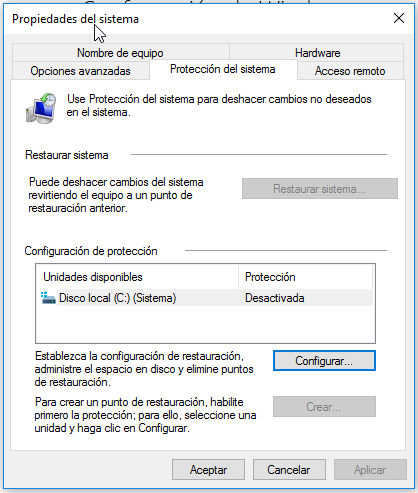
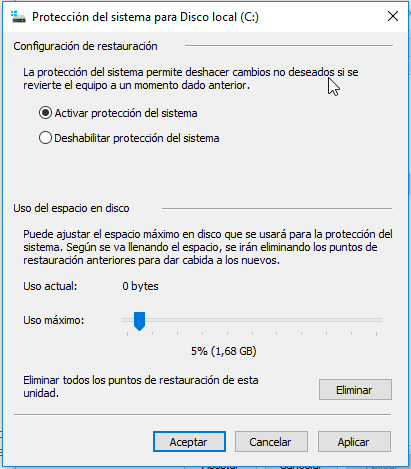
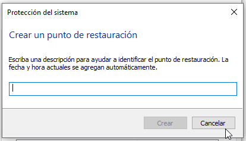
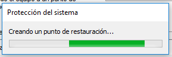
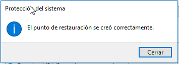
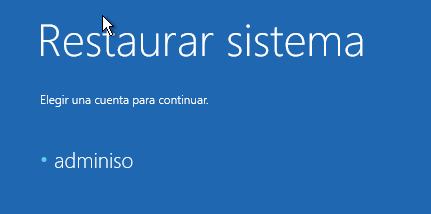
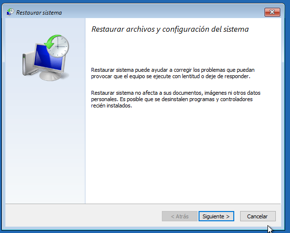
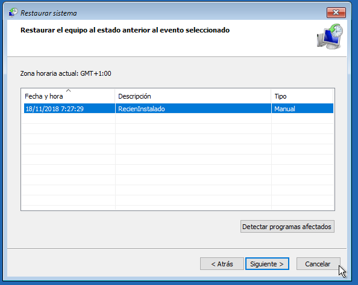
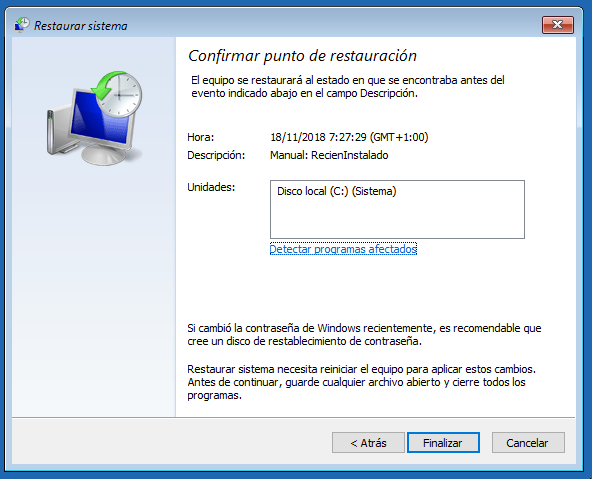
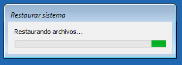

# Tarea: Crear punto de restauración

En esta tarea vamos a crear un punto de restauración en la máquina virtual de Windows 10 para poder restaurar el estado en el caso de que algún proceso de configuración o instalación no dé los resultados esperados.

## ¿Qué es un punto de restauración?

Un punto de restauración es como una *partida guardada* en los videojuegos, se trata de guardar la configuración y estado de las actualizaciones, así como los programas y datos del usuario y poder volver a este estado si lo deseamos desde el menú de restauración. Estos *puntos de restauración* ocupan un espacio en el disco duro, sin embargo es una buena idea configurarlos en los sistemas que son propensos a ser reinstalados, de tal manera que en vez de reinstalar Windows, podremos *cargar* este estado y el usuario podrá seguir utilizando el ordenador en mucho menos tiempo y con menos pérdida de datos. 

La creación de estos puntos de restauración no evita que se realicen copias de seguridad de los datos personales de los usuarios tales como Documentos, fotos, etc. Ya que si ocurre un fallo en el disco duro (por ejemplo), seguramente tampoco podremos restaurarlos.

## Habilitar la protección

Para crear ese punto de restauración, iremos a **Configuración** y en la búsqueda buscarmeos *Crear punto de restauración*. Nos aparecerá esta ventana:

\ 

No nos deja crear el punto de restauración a menos que habilitemos la configurar de protección. Para ello pulsamos el botón **Configurar** y dejamos las opciones como se muestra en la captura:

\ 

En el apartado que seleccionamos el uso máximo del disco deberemos tener en cuenta de cuanto Disco Duro dispone el equipo y cuanto queremos utilizar para almacenar puntos de restauración.

## Crear el punto

Una vez tenemos habilitada la protección, crearemos el punto de punto de restauración, pulsando el botón **Crear**.

\ 

Se nos lanzará el proceso de creación.

\ 

\ 

Una vez creado el punto de restauración, reiniciaremos el equipo y lo restauraremos, para comprobar que se ha creado correctamente.

## Restaurar desde ese punto

Arrancaremos en **modo seguro** tal y como hemos visto en teoría y seleccionaremos la opción **Solucionar problemas**, **Opciones avanzadas** , **Restaurar sistema**.

Nos pedirá el usuario administrador para restaurar el equipo.

\ 

Y a continuación un pequeño asistente nos guiará para restaurar el equipo.

\ 

Si tenemos múltiples puntos de restauración en esta ventana se nos permitirá elegir el que deseemos. 

\ 

Una vez tengamos claro que punto de restauración vamos a utilizar, lo seleccionamos y nos mostrará un resumen con las operaciones que van a tener lugar.

\ 

El proceso tardará un tiempo, dependiendo del punto de restauración elegido y de la potencia del equipo.

\ 

## Ejercicio 1

Crea un punto de restauración en la máquina virtual con Windows 10 que has instalado en tareas anteriores.

## Ejercicio 1

Ahora que hemos visto como se realiza un punto de restauración, reflexiona sobre qué ordenadores de una empresa puede ser más importante aplicar este tipo de medidas de seguridad.

## Ejercicio 2

La creación de puntos de restauración no exime de la creación de copias de seguridad en unidades externas. ¿Porqué?.
