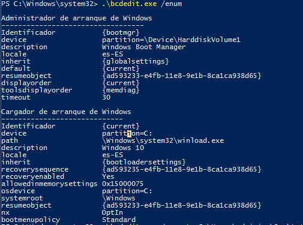
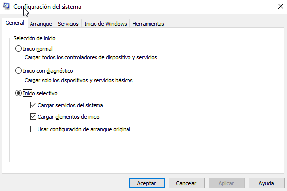
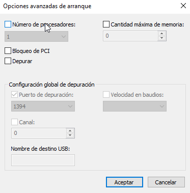
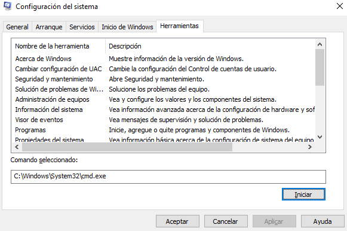

# Tarea: BCDEdit  y MSConfig

Hemos visto en teoría como funciona el arranque de Windows, cuales son los pasos que se siguen y como el sistema arranca. 

Sin embargo hay veces que debemos modificar el arranque desde el símbolo de sistema, ya que el entorno gráfico no es capaz de arrancar, para ello podemos utilizar el comando **bcedit.exe** que nos permite modificar la base de datos **BCD** que contiene la configuración básica del arranque.

Vamos a realizar dos sencillas tareas mediante el uso de este comando.

## Obtener Información

Para obtener información acerca la base de datos, basta con lanzar desde powershell (ejecutado como administrador), el comando :

``` shell
bcdedit /enum
```


\ 

Esto nos mostrará la información de la **BCD** de los sistemas instalados.

¿Cual es la ruta donde se encuentra el comando `winload.exe` del Sistema Operativo *default*?

Adjunta una captura de la salida del comando anterior y una respuesta razonada a la pregunta.

## Copia de seguridad

Se puede realizar una copia de seguridad de la configuración de arranque utilizando bcdedit.

``` shell
bcdedit /export C:\Users\adminiso\Desktop\copiaBCD.dat
```

Ese comando también nos permite la ejecución de :

``` shell
bcdedit /import C:\Users\adminiso\Desktop\copiaBCD.dat
```

## Ejercicio 1

¿Qué acción realiza esta opcion `/import RUTA_AL_FICHERO`?

\newpage 

## msconfig 

Msconfig es un programa que nos permite editar de manera gráfica la información contenida en la base de datos **BCD** y gestionar los procesos que se inician de manera automática en el arranque de Windows.

Para ejecutarlo, podemos pulsar el botón Windows, y escribir `msconfig` y la aplicación se pondrá en marcha.

### General


\ 

En la primera pestaña, nos ofrece información acerca de la configuración del arranque, nos permite establecer el modo en el que el sistema arrancará la siguiente vez.

* Inicio Normal
* Inicio con diagnóstico
* Inicio selectivo 

Si estamos teniendo problemas con el hardware, o problemas de la red derivados de troyanos, virus, etc. sería conveniente marcar *Inicio con diagnóstico*.

Si marcamos Inicio selectivo, podemos elegir más precisa cuales serán los servicios que se iniciarán automáticamente.

### Arranque

Esta pestaña accede al fichero BCD y nos permite mostrar las opciones que hemos visto utilizando `bcdedit`, pero de manera gráfica.

Podemos marcar cada opción, aplicar y ejecutar `bcdedit /enum` y ver como cambia la información que nos muestra.

Algunas opciones interesantes:

* Sin arranque de GUI: No pondrá en marcha el entorno gráfico.
* Registro de arranque: Mostrará todos los mensajes que se producen durante el arranque.
* Video base: No carga drivers avanzados de la gráfica, mostrando una resolución mínima.
* Información de arranque del SO: Mostrará información acerca del arranque del SO.

Los cambios que apliquemos aquí **solo** aplicarán al siguiente arranque, si deseamos que sean permanentes, debemos marcar la opción:

> Convertir en permanente toda la configuración de arranque.

En *Opciones avanzadas*, podemos precisar más aún algunas opciones.


\ 

### Servicios

Aquí aparecen los servicios que tenemos marcados para arrancar durante el proces de arranque.

### Inicio de Windows

En este apartado podemos desmarcar aquellos procesos que se inician cuando el usuario se ha *logado*. Es uno de los lugares más visitados para desmarcar servicios y aplicaciones que se han instalado de manera indeseada.

### Herramientas

En este apartado nos encontramos una serie utilidades que pueden ser útiles para resolver el/los problemas que estemos teniendo.


\

\newpage

## Ejercicio 2

Obtén la ruta de las siguientes herramientas para poder lanzarlas más rápidamente.

| Herramienta                  | Ruta |
| ------------                 | ---- |
| Acerca de Windows            |      |
| Cambiar configuración de UAC |      |
| Información del sistema      |      |
| Visor de eventos             |      |
| Programas                    |      |
| Administración de equipos    |      |
