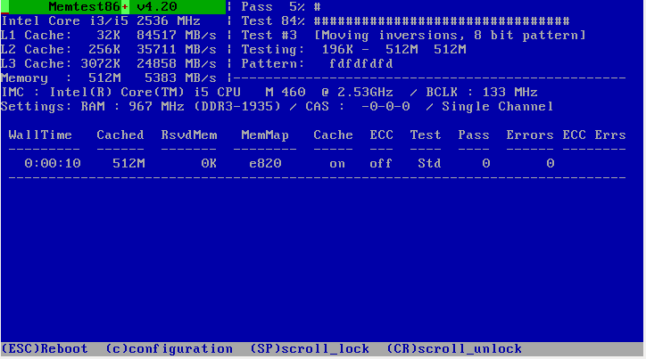

# Tarea: Memtest86+

## Ejercicio 1

Instala la opción de menú para lanzar el Memtest86 desde el GRUB y describe qué es lo que comprueba este software. Para ello ejecuta estas órdenes en el terminal:

```shell
sudo apt update
sudo apt install memtest86+
sudo update-grub
```

Reinicia la máquina.



Adjunta captura/foto del resultado en ejecución.