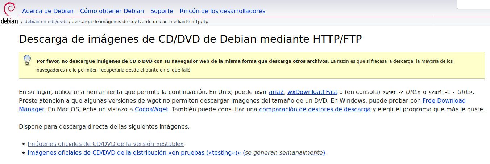
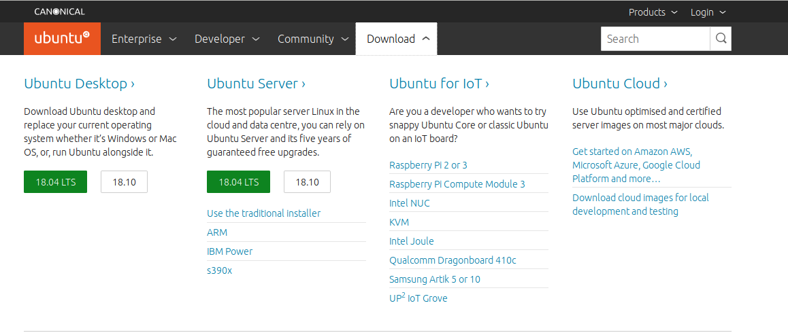
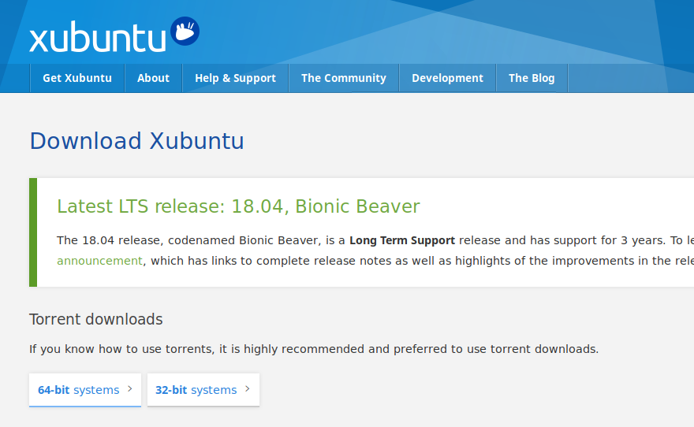
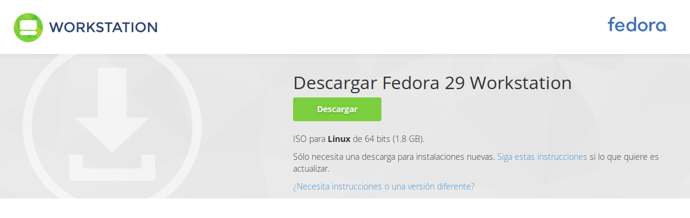

\newpage

# Obtener LinuX

Ya hemos visto en Unidades anteriores que existen multitud de distribuciones GNU/LinuX, cada una preparada para resolver un conjunto de problemas y suministrar un _ecosistema_ de aplicaciones al usuario que le permita trabajar con ella e integrar al SO en el Sistema Informático que esté administrando.

## Páginas de las Distribuciones

Las páginas de las distribuciones (_distros_) son los lugares a los que acudiremos para descargar de manera _oficial_ los Sistemas que instalaremos. En estas páginas además de permitirnos descargar las imágenes de instalación (_en caso de que se trata de una distribución de Software Libre_), nos suministran muchas veces los archivos .torrent y las sumas de verificación de las imágenes, que nos permitirán saber si la iso que hemos descargado es la correcta, o hemos sufrido un ataque, o se ha dañado en la descarga.

Se muestran a continuación una serie de páginas de descarga de algunas de las distros más famosas:

\

[Debian](https://www.debian.org/CD/http-ftp/#stable)

-------

\

[Ubuntu](https://www.ubuntu.com/)

-------

\

[Xubuntu](https://xubuntu.org/)

-------

\

[Lubuntu](https://lubuntu.net/)

-------

\

[Fedora](https://getfedora.org/es/)

-------
