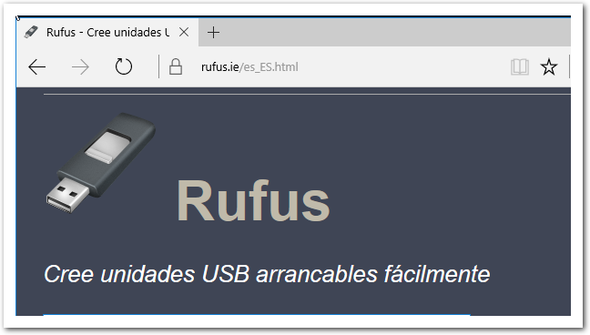
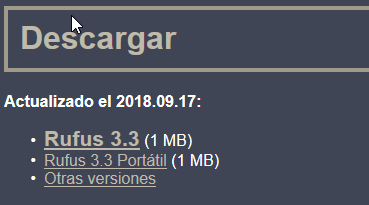
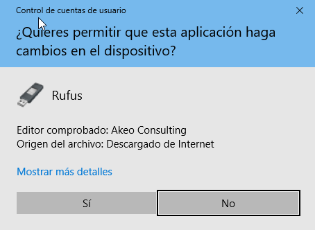
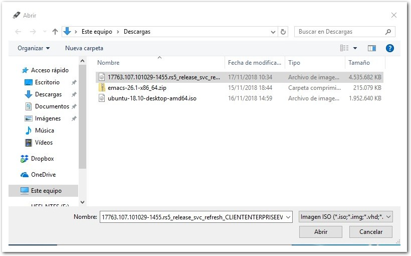
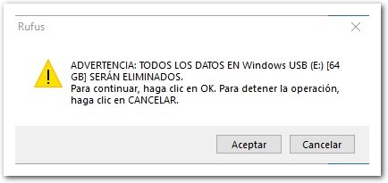
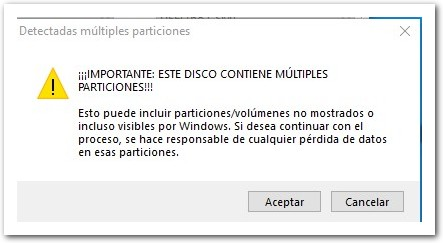
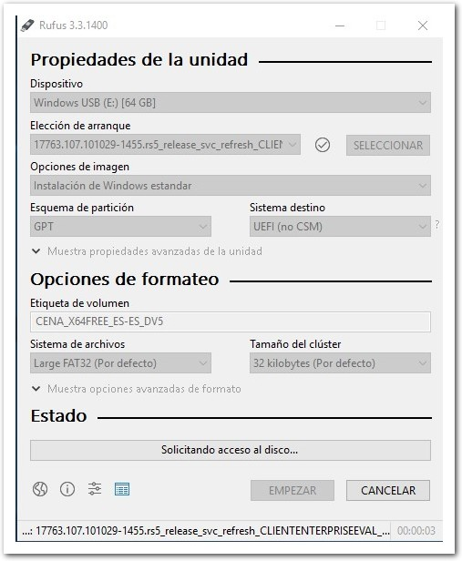
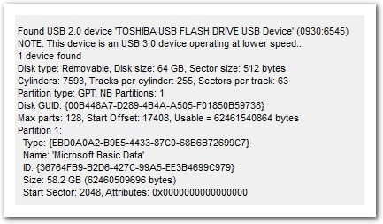

\newpage 

# Imágenes ISO

Cuando en la práctica hemos instalado Windows o anteriormente Xubuntu en el VirtualBox, no nos ha hecho falta grabar la imágen *iso* en ningún medio ni dispositivo, ya que el VirtualBox nos permite simular la *conexión* de esa imagen via el fichero .iso que nos hemos descargado.

Sin embargo, si deseamos realizar una instalación en una máquina física *real*, debemos crear esa imagen de instalación en algún medio extraible o en uno que la máquina destino pueda aceptar como disco de arranque.

Las imagenes ISO, o ficheros de imágen, son copias exactas para ser grabadas en CD/DVDs o más comúnmente en memórias USB.

Ya que se trata de imágenes, no basta con copiar el archivo en nuestro USB para que al colocarlo en un ordenador arranque, necesitamos *grabarlo* como si se tratara de un CD/DVD. 

Existen multitud de herramientas que nos permiten realizar esta operación. A continuación veremos algunas de las más usadas.

# Grabación de imágenes [Rufus]

Rufus es un software Libre que podemos encontrar en internet que nos permite en sistemas Windows grabar imágenes tanto de Windows como de GNU/LinuX o multitud de sistemas.

## Instalación de Rufus

La página web del proyecto es:

[Rufus](http://rufus.ie "Página del proyecto")

\ 

En está página, podemos descargar el software directamente.

\ 

Una vez tenemos descargado Rufus, lo lanzamos y nos preguntará si deseamos permitir que esta aplicación realize cambios en el dispositivo.

\ 

Esto lo veremos más adelante, pero es necesario pulsar que "Sí" ya que necesitamos acceder a los dispositivos como administradores para poder realizar operaciones de grabación.

\newpage 

## Ventana principal

Rufus nos ofrece una serie de opciones que son comunes a la mayoria de los programas que nos permiten realizar operaciones de grabado de imágenes.

\ 

En la parte superior nos permite elegir cual será el dispositivo que será utilizado como destino para la imagen de disco y el desplegable etiquetado como *Elección de Arranque* nos permite seleccionar el archivo *.iso* que grabaremos en ese dispositivo.

Los apartados de *Esquema de partición* y *Sistema destino*, nos permite seleccionar cual será el formato del disco y en que tipo de sistema lo arrancaremos.

| Esquema | Sistema destino   | Descripción                                               |
| ------- | ---------------   | -----------                                               |
| MBR     | BIOS o (UEFI-CSM) | Ordenadores antiguos o con UEFI en modo de compatibilidad |
| MBR     | UEFI              | Ordenadores con UEFI sin modo de compatibilidad.          |
| GPT     | UEFI              | Ordenadores con UEFI sin modo de compatibilidad           |
| 

Más adelante en el temario del módulo veremos las diferencias entre GPT y MBR para las particiones de disco. Por ahora basta con saber que si tenemos UEFI es recomendable que utilicemos GPT+UEFI.

Las opciones de formateo, por ahora dejaremos al software que elija las opciones por defecto para el formateo de los discos de destino. 

Seleccionaremos el archivo de instalación de Windows que hemos descargado previamente.

\ 

## Estado

Cuando pulsamos el botón de *Empezar*, Rufus nos muestra un aviso indicándonos que todos los datos del USB será borrados.

\ 

Si el disco contiene múltiples particiones también nos lo indicará.

\ 

A continuación, el software copiará todos los ficheros de la imágen y realizará algunos ajustes adicionales dependiendo del formato y de la imágen de origen.

\ 

Si pulsamos en detalles, nos aparece una ventana que nos indica cual es proceso que está realizando *rufus* para la creación del disco de arranque.

\newpage 

## Finalización

Cuando finaliza, comprueba que los datos han sido grabados y que ahora el USB contiene los los datos en el formato que es necesario para que luego un ordenador arranque e instale desde ese USB.

\ 
