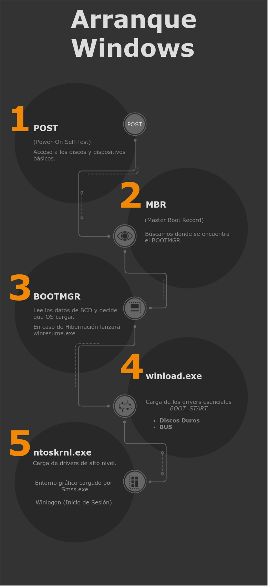

\newpage

# Proceso de Arranque de Windows

Para entender el proceso de arranque de Windows, primero debemos conocer los ficheros que son importantes para este proceso de arranque. Ya que en el caso de que tengamos un problema durante el arranque o un fallo en la configuración, conocer como funciona y cual es el orden en el que estos ficheros se van leyendo y ejecutando.

## Windows Boot Manager (BOOTMGR)

Windows Boot Manager (BOOTMGR) es el cargador de arranque utilizado por Microsoft Windows, la primera vez que apareció fué en Windows Vista, se utiliza en todas las versiones posteriores de Windows, incluyendo las versiones **servidoras** (Windows Server 2012, 2016,...). En versiones anteriores (XP, etc.) se utilizaba NTLDR.

BOOTMGR es un fichero de **solo lectura** que está oculto y situado en la carpeta raiz de la partición marcada como *System Reserved* (Reservada para el Sistema).

## Boot Configuration Data (BCD)

Boot Configuration Data (BCD) es la base de dataos de la configuracón del arrnque, que el disco duro almacena en un formato similar al del registro de Windows.  Windows Vista y las versiones posteriores utilizan esta base de datos (BCD) para cargar el Sistema Operativo o las aplicaciones y servicios que se lanzan en el arranque, como por ejemplo el comprobador de problemas de memoria. Los sistemas operativos anteriores como XP utilizaban el fichero **BOOT.INI**. Esta información de arranque (BCD) esta almacenada en un fichero que tiene el mismo formato que el registro de Windows y ademas está montada como clave de registro en :

```shell
HKEY_LOCAL_MACHINE\BCD00000
```

### Sobre UEFI

Si nos encontramos en un arranque sobre UEFI está en :

```shell
\EFI\Microsoft\Boot\BCD 
```
en la particion EFI.

### Sobre BIOS

En el caso de que estemos arrancando sobre BIOS el fichero está en 

```shell
\boot\BCD 
```

de la partición **activa**.

### Modificación

Para modificar los datos de la BCD debemos utilizar uno de los siguientes mecanismos:

* Uso del comando **bcdedit.exe** (lo veremos en las prácticas).
* Uso del regedit (Desaconsejado).
* Utilizando Windows Management Instrumentation (WMI).
* Uso de aplicaciones de terceros : EasyBCD, BOOTICE, Visual BCD Editor, ...

\newpage 

## Winload.exe 

**Winload.exe** es el cargador del sistema operativo que *BOOTMGR* pone en marcha. La tarea de **winload.exe** es cargar los drivers esenciales (*BOOT_START*) y el núcleo del sistema (*kernel*): **ntoskrnl.exe**. **Winload.exe** combinado con **BOOTMGR** realizan las mismas funcionalidades que en versiones anteriores se ejecutaban con *NTLDR*.

## Winresume.exe

Si la base de datos BCD contiene información acerca de una imagen de hibernación, **BOOTMGR** informa a **Winresume.exe** de que esto ha ocurrido. Winresume.exe lee la imagen de hibernación y la carga en la RAM, de tal manera que reducimos el tiempo de arranque y se cargan las aplicaciones que el usuario hubiera dejado en marcha.

> **NOTA**: Esto provoca algunos problemas en arranques duales y particiones NTFS que estén compartidas entre Windows y LinuX (esto lo veremos más adelante en una práctica).

Con esto habríamos visto los ficheros más importante durante el arranque así que vamos a ver ahora el arranque.

\newpage 

## Pasos de arranque

La UEFI o BIOS realiza el **POST** (*power-on self-test*). Durante este POST, se realizan una serie de comprobaciones acerca de Hardware incompatible, dispositivos desconectados, avisos acerca de problemas etc. Es la **BIOS** o **UEFI** (dependiendo de cual tengamos en el equipo, el que permite al equipo acceder a los dispositivos como teclados, discos duros, pantallas, etc. Antes incluso de que el Sistema Operativo haya arrancado.

El ordenador utiliza esta información que le proporciona la **BIOS** o **UEFI** para localizar un disco duro en el equipo que contenga un **MBR** (*Master Boot Record*) en el primer sector del disco duro (que son los primeros *512 bytes*). Este **MBR** contiene información acerca de la partición activa del disco duro y donde se encuentra nuestro **BOOTMGR** que es cargado para ejecutarse.

Una vez el **BOOTMGR** es lanzado , este lee la información BCD de la partición activa, obteniendo la información sobre los sistemas operativos instalados y en caso de que hubiera más de uno, mostraría un menú de arranque.

Una vez se ha seleccionado el Sistema operativo que va a ser arrancado, **BOOTMGR** transfiere el control a **winload.exe** o llama a **winresume.exe** si la máquina habia sido hibernada. Si hubieramos seleccionado un sistema operativo antiguo, como por ejemplo XP, **BOOTMGR** habría transferido el control a **NTLDR**.

En el caso de que cargemos **winload.exe** , este inicializará la memoria y cargará los drivers que deben ser inicializados en primer lugar. Estos son los drivers denominados *BOOT_START* drivers y son aquellos que manejan los dispositivos más importantes para el arranque:

* Controladores de disco.
* Controladores de bus.

Una vez todo esto ha sido cargado, **winload.exe** le pasa el control a **ntoskrnl.exe**, que es el núcleo del sistema operativo.

Este es el responsable de cargar los drivers de más alto nivel (excepto los *BOOT_START* y los servicios. En esta fase ya se muestra en la pantalla que estamos entrando en el entorno grafico a medida que el controlador de sesiones (**Smss.exe**) inicializa el subsistema de Windows.

Ahora se carga el servicio de *Winlogon*, que es el encargado de mostrar la ventana de inicio de sesión. Una vez el usuario ha introducido correctamente su usuario y contraseña, *Windows explorer* se carga.

## Resumen del arranque en Windows


