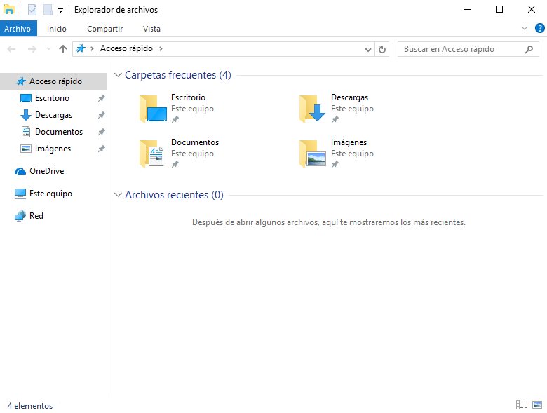
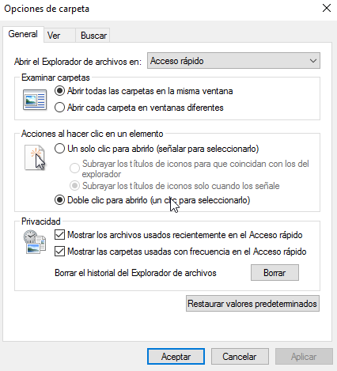
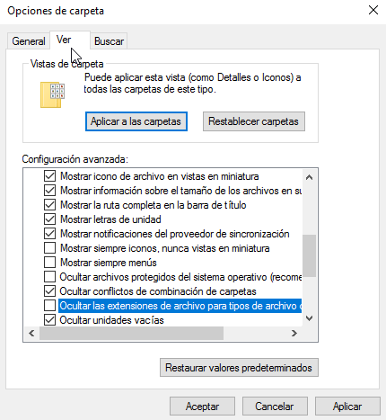

# Tarea: Configuración básica del Explorador de Ficheros

Para la realización de las prácticas y las tareas que vamos a ir desarrollando en las unidades siguientes, es necesario que configuremos el Explorador de Ficheros de Windows para que *no* nos oculte cierta información. 

A medida que los sistemas Operativos han ido avanzando, han añadido capas de abstracción entre lo que realmente ocurre en el sistema y el usuario.

En los viejos sistemas de línea de comandos, el conocimiento de como funcionaba el sistema era un requisito para la posible interacción con el mismo, sin embargo hoy en dia los sistemas ocultan gran parte de la información con el objetivo de que el usuario no tenga que preocuparse, ofreciendo una interfaz más *limpia*.

Sin embargo, nosotros vamos a ser Administradores de Sistemas y es conveniente que sepamos lo que está ocurriendo en nuestros equipos. 

Vamos a configurar unas pequeñas opciones del explorador de ficheros de Windows, que nos permitirán trabajar de manera más efectiva con los directorios y ficheros.

Si abrimos el explorador de ficheros (`Win+E`), la pantalla que nos muestra es la siguiente:

\

Vamos a modificar una serie de opciones, para ello iremos a la opción :

> Vista -> Opciones -> Cambiar opciones de carpeta y búsqueda

\

Se nos abrirás las opciones de carpeta:

\

Desmarcaremos las dos opciones de privacidad

Ahora en la pestaña de "*Ver*", marcaremos las siguientes opciones:

 - [X] Mostrar la ruta completa en la barra de titulo
 - ...
 - [ ] Ocultar archivos protegidos del sistema operativo
 - ...
 - [ ] Ocultar las extensiones de archivo para tipos de archivo conocidos
 

\

## Ejercicio 1

Después de realizar estas acciones, explora un poco las carpetas del equipo. Anota los ficheros que "*han aparecido*". 

## Ejercicio 2

¿Porqué cree es que es una buena idea no ocultar las extensiones de archivos para los archivos conocidos?

