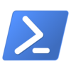

\newpage 

## CMD

CMD, también conocido como *símbolo de sistema*, es el intérprete de comandos en los sistemas Windows.

El ejecutable es `cmd.exe` y se trata de una aplicación que podemos encontrar en todos los sistemas Windows.

### Un poco de historia

`cmd.exe` es el sucesor de `command.com`, de los sistemas *MS-DOS* y *Windows9x*. En aquellos sistemas, el intérprete de ordenes también era el encargado de cargar la configuración al arrancar el sistema.

`cmd.exe` ya no tiene este cometido.

### CMD vs PowerShell

El símbolo de sistema ha sido una de las herramientas más utilizadas por parte de los administradores de sistemas en Windows para realizar tareas, sin embargo, ha sido superado por una de las herramientas más versátiles para los administradores que se ha desarrollado Microsoft : **PowerShell**. 

Desde Noviembre de 2017, **PowerShell** ha ido ganando terreno en las builds de Windows 10, siendo ya el intérprete por defecto cuando se pulsan las teclas `Win+X` o en el explorador de ficheos.

[Microsoft: Build de Noviembre ](https://blogs.windows.com/windowsexperience/2016/11/17/announcing-windows-10-insider-preview-build-14971-for-pc/)

En algunás páginas de Internet relacionadas con los Sistemas Operativos a este cambio que se produjo en esa actualización se le denomina *la Venerable vs la Versátil*.

\newpage 

## PowerShell


\ 

**PowerShell** es el intéprete que veremos en el módulo con mayor profundidad en Sistemas Windows. Ofrece una serie de características pensadas sobretodo para los administradores de sistemas (nosotros). Con el propósito de automatizar tareas y realizarlas de manera más controlada.

A medida que Microsoft ha ido apoyando al Software Libre ha ido abriendo proyectos suyos y uno de ellos es **PowerShell**, que fué subido a *GitHub* en agosto de 2016 y cuya licencia ha sido cambiada a **MIT** en la versión 6.

La riqueza de **PowerShell** se debe sobretodo a que todo son *Objetos*, no se trata de una shell que trabaja con cadenas de texto, sino que tanto los resultados, las variables y las operaciones están orientadas a objetos. Esto se debe al uso de *.NET Framework*. Este tipo de aproximación a la programación es habitual en los desarrolladores de aplicaciones, pero no lo es tanto por parte de los administradores de sistemas.

### cmdlets

Se trata de los *comandos* básicos en **PowerShell**, están orientados a realizar una tarea concreta. Sus nombres constan de dos partes:
<*verbo*>-<*nombre*>.

La parte del *verbo* indica la acción que se va a realizar con la ejecución del *cmdlet* y la parte del *nombre* indica el recurso sobre el que el *cmdlet *va a realizar la acción. 

| verbo | acción |
| ----- | ------ |
| Enable| Habilita el objeto|
|Disable| Deshabilita el objeto|
|Install| Instala el objeto |
|Uninstall|  Desinstala el objeto|
|Move|  Mueve el objeto|
|New|  Crea información|
|Get|  Obtiene información|
|Set|  Modifica información|
|Test|  Testea información|
|Remove|  Borra información|

### Parámetros

Los parámetros (*argumentos*) son los modificadores que se añaden a un comando para cambiar el modo de ejecución de dicho comando. 

``` powershell
Get-ChildItem -Name w*
```

Nos devolverá aquellos directorios y ficheros que comiencen por *w* en la carpeta en la que estemos.

### Tuberias | 

Uno de los conceptos más complicados, y más potentes y utilizados en la administración de sistemas. Se trata que el resultado de la ejecución de un comando puede ser enviado como entrada del siguiente.

``` powershell
Get-Process | sort -Descending id
```

**Get-Process** nos muestra el listado de procesos, lo pasa a **sort** y este nos lo muestra de manera descendente por **id**


### Archivos .ps1

Cuando estemos desarrollando scripts, debemos guardarlos en ficheros con la extensión **.ps1**. Estos archivos serán interpretados por **PowerShell** y el código que contengan será ejecutado.

### Ayuda en PowerShell

No hace falta que nos aprendamos de memoria todas las opciones de los comandos, el primer motivo es porque *normalmente* dispondremos de internet, pero a veces (más a menudo de lo que imaginamos) nos encontramos en lugares donde no es fácil encontrar conectividad. 

PowerShell ofrece ayuda acerca de los **cmdlets** (*comandos*), que podemos consultar ejecutando:

* `get-help comando` : Ayuda estándar
* `get-help comando -detailed` : Ayuda detallada con ejemplos de uso
* `get-help comando -full`: Ayuda detallada, ejemplos y consideraciones técnicas.

### Política de ejecución de scripts

Debido a que la línea de comandos es una herramienta muy versátil y nos permite hacer *casi* cualquier cosa, debemos tener en cuenta también la seguridad y los privilegios con los que ejecutaremos estos scripts, ya sea porque estamos depurándolos nosotros, ya sea porque no debemos permitir a *orígenes desconocidos* ejecutar comandos en nuestros sistemas.

Por ahora vamos a habilitar la ejecución de los scripts : **sin restricción** (*Unrestricted*).

Ya vimos en la configuración básica del equipo como se podía habilitar vía interfaz gráfica, pero también podemos establecer esta política desde la línea de comandos ejecutando:

``` powershell
Set-ExecutionPolicy -ExecutionPolicy Unrestricted
```

Para establecer esto desde **PowerShell** debemos lanzarlo como administrador:

Botón derecho sobre el icono de **PowerShell** y marcar la opción de *Lanzar como administrador*

