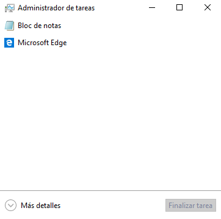
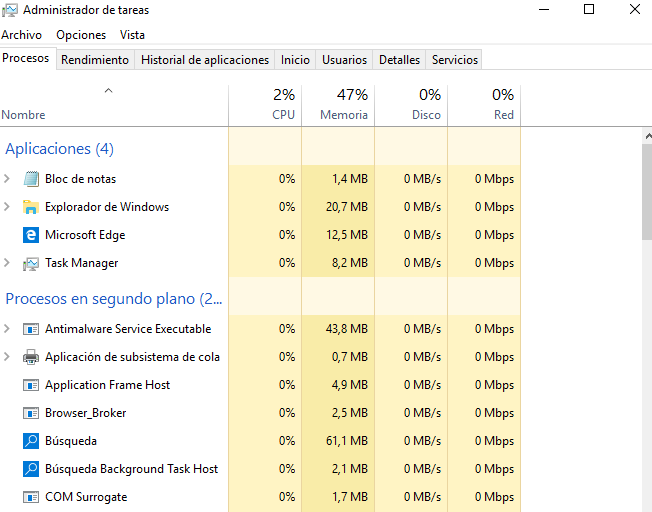
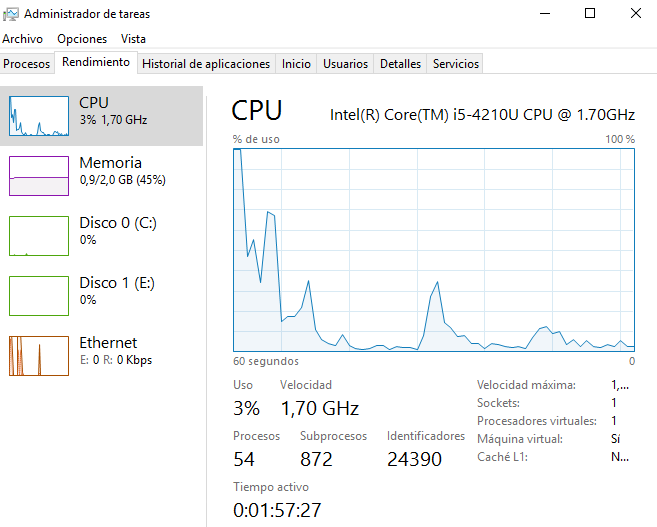
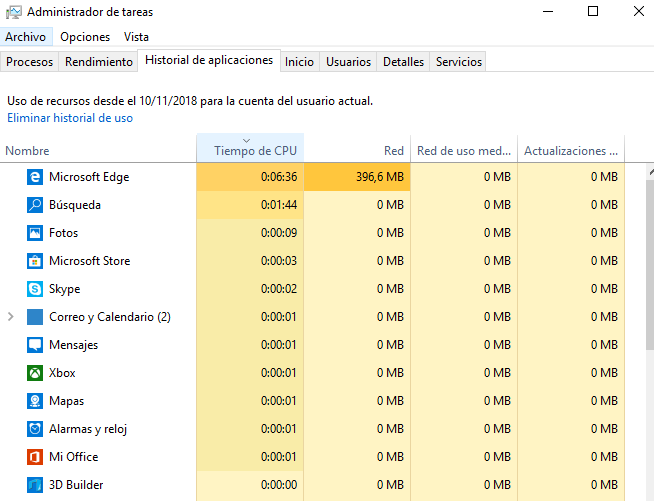
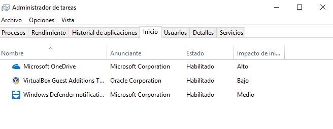
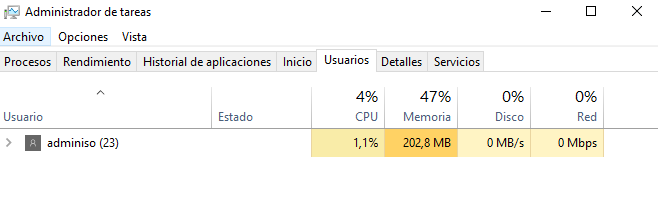
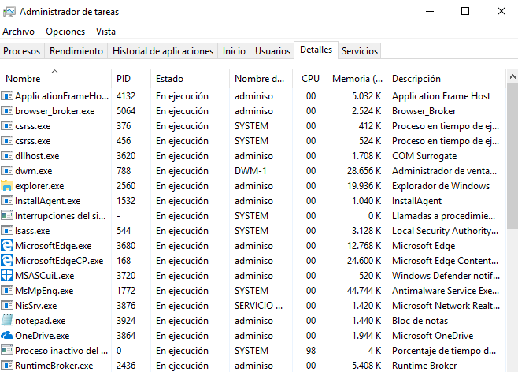

## Procesos en Windows : Administrador de tareas

Cuando un proceso toma el control de un ordenador, sin ofrecer respuesta al sistema operativo, es responsabilidad del Sistema detenerlo, sin embargo, puede ser que ese proceso esté trabajando con datos valiosos, o realizando tareas para las que necesita todos los recursos, por eso muchas veces el Sistema marca el proceso como *Inactivo* (No responde), y nosotros debemos ir al Administrador de Tareas y detenerlo.

Para ir al administrador de Tareas de un Windows, pulsaremos la combinación de teclas : `Ctrl+Alt+Del` (Todo un clásico), y si el menú estuviera funcionando todavía, lo tenemos en : botón derecho sobre el icono de inicio de Windows: *Administrador de Tareas*.

> NOTA : En caso de que estemos trabajando con un Windows Virtualizado mediante VirtualBox, la combinación de teclas ha de ser introducida mediante : `Ctrl (derecho)+Del`, o mediante el menú de VirtualBox.

\ 

Aquí se muestran las aplicaciones que tenemos en marcha, sin embargo, al igual que pasaba con el explorador de ficheros, Windows nos está ocultando mucha información (por si somos usuarios de escritorio), para obtener más información podemos pulsar en *Más Detalles*.

### Detalles

\

Aquí ya vemos mucha más información acerca de los procesos, las aplicaciones (ventanas que tenemos abiertas) y los procesos que están en marcha, sin utilizar ventanas.

Las columnas nos muestran el porcentaje de los recursos que están utilizando cada uno de los procesos y aplicaciones.

* CPU
* Memoria
* Disco
* Red

Estas columnas son muy útiles para saber que procesos están utilizando determinados recursos, por ejemplo si vemos que la red va excesivamente lenta, podríamos auditar que procesos están haciendo uso de ella.

### Rendimiento

\

Aquí se muestra el rendimiento que está teniendo nuestro sistema, el tiempo que lleva encendido, el número de procesos activos, los procesadores que están en uso, ...

### Historial de aplicaciones

En esta ventana se muestra todo el historial de aplicaciones del usuario desde una determinada fecha.

\ 

### Inicio

Los programas que se lanzan en el inicio de la sesión, es un buen lugar para buscar posible *malware*, aplicaciones que se minimizan en la barra de tareas, etc.

\ 

También se nos indica cual es impacto en el tiempo de arranque del sistema, esto puede ser muy importante para realizar puestas a punto de equipos que están  funcionando excesivamente lentos.

### Usuarios

Se muestran los diferentes usuarios que han iniciado sesión en el equipo, esto es más útil en sistemas donde tenemos varios usuarios trabajando al mismo tiempo.

\

### Detalles

Aquí se muestran los detalles de cada uno de los procesos del Sistema, vamos a ver cada una de las columnas:

| Columna            | Significado                                                      |
| -------            | -----------                                                      |
| Nombre             | Ejecutable que ha puesto en marcha el proceso                    |
| PID                | Número que identifica al proceso                                 |
| Estado             | Estado del proceso                                               |
| Nombre del usuario | Usuario que ha puesto en marcha el proceso                       |
| CPU                | Porcentaje de la CPU que está usando el proceso                  |
| Memória            | Cantidad de memória RAM que está usando el proceso               |
| Descripción        | Descripción proporcionada por el ejecutable (esto puede engañar) |

\ 

### Servicios

Los servicios que están en marcha en este momento. Un servicio es un proceso que atiende peticiones y realiza tareas sin interactuar con el usuario. Algunos servicios famosos serían el Windows Defender (*un antivirus*) y el servicio de impresión (*Spooler*).

### Otras herramientas

En las prácticas también trabajaremos con **Process Explorer**, y con el **PowerShell**, para la gestión de procesos.
