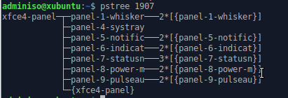
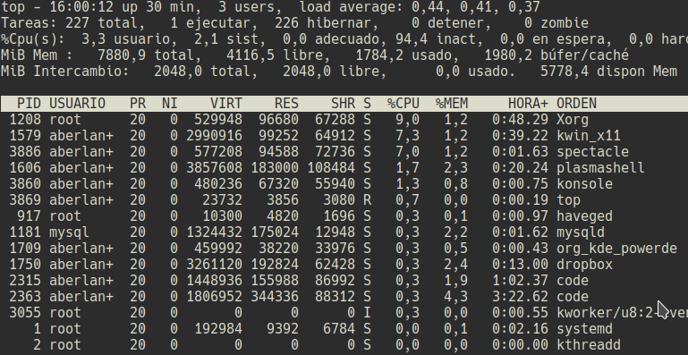
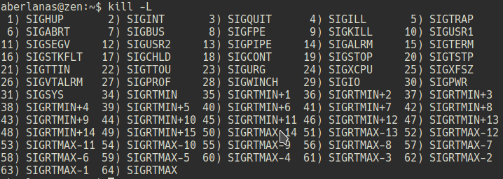

\newpage

## Procesos en GNU/LinuX

Al igual que en los sistemas Windows, en GNU/LinuX disponemos de herramientas graficas que nos permiten manipular los procesos. Sin embargo en este apartado vamos a trabajar con los mismos conceptos que hemos visto antes, pero desde una terminal.

### Comando ps

`ps` nos muestra información acerca de los procesos que están activos actualmente en el sistema. Ejemplo:

`ps -e`

nos devolverá una salida similar a esta:

```shell

  PID TTY          TIME CMD
    1 ?        00:00:02 systemd
    2 ?        00:00:00 kthreadd
    4 ?        00:00:00 kworker/0:0H
    6 ?        00:00:00 mm_percpu_wq
  ....         ........ ..........
 1716 ?        00:00:01 xfce4-terminal
 1721 pts/0    00:00:00 bash
23368 ?        00:00:00 cupsd
23369 ?        00:00:00 cups-browsed
23785 pts/0    00:00:00 ps
```

>**NOTA**: Aparecerán muchos más procesos en marcha, pero he recortado la presentación por comodidad.

-----

Si queremos _filtrar_ la salida de `ps` basta con que entubemos la salida de `ps` a la entrada de `grep`.

Ejemplos:

```shell
ps -e | grep firefox
ps -e | grep mousepad
ps -e | grep update-manager
```

De esta manera obtendremos tan solo los PIDs de los procesos seleccionados, recordar que los PIDs son los números que identifican de manera única a los procesos dentro del Sistema Operativo.

### Comando pstree

Muestra el árbol de subprocesos que ha lanzado determinado proceso. Por ejemplo, en caso del panel indicador de Xfce4 (sería algo similar a _Cortana_ en Windows), podemos ver cuáles han sido los procesos que ha lanzado dicho panel. Para ello, ejecutaremos los siguientes comandos:

```shell
ps -e | grep xfce4-panel
```

En mi caso esto genera una salida similar a esta:

```shell
 1907 ?        00:00:00 xfce4-panel
```

Obtendremos el PID del proceso xfce4-panel y se lo pasaremos como argumento a `pstree`:

```shell
pstree 1907
```

Que nos devolverá una salida como esta:


\ 

### Comando top

Nos muestra en _directo_ el estado de los procesos en nuestro sistema, así como el consumo de la CPU, el tiempo en ejecución (_uptime_), la memória RAM disponible, consumida, etc.

```shell
top
```

Ejecución:




### Comando kill

El comando `kill` nos permite enviarle señales a los procesos. Estas señales nos permiten modificar el estado de los procesos.

Una lista posible de las señales que le podemos enviar a un proceso nos la muestra el propio `kill` al pasarle la opción : `-L`:

`kill -L`

Salida:



Una de las opciones más comunes es la opción 9: `SIGKILL` que _termina_ el proceso que se le indica. 

Ejemplo de uso:

_El usuario quiere detener el programa mousepad que parece no responder, para ello ejecuta las siguientes ordenes:_

```shell
ps -e | grep mousepad
```

Salida:

```shell
23895 pts/0    00:00:00 mousepad
```

Obtiene el PID de mousepad y se lo pasa a `kill` con el parámetro `-9 `

```shell
kill -9 23895
```

Y `mousepad` termina.

----

### Comando killall

`killall` funciona de una manera similar a `kill`, pero detiene todas las instancias de un proceso cuyo nombre sea el que se pasa como argumento.

Ejemplo:

`killall firefox`

Detendrá todos los firefox lanzados.

----

### Comando nice

Como administradores de sistemas, muchas veces comprobaremos que determinados procesos no tienen la misma prioridad, o no necesitamos que consuman todo la CPU cuando se realicen, ya que tampoco es requerido que acaben lo antes posible, y otros que sin embargo es necesario que se ejecuten rápidamente y con mucha prioridad para que el proceso acabe lo antes posible.

En GNU/LinuX contamos con el comando `nice` que nos permite establecer la prioridad con la que se ejecutará un proceso. 

La prioridad se establece mediante un argumento númerico que va desde el -20 (prioridad máxima) a 19 (prioridad mínima), siendo `0` el valor por defecto que el SO le asigna a un proceso.

Si ejecutamos `nice` sin parámetros veremos el nivel de prioridad (_niceness_) actual del proceso.

Si ejecutamos:

```shell
nice 10 bash
nice
```

Obtendremos el valor :

`10`

¿Serías capaz de explicar que está pasando en este caso?
