\newpage

## Red en PowerShell

La administración de la red es una tareas más comunes en la configuración y puesta a punto del sistema operativo, además, las herramientas gráficas se encuentran bastante *dispersas* en las herramientas administrativas, con lo que a veces para comprobar determinadas situaciones debemos visitar varios menús y aplicaciones.

La línea de comandos es mucho más efectiva en estos casos, ya que nos permite ejecutar los comandos que comprueban lo que deseamos de manera secuencial.

Vamos a ver algunas herramientas que nos permitirán obtener y establecer los parámetros de la red de un equipo.

> NOTA: En unidades anteriores hemos visto bastantes cmdlets y comandos, aquí trabajaremos con los cmdlets propios de PowerShell, sin embargo, ya que es muy común encontrar en Internet referencia a los comandos *de legado*, se indicarán en cada apartado cuáles son.

## Obtener IP

Un ordenador necesita una IP para comunicarse con los demás dispositivos de la red.

### Get-NetIPConfiguration


``` powershell
Get-NetIPConfiguration
```

Nos devuelve toda la configuración de la red de las tarjetas que no son *Loopback*, y que están configuradas, ya sea mediante reglas *estáticas* o *dinámicas*.


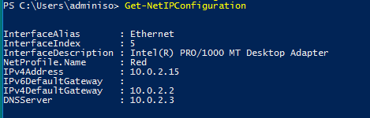
\


### Get-NetIPAddress

``` powershell
Get-NetIPAddress
```

Esto extrae toda la configuración de las diferentes IPs que tiene nuestro sistema, ya sea en formato IPv4 como IPv6, así como las interfaces de *Loopback*.


Sin embargo, el listado es muy grande y tal vez no queremos toda esa información, así que filtraremos ese resultado mediante el comando `Format-Table` , indicándole cuáles son los campos que queremos que muestren:

``` powershell
Get-NetIPAddress | Format-Table InteraceAlias, IPAddress
```

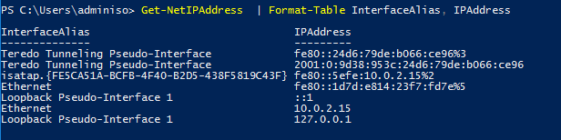
\

También podemos mostrarlo en formato lista

``` powershell
Get-NetIPAddress | Format-List InteraceAlias, IPAddress
```
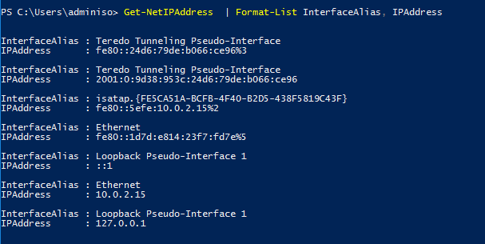
\ 

Ya vemos que podemos ir *filtrando*, este es otro ejemplo:

``` powershell
Get-NetIPAddress | ? AddressFamily -eq IPv4 | Format-List IPAddress
```

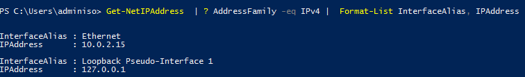
\ 

>**CMD** : ipconfig

### Get-NetAdapter

Este comando nos muestra información acerca de los propios dispositivos de red, por ejemplo si tenemos conexión, la MAC, el Driver, etc.

``` powershell
Get-NetAdapter Ethernet | Format-List
```

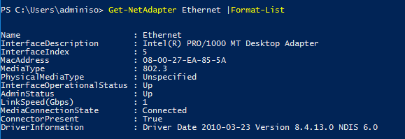
\ 

## Comprobar conectividad

Otras veces el problema no está en la configuración de la red en nuestro equipo, sino en la resolución de nombres o en el *enrutamiento* hasta el destino.

Vamos a ver algunos comandos que nos pueden ayudar a comprobar si podemos alcanzar determinadas máquinas.

### Test-NetConnection 

``` powershell
Test-NetConnection www.google.es
```

Esto nos resuelve via DNS el destino y nos indica por qué conexión hemos llegado hasta esa máquina y cuánto tiempo ha costado.

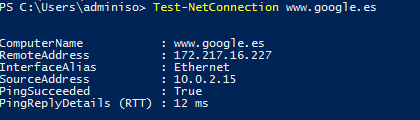
\ 

> NOTA: En la red de centros ( y en muchas redes empresariales) el Ping está deshabilitado.


\

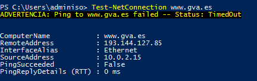
\

``` powershell
Test-NetConnection www.google.es -InformationLevel Detailed
```

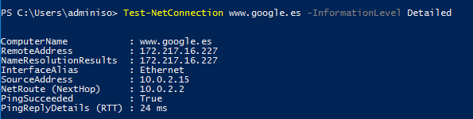
\

Aquí mostramos mayor cantidad de información.


Si queremos ver los diferentes *saltos* que se dan en la red hasta alcanzar un equipo podemos utilizar el argumento : `-TraceRoute`

``` powershell
Test-NetConnection www.google.es -TraceRoute
```

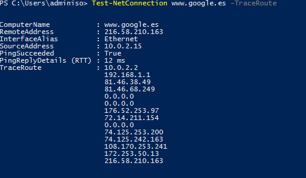
\

>**CMD** : ping

>**CMD** : tracert

### Resolve-DnsName

Este comando nos permite resolver un nombre a una IP y nos indica cual es la estructura DNS.


``` powershell
Resolve-DnsName www.google.es
```
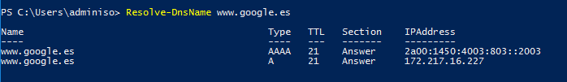
\ 

Al igual que en los comandos anteriores, podemos establecer el formato de salida:

``` powershell
Resolve-DnsName www.google.es -Type SOA | Format-List
```

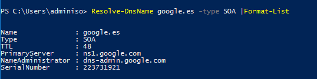
\ 

Si lo qué queremos es probar otro Servidor DNS para comprobar si estamos teniendo problemas con el que tenemos asignado:

``` powershell
Resolve-DnsName www.google.es -Server 1.1.1.1 -Type SOA | Format-List
```


### Get-NetRoute

Otra comprobación habitual en la red es obtener la Ruta que nos permite llegar a determinada red o dirección IP.

``` powershell
Get-NetRoute -DestinationPrefix 10.0.2*
```

>**CMD** : route
