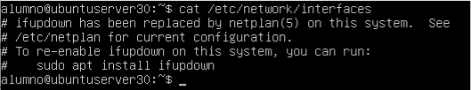
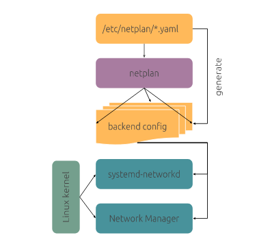
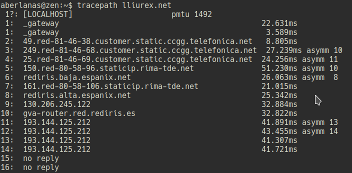
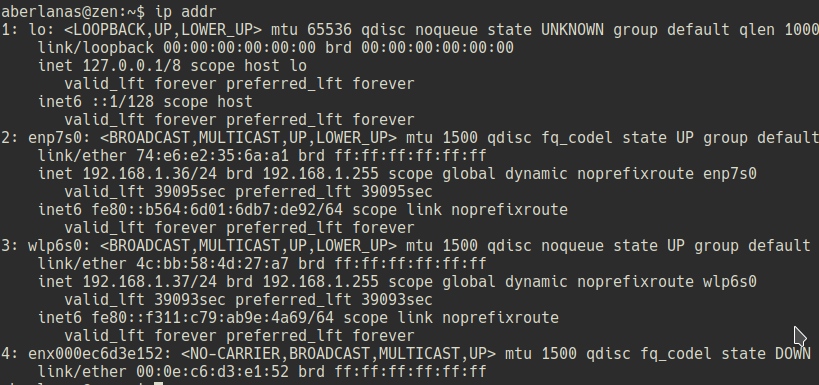

## Configuración de la red en GNU/LinuX

La configuración en los Sistemas GNU/LinuX presenta varios mecanismos. Desde la edición de un fichero que contiene la información de todas las tarjetas de red, al uso de diferentes
sistemas gráficos para configurarla (_NetworkManager_). En este módulo veremos diferentes formas de configurar la red, sin embargo todas tienen en común una serie de características
que debemos conocer para comprender _qué es_ lo que estamos configurando:

* Persistencia de la configuración
* Dirección MAC
* Dirección IP -> Estática o dinámica
* Red a la que pertenece (Máscara)
* Puerta de enlace
* Servidores DNS

Todos estos conceptos debemos tenerlos en cuenta a la hora de realizar las instalaciones y configuraciones de los Sistemas Operativos.

### A través de netplan

Las versiones de linux mantienen un fichero de configuración `/etc/network/interfaces` que se genera durante la instalación. Sirve para detectar las interfaces de red y activarlas.


\ 

En un servidor tendrá el aspecto que hemos visto, aquí mientras que si lo comprobamos en nuestro Xubuntu contiene lo siguiente:

`cat /etc/network/interfaces`

Nos mostrará lo siguiente:

```shell
# interfaces(5) file used by ifup(8) and ifdown(8)
auto lo
iface lo inet loopback
```

Este fichero no es nativo de Ubuntu, existe para todas las distribuciones GNU-Linux, tanto en versiones _Server_ como en versiones _Desktop_.
Por otro lado las versiones de _Ubuntu Cloud_ utilizan otro fichero para configurar la red. Este fichero esta en formato **YAML**.

Esta situación complica la configuración automatizada que usa Network Manager y no permite usar alternativamente networkd.

Por ello se ha lanzado **netplan**  que está disponible desde la version 17.10 de Ubuntu.

El objetivo de netplan es introducir poco a poco más funcionalidades para tener los ficheros de configuración de redes centralizados en un directorio único. Los ficheros de configuración usarán la extensión _*.yaml_ (soporte networkd ) y se encontrarán en el directorio:

`/etc/netplan`

\newpage
#### Configuración de la interfaz de red en Ubuntu 18.04

Desde la versión 17.10, Ubuntu ha activado por defecto en sistema “Netplan” para la configuración de los interfaces de red. Aunque desde esa versión se ha activado, el sistema ya viene implementado desde la versión 16.04. Este sistema es totalmente distinto a lo que hasta ahora veníamos utilizando para la configuración de las tarjetas de red.

El primer cambio que nos encontramos, es la ubicación de los ficheros de configuración. Pasando de estar en  `/etc/network/interfaces` a estar en `/etc/netplan/01-netcfg.yaml`
.
El esquema  es


\ 

#### Configuración de la interfaz

El formato de esta nueva versión es completamente diferente a la que normalmente veníamos usando en las versiones anteriores.
Obviamente, sin configuración, netplan no hará nada. La configuración básica podría ser:

```shell
network:
  version: 2
  renderer: NetworkManager
```
Esta hará que NetworkManager maneje todos los dispositivos (y por defecto cualquier dispositivo ethernet se activará por DHCP nada mas ser detectado).

Usando `networkd` como _renderer_ no se configuran las interfaces automáticamente usando DHCP, sino que cada interfaz debe ser configurado en un fichero en `/etc/netplan` que será interpretado por `networkd`.

Un ejemplo del fichero 01-netcfg.yaml, seria el siguiente:

```shell
# This file describes the network interfaces available on your system
# For more information, see netplan(5).
network:
    version: 2
    renderer: networkd
    ethernets:
        enp0s3:
            dhcp4: yes
```

>**NOTA** Una de las cosas que hay que tener muy en cuenta es respetar las 
tabulaciones, si las establecemos mal, será una de las causas que nos 
pueden provocar un error en la configuración.

El ejemplo muestra como sería una configuración por defecto para una interface que obtenga la dirección ip por DHCP.

La configuración se divide en dos zonas, la primera con indicaciones para la herramienta `netplan`. Y la segunda, con la configuración de las interfaces de red. 

Debajo del parámetro `ethernets`  pondremos la configuración de todas nuestras interfaces de red que tengamos instaladas en nuestro sistema.

Para realizar esta configuración lo primero que debemos indicar será, el nombre lógico asignado a la tarjeta. En el caso del ejemplo  `enp0s3`.

Debajo de él y con un nuevo nivel de tabulación pondremos la configuración. En el caso del ejemplo, se obtiene la dirección IP desde el servidor de DHCP. Solo tendremos
que poner : _dhcp4: yes_

#### Otras configuraciones

En el caso que queramos personalizar la dirección ip de la interface, utilizaríamos los siguientes comandos:

* `addresses` : Dirección que queremos establecer para la interface. Para establecer la máscara de red, se lo indicaremos en formato **CIDR**.
    Ejemplo:
    ```shell
    addresses:
        -192.168.0.10/24
    ```
* `gateway4`: Dirección ip del gateway para la versión 4 del protocolo IP. Para establecer el gateway para la versión 6, solo tendríamos que cambiar en 4 por el 6, y  establecer una dirección de tipo v6.
* `nameservers` : bloque para establecer los servidores de dns que va a usar la tarjeta de red. Para indicar la dirección utilizaremos el parametro `addresses`, al igual que la dirección IP, la acotaremos entre corchetes, las direcciones IP de los servidores de **DNS**, las separaremos por comas.

Ejemplo:

```shell
# This file describes the network interfaces available on your system
# For more information, see netplan(5).
network:
    version: 2
    renderer: networkd
    ethernets:
        enp0s8:
            dhcp4: yes
        enp0s3:
            dhcp4: no
            addresses:
                [192.168.100.10/24]
            gateway4: 192.168.100.10
            nameservers:
                addresses: [8.8.8.8, 8.8.4.4]
```
#### Comandos de netplan

Netplan usa un conjunto de subcomandos para controlar su comportamiento:

* `netplan generate` : Usa  `/etc/netplan`  para generar la configuración de los manejadores (renderers).
* `netplan apply` : Aplica la configuración para cada uno de los manejadores.

## Comandos de Redes

### Comando tracepath

El comando `tracepath` nos permite trazar una ruta entre nuestro host y el host que le indiquemos, mostrándonos todos los pasos intermedios que va recorriendo.

 * `tracepath lliurex.net`


\ 

### Comando ping

El comando `ping` permite enviar paquetes ICMP (Internet Control Message Protocol) del tipo **ECHO_REQUEST** a otra computadora, con el objetivo de saber si esta es alcanzable a través de la red.

Además muestra un resumen estadístico acerca del tanto por ciento de paquetes perdidos y las velocidades de transmisión. Este comando se ejecuta por defecto sostenidamente por lo que para interrumpirlo se debe hacer Ctrl-c.

Sintaxis `ping [opciones] <máquina>`

Algunas opciones:

 *` -c <n>` : envía n paquetes exactamente.
 *` -i <n> `: espera n segundos entre los envíos.
 *` -s <n> `: envía paquetes de n bytes. Se le suman los 8 bytes del header del paquete ICMP.
 *` -q `: sólo despliega el sumario final.

Ejemplos

 `ping www.google.es`

### Comando ifconfig

El comando `ifconfig` permite configurar por parte de root las interfaces de red. Los usuarios distintos de *root* lo pueden invocar también con fines informativos.
Para ello deben especificar el camino completo (`/sbin/ifconfig`) pues por defecto este no está en el path de los usuarios comunes.

Sin argumento ifconfig despliega información acerca de la configuración y funcionamiento actuales de las interfaces de red activas.

Ejemplos

`ifconfig`

`ifconfig –s`

Muestra un resumen de los interfaces

`ifconfig eth0`

Muestra información solo sobre el interface *eth0*

`ifconfig` también puede usarse para activar y desactivar los interfaces de red.

`ifconfig eth0 up`
`ifconfig lo down`

`ifconfig` puede usarse también para configurar los interfaces de red, aunque suele ser mejor configurarlos editando el fichero de netplan.

`ifconfig eth0 hw ether 00:30:CA:52:0A:F0 `

Cambia la dirección MAC del interface

`ifconfig eth0 address 192.168.100.2`

Establece en eth0 esa dirección IP

`ifconfig wlan0 netmask 255.255.255.0`

Establece en la tarjeta Wi-Fi la mascara de red 255.255.255.0

### Comando ip

El comando `ip` es el nuevo estándar en los sistemas GNU/LinuX para las tareas de gestión de las tarjetas de red.

Nos permite mostrar y manipular enrutamiento, dispositivos de red, interfaces y túneles.

#### Obtener IP

`ip addr`

Nos muestra una salida como esta:


\ 

#### Obtener IP (IPv4 Only)

Si le indicamos que tan solo queremos ver la información acerca de IPv4 :

`ip -4 addr`

La salida será como esta:

```shell
1: lo: <LOOPBACK,UP,LOWER_UP> mtu 65536 qdisc noqueue state UNKNOWN group default qlen 1000
    inet 127.0.0.1/8 scope host lo
       valid_lft forever preferred_lft forever
2: enp0s3: <BROADCAST,MULTICAST,UP,LOWER_UP> mtu 1500 qdisc fq_codel state UP group default qlen 1000
    inet 10.0.2.15/24 brd 10.0.2.255 scope global dynamic noprefixroute enp0s3
       valid_lft 86279sec preferred_lft 86279sec
```

----

#### Establecer una IP en un dispositivo

`ip address add 192.168.4.177 dev enp0s3`

----

#### Habilitar una interfaz

`ip link set enp0s3 up`

Habilita la interfaz enp0s3.

----

#### Ver la tabla de enrutamiento de nuestro sistema

`ip route`

Nos muestra la tabla de enrutamiento de nuestro sistema:

```shell
default via 10.0.2.2 dev enp0s3 proto dhcp metric 100 
10.0.2.0/24 dev enp0s3 proto kernel scope link src 10.0.2.15 metric 100 
169.254.0.0/16 dev enp0s3 scope link metric 1000 
```

----

#### Añade una red a una interfaz

`ip route add 192.168.3.0/24 dev enp0s3`

Añade la red 192.168.3.0/24 a la interfaz enp0s3 para su enrutamiento.

----

### Comando hostname y dnsdomainname

El comando `hostname` nos devuelve el nombre de equipo (host) y nos permite cambiarlo. El comando `dnsdomainname` hace lo mismo pero para un nombre FQDN (Fully Qualified Domain Name).

 * `hostname`
 * `dnsdomainname`

Para cambiar el nombre al equipo es mejor escribir el nuevo nombre en su fichero `/etc/hostname` y luego invocar al comando `hostname` con el argumento : `-F /etc/hostname` : 

`hostname -F /etc/hostname`.

Hay que tener mucho cuidado al cambiar el nombre de equipo, ya que es muy posible que tengamos programas y comandos que están preparados para trabajar y encontrar nuestro equipo con el nombre actual (sudo por ejemplo). Nos podemos encontrar que estos programas funcionen mal si cambiamos el nombre del equipo.

En el fichero `/etc/hosts` también tendremos que modificar el nombre del equipo en la dirección **127.0.1.1**.
