# Tarea: Creación de Usuarios Locales

Ya hemos visto en Teoría qué son los usuarios, cuáles son los tipos de usuarios locales en Windows y como funcionan los grupos. 

Ahora vamos a ver las diferentes maneras de creación y administración de los usuarios en los sistemas Windows.

## Menú Configuración

En el menú de **configuración**, en el submenú **cuentas**, podemos ver la información relativa al usuario que ha iniciado sesión.

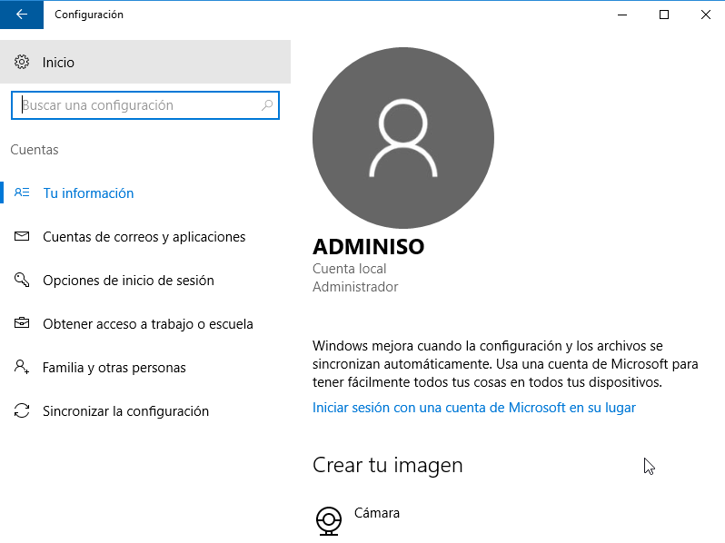
\ 

En este menú, nos permite cambiar la foto de inicio de sesión, gestionar las cuentas de correo, sincronizaciones y otras tareas reacionadas con la sesión y la autenticación de los servicios de Microsoft.

Uno de los menús que aparece es : **Familia y otras personas**, desde el cual podremos añadir más usuarios *locales* a nuestro equipo.

Microsoft permite el uso de varios usuarios del tipo Familia, que nos permite realizar tareas de control de navegación, permisos para instalar aplicaciones, etc.

Vamos a crear ahora un usuario que no pertenecerá a ese tipo de usuarios.

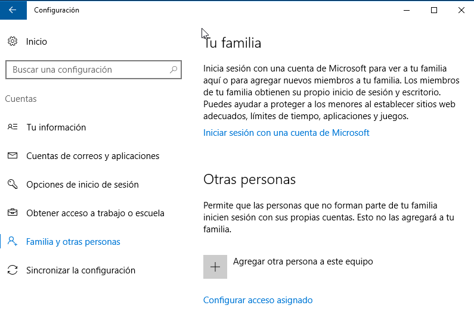
\ 

Para ello pulsaremos en : *Agregar otra persona a este equipo*.

Windows nos ofrece aquí un asistente que nos permitirá elegir cómo iniciará sesión este usuario.

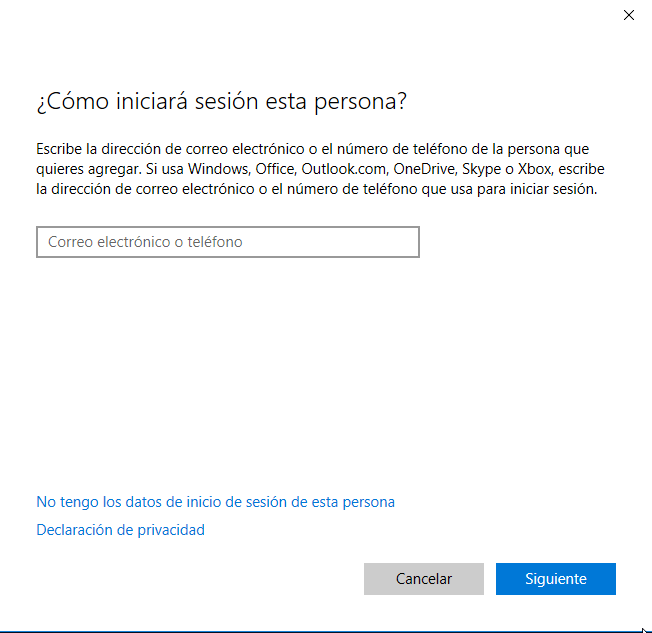
\ 

En nuestro caso, marcaremos la opción de : **No tengo los datos de inicio de sesión de esta persona**, ya que no queremos configurar una cuenta de Microsoft para este usuario.

En la siguiente ventana, elegiremos la opción: **Agregar un usuario sin cuenta Microsoft**.

> NOTA : En caso de que si que quisiéramos crear un usuario con un correo de Windows, deberíamos rellenar el formulario que aparece en esta pantalla.

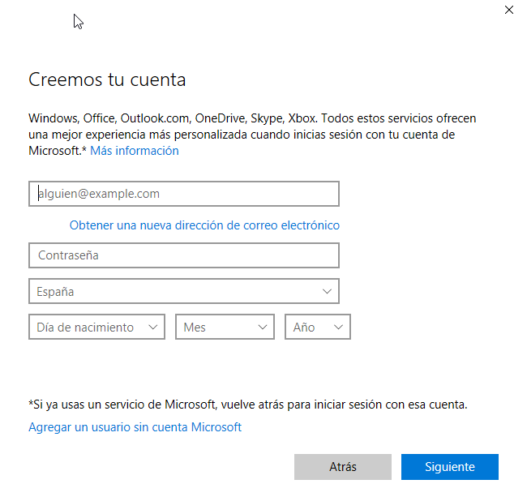
\ 

En esta ventana crearemos el usuario, estableceremos un nombre (*login*) y la contraseña que utilizará para iniciar sesión:

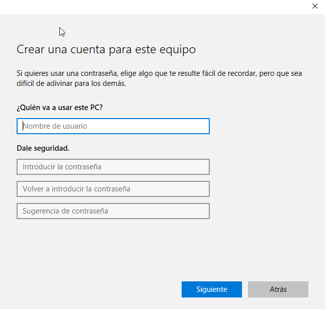
\ 

> NOTA: Si *intentamos* crear el usuario invitado, el sistema nos indicará que no podemos asignar ese nombre.

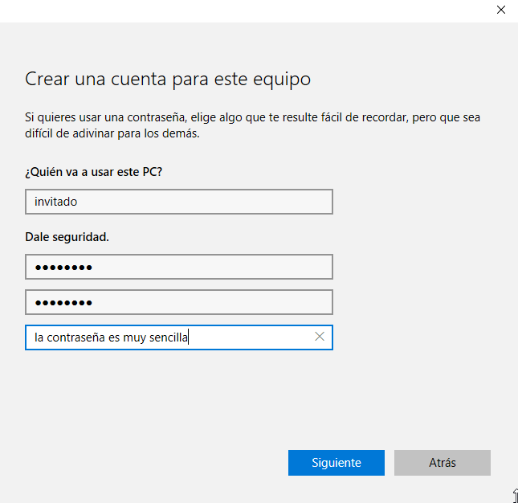
\ 

Veremos este mensaje
s
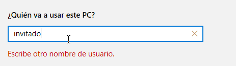
\ 

> **Pregunta **: ¿Porqué nos acaba de dar este error? 

Ahora crearemos un usuario que lo llamaremos : *esbirro*. La contraseña sugerida es : *esbirro*

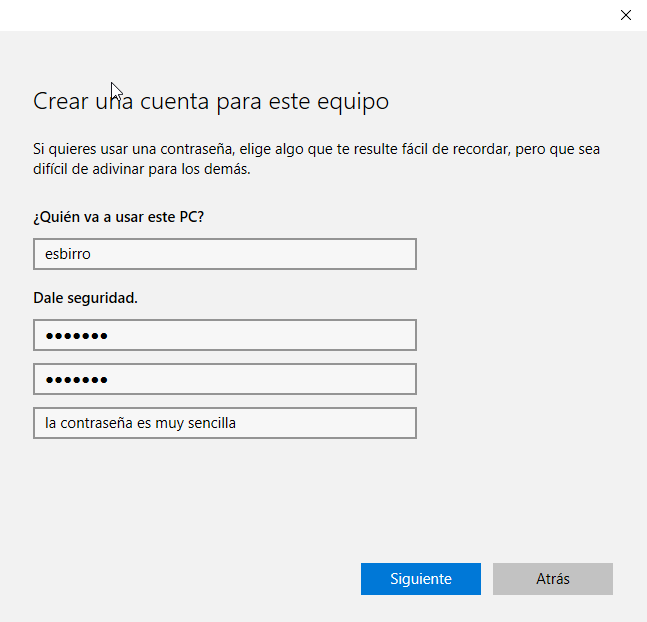
\

Al crear el usuario, ahora en el listado de usuarios nos aparece *esbirro*.

## Panel de control

Si utilizamos el **Panel de control** de Windows, en el apartado : Cuentas de usuario, veremos que aparecen ambas cuentas, *adminiso* y *esbirro*.

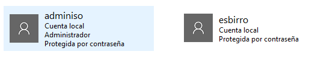
\ 

Desde aquí podemos realizar una serie de operaciones que están relacionadas con la cuenta.


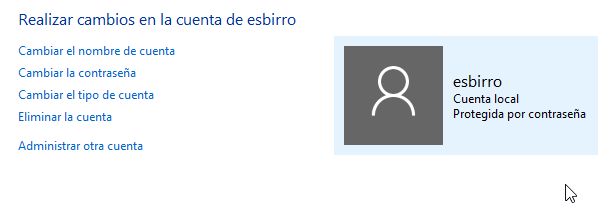

Una de las operaciones más habituales es **Cambiar la contraseña**, otra sería **Cambiar el tipo de cuenta**, que nos permite *promocionar* o *degradar* cuentas, estableciendo los permisos de administrador o de usuarios locales. 

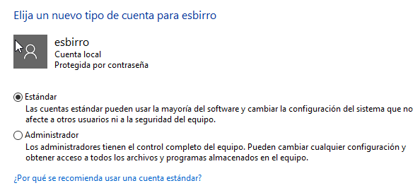
\ 

  El listado de privilegios y permisos que puede tener un usuario en los sistemas Windows es muy largo, y veremos los más interesantes en temas posteriores.
  
Una de las opciones que nos permite seleccionar aquí es el número de veces que el sistema nos notificará cuando una aplicación intente realizar cambios en el equipo.

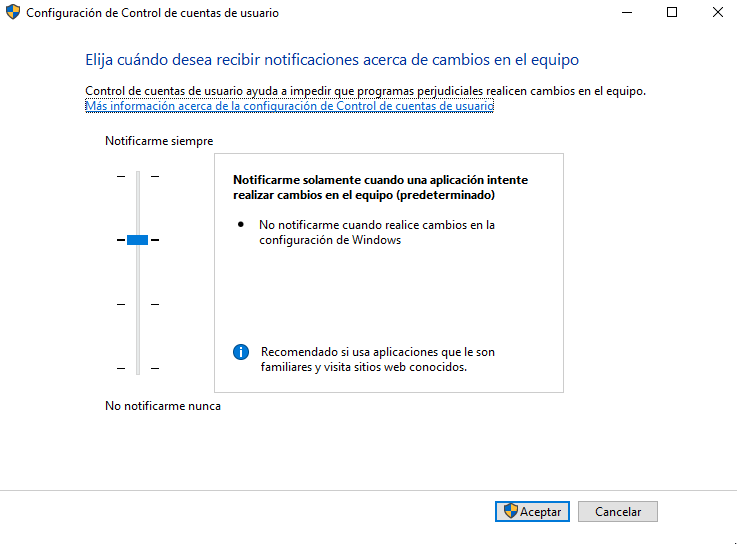
\ 

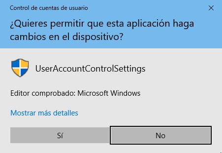
\ 

## Administración de equipos

Hasta ahora hemos visto como administrar los usuarios a través del menú configuración y a través del panel de control. 

Poco a poco hemos ido incrementando el nivel de detalle de las operaciones y la complejidad de la administración. Así como al principio hemos visto como el Sistema Operativo nos mostraba un *Asistente* que nos guiaba a lo largo del proceso, en el **Panel de Control**, se nos ofrecían una serie de opciones más avanzadas.

Sin embargo, para los administradores de sistemas (nosotros), contamos con herramientas que nos permiten realizar operaciones mucho más avanzadas, vamos a ver primero la **Administración de Equipos** y luego veremos la línea de comandos.

Para lanzar la administración de equipos, pulsaremos el botón derecho sobre el símbolo de Windows y seleccionaremos la opción de menú: **Administración de equipos**
  
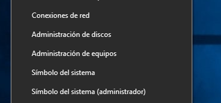
\ 

Esto es lo que se conoce como *MMC*(Microsoft Management Console).

En esta ventana Windows 10 ofrece a los administradores múltiples opciones y ajustes de configuración.

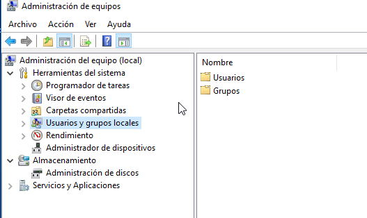
\ 

Navegaremos el arbol de operaciones posibles dentro del apartado **Administración del equipo (local)**.

* Administración del equipo (local)
  * Herramientas del sistema
    * Usuarios y grupos locales
      * Usuarios
      * Grupos
        
Dentro de usuarios (que aparece como una carpeta) podemos ver los diferentes usuarios que hemos creado en el equipo.

Sin embargo, hay 4 usuarios que podemos encontrar ahí, que no hemos creado nosotros:

* Administrador
* DefaultAccount
* defaultuser0
* Invitado

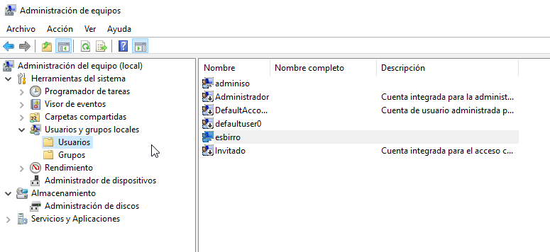
\ 

De estas 4 cuentas, las más importantes que se crean por defecto son : *Administrador* e *Invitado*. 

Administrador es la cuenta que tiene todos los permisos dentro de la máquina.
Invitado es un usuario especial que podemos habilitar que no tiene permisos apara instalar aplicaciones y tiene muchas restricciones.

Desde Consola de Administración (MMC) podemos realizar operaciones que no había aparecido en las otras herramientas de administración.

Al hacer clic con botón derecho sobre un usuario se nos muestra el siguiente menú:

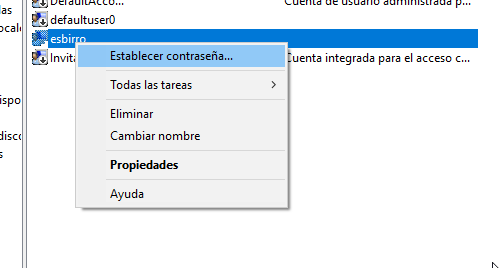
\ 

Si marcamos la opción **Propiedades** vemos las siguientes ventanas:

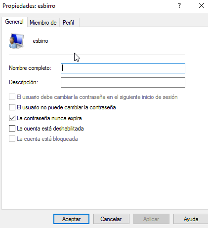
\ 

* Establecer que el usuario **no** puede cambiar la contraseña
* La contraseña nunca expira
* La cuenta está deshabilitada.

En la pestaña **Miembro**, podemos ver los grupos a los que pertenece el usuario.

Y en la pestaña Perfil, nos aparecen las siguientes propiedades:

* Perfil de usuario

    * Ruta de acceso al perfil (ruta al perfil que se aplicará)
    * Script de inicio de sesión
    
* Carpeta particular

    * Ruta de acceso local
    * Conectar ...
    
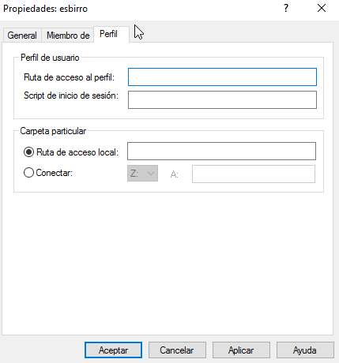
\ 

## Directivas de Cuentas

Para cambiar los requisitos de las contraseñas que permitiremos en el sistema, Windows nos ofrece un herramienta que nos permite realizar cambios en las directivas de las contraseñas y usuarios que se aplicarán en la creación de usuarios.

Para lanzar el editor de directivas, ejecutar:

```PowerShell
gpedit.msc
```
Este editor lo trabajaremos más adelante con mayor profundidad, pero por ahora vamos a ver como establecer una mayor `fortaleza` en las contraseñas de los usuarios.

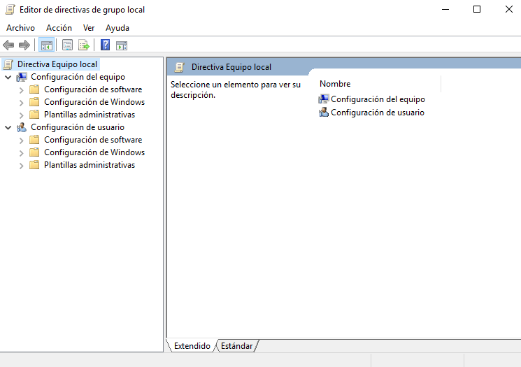
\ 

Iremos al apartado `Directivas de contraseñas`:

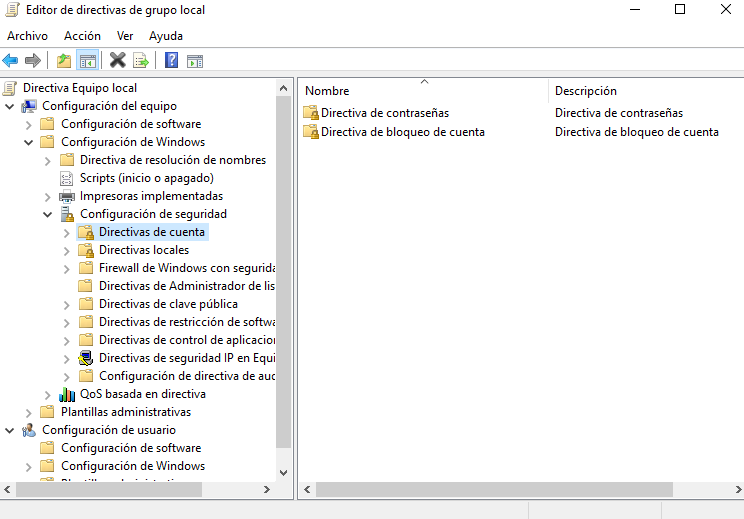
\ 

Y seleccionaremos las opciones que deseemos.

Estos son los valores por defecto:


\ 


## Tarea

### Ejercicio 1

Replicar el usuario que hemos creado aquí (esbirro) y crear otro usuario (esbirro02) que utilizaremos para las pruebas. Documenta todo el proceso.

### Ejercicio 2

¿Se puede utilizar el usuario Administrador que se crea de manera automática?

### Ejercicio 3

Utilizando el editor de directivas establece una vigencia máxima de la contraseña a 62 dias. Realiza una captura de pantalla del resultado.

### Ejercicio 4

Utilizando la web [HowSecureIsMyPassword.net](https://howsecureismypassword.net/), prepara una directiva de contraseñas que impida a los usuarios establecer una contraseña que pueda ser _rota_ en menos de 2 semanas. Documenta el proceso.

### Ejercicio 5

¿Porqué crees que no debemos habilitar la directiva de almacenamiento de contraseñas con cifrado reversible?

