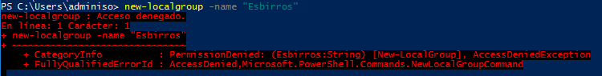
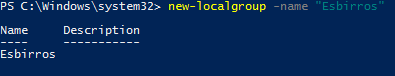
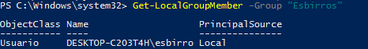

# Tarea: Gestión de Grupos

## Ejercicio 1

En powershell ejecuta :

``` powershell
Get-LocalGroup
```

El sistema nos muestra el listado de los grupos *Locales* que tenemos, ya sean creados por nosotros, o de manera automática.

Vamos ahora a crear un grupo y añadiremos al usuario esbirro al mismo.

Para crear un grupo podemos hacerlo desde la GUI, o desde el **PowerShell**.

En **PowerShell**, el comando que crea un grupo es:

``` powershell
New-LocalGroup -Name Esbirros
```

Si el sistema nos devuelve un error de permisos, debemos ejecutar el PowerShell como Administrador.


\ 

Cuando hayas acabado, vuelve a ejecutar el comando de listar grupos para comprobar que el grupo ha sido creado.

## Ejercicio 2

Añade al usuario *esbirro* al grupo que acabamos de crear, para ello utiliza el comando 

``` powershell
Add-LocalGroupMember -Group "Esbirros" -Member "esbirro"
```


\ 

Comprueba mediante la herramienta gráfica y mediante el siguiente comando que la operación ha tenido éxito:

``` powershell
Get-LocalGroupMember -Group "Esbirros"
```


\

## Ejercicio 3

Utilizando *PowerShell ISE*, crea un script que genere 4 usuarios con los siguientes parámetros , el grupo: `OperadoresEspeciales` y los añada a ese grupo.

Usuarios:

| Login | FullName | Password | Descripcion | 
| ----- | -------- | -------- | ----------- |
|esbirro02| Esbirro 02 | #esbirro02# | El esbirro número 2|
|esbirro03| Esbirro 03 | #esbirro03# | El esbirro número 3|
|esbirro04| Esbirro 04 | #esbirro04# | El esbirro número 4|
|esbirro05| Esbirro 05 | #esbirro05# | El esbirro número 5|

TODOS han de pertenecer al grupo `OperadoresEspeciales`, y lo ha de hacer el Script.

Adjunta el Script que has generado y una captura de la ejecución de la siguiente orden:

``` powershell
Get-LocalGroupMember -Group "OperadoresEspeciales"
```
