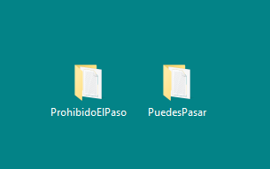
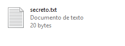
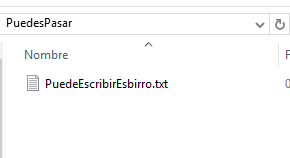
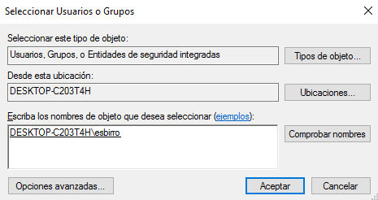
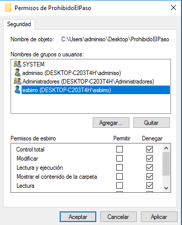
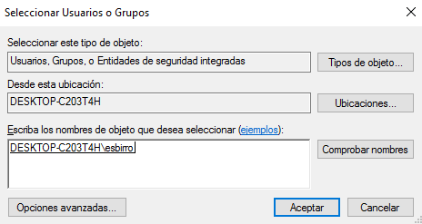

# Tarea: Permisos NTFS

Vamos a realizar una serie de ejercicios que ponen en práctica los conceptos que hemos visto en la teoría acerca de los permisos sobre Usuarios y Grupos.

## Ejercicio 1

Crea en el Escritorio del usuario **adminiso** la siguiente estructura de carpetas:

\ 

* ProhibidoElPaso (carpeta)
  * -> secreto.txt (fichero)
* PuedesPasar (carpeta)
  * -> PuedeEscribirEsbirro.txt (fichero)
  

\ 

\ 

## Ejercicio 2

Una vez realizado el ejercicio 1, mediante el botón derecho en la Opción : **Propiedades -> Seguridad** Edita los permisos y establece **denegando** todos los permisos al usuario *Esbirro*  a la carpeta `ProhibidoElpaso`.

\ 

\ 

## Ejercicio 3

Sobre el fichero `secreto.txt` establece los mismos permisos que sobre la carpeta del ejercicio 2

\ 

## Ejercicio 4

Sobre la carpeta `PuedesPasar`, permite que el usuario *esbirro* pueda leer y escribir dentro del fichero `PuedeEscribirEsbirro.txt`.

## Ejercicio 5

Realiza un breve resumen de cuales han sido los pasos que has seguido para realizar los ejercicios anteriores.
