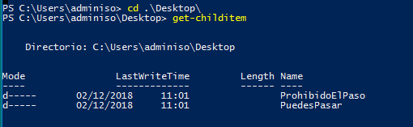
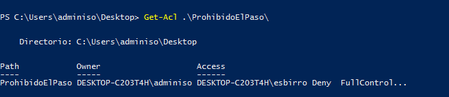
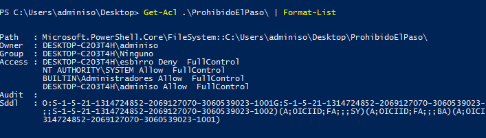
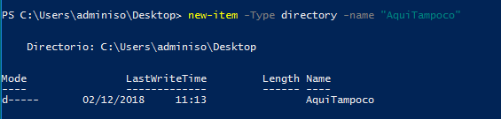
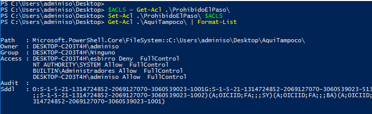

# Tarea: Permisos NTFS

Vamos a realizar una serie de ejercicios que ponen en práctica los conceptos que hemos visto en la teoría acerca de los permisos sobre Usuarios y Grupos. Pe
ro ahora desde el PowerShell

**PowerShell** dispone de un `cmdlet` que nos permite obtener las ACLs que se aplican a determinado objeto del Sistema Operativo. Vamos a realizar algunas operaciones básicas sobre estas ACLs. 

Nos basaremos en este ejercicio en las carpetas y ficheros que hemos creado en prácticas anteriores.

* [[Microsoft] : Get-ACL](https://docs.microsoft.com/en-us/powershell/module/microsoft.powershell.security/get-acl?view=powershell-6)

* [[Microsoft] : Set-ACL](https://docs.microsoft.com/en-us/powershell/module/microsoft.powershell.security/set-acl?view=powershell-6)

## Ejercicio 0

### Cambiar de directorio de trabajo

El dominio del sistema de archivos es muy importante para comprender como funcionan los sistemas operativos y las aplicaciones, así que iremos realizando ejercicios cada vez más complicados donde una parte importante de la ejecución de los comandos es saber **donde** estamos y **qué** queremos obtener.

El comando `cd` nos permite cambiar nuestro directorio actual al que especifiquemos, sería equivalente a abrir mediante el explorador de archivos las carpetas y *desplazarnos* a esa carpeta abierta, de tal manera que ahora podemos realizar operaciones *directamente* sobre las carpetas y ficheros que se encuentran allí.

Si hemos ejecutado PowerShell desde el menú, esta se situa por defecto en nuestra carpeta de usuario: `C:\Users\adminiso`, debemos cambiar de directorio a `Escritorio` (*desktop*), para poder ejecutar el comando `Get-ACL` (o cualquier otro) sin tener que poner toda la ruta (*PATH*) hasta el directorio of fichero.

``` powershell
cd .\Desktop
```

En vez de escribir *Escritorio* escribiremos *Desktop*, ya que es el nombre *Real* del directorio dentro de nuestro sistema de archivos. Esto es bastante común en Sistemas Windows, donde el sistema hace cierta abstracción en busca de la comodidad del usuario. (Pero a veces complica las cosas para el Administrador). 

El comando `Get-ChildItem` nos muestra el contenido de determinado objeto, en este caso, si lo ejecutamos en la carpeta `Desktop` obtenemos las dos carpetas que hemos creado en el ejercicio anterior.



\ 

## Ejercicio 1

Ejecuta el comándo `Get-ACL` sobre la carpeta `ProhibidoElPaso`. 

Obtendrás un resultado parecido a este:


\

* ¿Tienes el mismo texto que en la imágen en Owner y Access?

## Ejercicio 2

Ejecuta el comando `Get-ACL` y pásale la salida al comando

``` powershell
Format-List
```

para ello utilizaremos el mecanismo de tubería que hemos visto en teoría.


\

Ahora la salida (lo que vemos en pantalla) es más parecida a lo que vemos en la interfaz gráfica.

* ¿Reconoces alguno de los grupos que hemos visto en teoría que se crean por defecto?

## Ejercicio 3

Vamos a *clonar* las ACLs que tiene `ProhibidoElPaso` y se lo asignaremos a una carpeta que vamos a crear ahora desde **PowerShell**. 

Lo primevamos a hacer es crear la carpeta `AquiTaepara ello utilizaremos el comando `New-Iteicándole los argumentos el tipo y el nombre:e

``` powershell
New-Item -Type directory -name "AquiTampoco"
```


\

Una vez creado el directorio (lo podemos comprobar ejecutando

``` powershell
Get-ChildItem
```

Lo que haremos será guardarnos en una *variable* las ACLs pertencientes a `ProhibidoElPaso` y luego se lo aplicaremos a `AquiTampoco` utilizando `Set-ACL`:

``` powershell
$ACLS = Get-Acl .\ProhibidoElPaso\
Set-Acl .\ProhibidoElPaso\ $ACLS
```

Si no nos da error, podemos comprobar que tenemos los mismos permisos y ACLs en `ProhibidoElPaso` que en `AquiTampoco`:

``` powershell
Get-Acl .\AquiTampoco\ | Format-List
```


\ 

## Ejercicio 4

Aplicar estos mismos permisos a un **fichero** que se llame:` enEsteFicheroTampoco.txt`, todo desde la Terminal.

## Ejercicio 5

Realiza un breve resumen sobre cada uno de los comandos que has utilizado en esta práctica.
