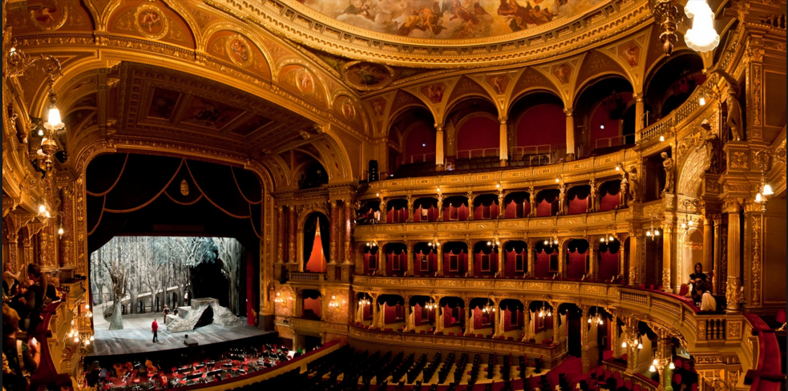
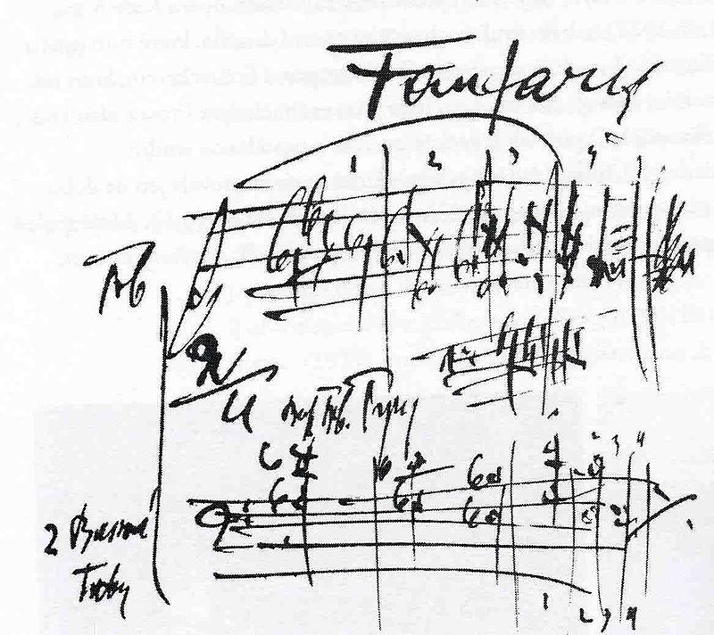
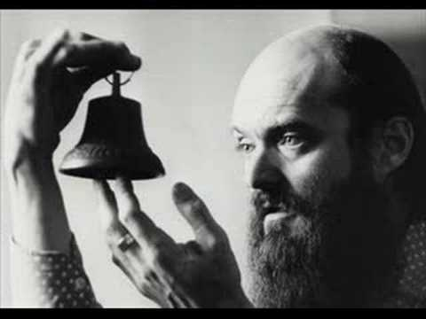
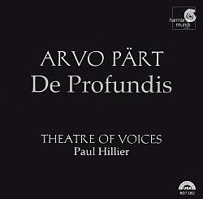
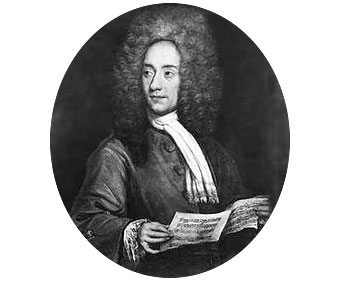

# Tarea: Una noche en la Ópera

*Bienvenidos ciudadanos a una noche mágica...*

Acabáis de ser ascendidos, contratados o como querais verlo, pero resulta que ahora mismo estamos trabajando para la *Orquesta Filarmónica de Budapest*.

Nada más llegar el director os cuenta que tienen un gran problema...Han informatizado los atriles y ahora todo es un **caos**, los músicos no se aclaran, necesitamos orden, saber que partituras son de cada uno, ver los grupos de instrumentos y además...todo tiene que estar arreglado pronto.

El gran principe va a asistir al concierto que dará comienzo a la gira por todo el pais de la *Orquesta Filarmónica de Budapest*.

La situación es la siguiente, tenemos una serie de instrumentos (*usuarios*) y una serie de carpetas en los atriles (`/srv/orquesta/`) que contienen las partituras de las obras que van a interpretar. Pero una desgracia ha ocurrido, uno de los músicos (o varios), son muy torpes y no se aclaran con los nuevos atriles...sin querer entran donde no deben y se ponen a interpretar lo que no corresponde...**¡QUE CAOS!**.

\newpage

Los usuarios que debemos crear son los siguientes:

 * flautin
 * clarinete
 * corno
 * trompa
 * violin
 * viola
 * chelo
 * contrabajo
 * bateria
 * xilofono
 * director

Y los grupos de una orquesta son los siguientes:

 * cuerdas
 * vientomadera
 * vientometal
 * percusion
 * direccion
 * orquesta

 \newpage

 Los instrumentos están agrupados de la siguente manera:

| Instrumento | Cuerdas | Viento Madera | Viento Metal | Percusion | Direccion | Orquesta|
| ------------| --------| --------------|--------------|-----------|-----------|---------|
|flautin    |           |   X           |              |           |          |     X    |
| clarinete     |       |     X          |               |         |             |   X      |
| corno     |       |               |     X          |         |             |   X      |
| trompa    |       |               |      X         |         |             |    X     |
| violin    |   X    |               |               |         |             |     X    |
| viola     |   X    |               |               |         |             |   X      |
| chelo     |   X    |               |               |         |             |    X     |
| contrabajo    |  X     |               |               |         |             |    X     |
| bateria     |       |               |               |   X      |             |     X    |
| xilofono    |       |               |               |   X      |             |    X     |
| director    |       |               |               |         |     X        |  X       |

\newpage

El proximo concierto tiene un programa de 4 obras que són:

 * La Gran Puerta de Kiev : Carpeta (`LaGranPuertaDeKiev`)
 * El Danubio Azul : Carpeta (`DanubioAzul`)
 * La Sinfonia del Nuevo Mundo : Carpeta (`SinfoniaDelNuevoMundo`)
 * La Suite de Jazz : Carpeta (`SuiteDeJazz`)

En cada una de esas carpetas estarán las partituras de cada uno de los instrumentos anteriormente descritos, que simularemos por ahora con archivos **.txt** que contendran el nombre del instrumento, y en su nombre (del fichero) se incluye dicho instrumento. El anterior Administrador de sistemas os ha dejado un par de *scripts* que os pueden ayudar.

Y sin más dilación...**¡MÚSICA MAESTRO!**

\newpage

## Ejercicio: 1 ACTO

En un primer momento el director está algo liado, y teme por que no lleguemos a tiempo para la actuación...

Lo que nos pide és:

  1. Que cada instrumento pueda escribir *solo* en su partitura
  2. Que cada grupo de instrumentos pueda *leer* las de su grupo, pero no *escribir*
  3. El director puede *leer* todas las partituras (para eso es el director).

\newpage

## Ejercicio: 2 ACTO

Ya parece que la orquesta comienza a aclararse con los atriles...y para el segundo acto el director quiere poder hacer algunas cosas más...

El programa para el Segundo Acto es :

* La Sinfonietta de *Janacek* (`Sinfonietta`)
* Saturno de Los Planetas de *Holst* (`Saturno`)
* La Sinfonia Inacabada de *Schubert* (`Inacabada`)
* La cabalgata de las Valquirias de *Wagner* (`Valquirias`)

En este segundo acto el director necesita algunos detalles, a lo anterior se suma lo siguiente:

 1. Que cada instrumento pueda escribir *solo* en su partitura
 2. Que cada grupo de instrumentos pueda *leer* las de su grupo, pero no *escribir*
 3. El director puede *leer* todas las partituras (para eso es el director).
 4. El grupo de las cuerdas en Saturno necesita poder hacer anotaciones (*escribir*) en las de su grupo. Esto predomina sobre lo anterior.
 5. En la Inacabada todos las partituras de los instrumentos que empiezan por la letra "**c**" han de poder ser ejecutadas por *Otros*.
 6. En todas las partituras de la cabalgata de las Valquirias ha de aparecer la frase:

    `El veloz murciélago hindú comía feliz cardillo y kiwi, mientras la cigüena tocaba el saxofón detrás del palenque de paja....0123456789
    `

    y además el director tiene que poder *escribir*.
 7. La sinfonietta debe contener una partitura adicional, que se llamará: `ElSilencio.txt` y que no debe pertenecer a nadie.

\newpage
## Ejercicio: 3 ACTO

Ya parece que la orquesta comienza a aclararse con los atriles, el administrador con los permisos y estamos a punto de hacer el mejor espectaculo que la Orquesta ha preparado jamás. Hemos presentado dos actos bastante movidos, con obras de gran intensidad, pero ahora, toca reflexionar sobre lo que hemos aprendido y presentar a los oyentes piezas que inviten a la reflexión y a la calma interior.

El programa para el Tercer Acto es :

* Los Nocturnos de *Chopin* (`Nocturnos`)
* Fratres de *Arvo Part* (`Fratres`)
* El Adagio de *Albinoni* (`Adagio`)
* De Profundis de *Arvo Part* (`DeProfundis`)

El director está cada vez más convencido de que ha sido buena decisión contrataros...pero quiere asegurarse. Pide lo siguiente:

1. Que cada instrumento pueda escribir *solo* en su partitura
2. Que cada grupo de instrumentos pueda *leer* las de su grupo, pero no *escribir*
3. El director puede *leer* todas las partituras (para eso es el director).
4. En los **Nocturnos** quiere cambiar la fecha de ultima modificación al dia 01/10/1983 en todas las partituras.
5. En **Fratres** todos los usuarios deben poder crear nuevos ficheros, pero todos ellos (los nuevos) han de pertenecer al grupo *orquesta*, estos archivos se irán creando en directo!, así que no vale cambiar los permisos *"a posteriori"* se trata de hacer que los usuarios directamente establezcan esos permisos al crear los ficheros de manera **transparente**.
6. Después de la dificultad de Fratres,...el **Adagio** ha de contener una carpeta donde el director cree archivos y estos pertenezcan al grupo *orquesta*.
7. En la reposición de **De Profundis** de *Arvo Part* se quiere que en cada una de las partituras, además de su contenido original contenga:
 * El identificador númerico del propietario. (id)
 * El identificador del grupo principal del propietario. (gid)

\newpage

## Ejercicio : FINAL

Ya estamos al final de la gira, y el director está mucho más que contento con nosotros. Nos quedan pocos dias para que nos contraten definitivamente o nos despidan con cajas destempladas.

El director prepara el último concierto con las siguientes obras:

* El galope de Guillermo Tell de *Rossini* (`Galope`)
* Oh Fortuna de Carmina Burana de *Carl Orff* (`Carmina`)
* La Obertura solemne 1812 de *Tchaikovsky* (`1812`)

¿Qué es lo que necesita?

1. Que cada instrumento pueda escribir *solo* en su partitura
2. Que cada grupo de instrumentos pueda *leer* las de su grupo, pero no *escribir*
3. El director puede *leer* todas las partituras (para eso es el director).
4. En el **Galope** los ficheros del grupo *Cuerdas* han de contener los instrumentos pertenecientes a ese grupo.
5. En el **Carmina** el fichero del director ha de ser la **CONCATENACION** del resto de ficheros.
6. En la **Obertura solemne (1812)** debemos hacer que cada una de las partituras de los instrumentos contendrá **además** del texto que contienen siempre, el *Historico* de las ordenes que ha ejecutado el usuario propietario del fichero. (Pista: **history**)

\newpage
## Ayuda del anterior Sysadmin

El *script* : `compositor_de_partituras.sh` creará los archivos para *UNA OBRA*. No os preocupeis si todas las obras **suenan** parecido :-).
