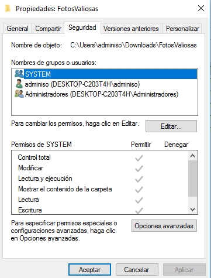
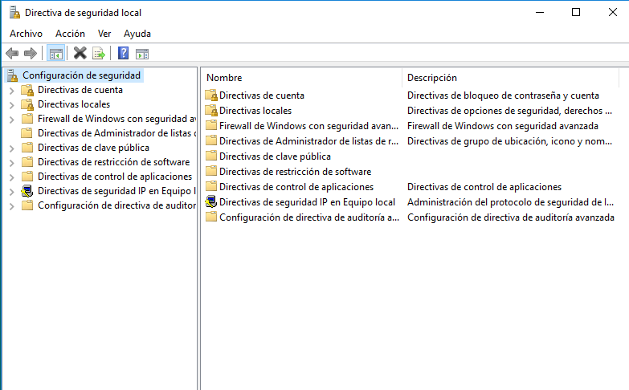

\newpage

# Usuarios y Grupos de un Sistema Operativo

Los usuarios en los sistemas operativos son entidades a las que se les permite realizar una serie de acciones sobre los procesos y los ficheros que se encuentran en el equipo. Cuando nosotros nos identificamos en un Sistema Operativo (*login*), si hemos logrado identificarnos, el sistema nos otorga unos recursos y nos permite lanzar programas y acceder a los recursos correspondientes a nuestro usuario.

Los sistemas operativos modernos, cuando iniciamos sesión en ellos de manera gráfica, nos preparan un entorno gráfico que nos permitirá interactuar con el ordenador. Pero esto no es la única manera de iniciar sesión y de interactuar con los sistemas, esto lo veremos más adelante.

El sistema operativo ha de preparar el entorno (*Environment*) para cada uno de los usuarios que pueda iniciar sesión en el equipo, poblándolo de los recursos y ficheros necesarios para que el usuario pueda interactuar de manera adecuada.

Los sistemas operativos actuales de escritorio son *multiusuario*, esto quiere decir que existen varios usuarios que pueden estar ejecutando programas sobre el sistema.

Los usuarios son capaces de efectuar operaciones sobre ficheros, tales como:

* Leer
* Modificar
* Cambiar propietario
* Eliminar

Además cuando ejecutamos una aplicación en el equipo, esta se pone en marcha utilizando los permisos de los que dispone nuestro usuario, permitiendo así el acceso a ficheros nuestros, Configuraciónes, recursos hardware, etc.

## Grupos

Los usuarios se pueden agrupar en *Grupos*, estos grupos son entidades a las que se les asignan determinados permisos, de tal manera que si necesitamos que una serie de usuarios sea capaz de realizar determinada acción, podamos asignarle este permiso o capacidad a un grupo y a continuación añadir a todos los usuarios que queramos que lo puedan hacer a ese grupo recién creado.

## Usuarios y Grupos predefinidos

Existen tanto en Windows como en GNU/LinuX usuarios y grupos predefinidos en el sistema. Uno de los más famosos de todos es :

> `root` 

Este usuario, el administrador de los sistemas UNIX, aparece en millones de dispositivos y se trata del usuario **0** de los sistemas, puede realizar cualquier operación que el hardware le permita, esto se verá con más detalle en las Unidades de GNU/LinuX.

El usuario administrador en los sistemas Windows es : **Administrador**, en las prácticas veremos que se crea automáticamente durante la instalación del equipo.

Otros usuarios que se crean automáticamente en Windows son:

* Invitado
* defaultUser0

Respecto a los grupos, tanto Windows como LinuX vienen con una serie de grupos que podemos utilizar para asignarles permisos y capacidades a los usuarios que pertenezcan a esos grupos.

A continuación veremos los diferentes grupos que se crean por defecto en Windows 10

| Nombre | Descripción|
| -------| -----------|
|Administradores |	Los administradores tienen acceso completo y sin restricciones al equipo o dominio|
|Administradores de Hyper-V | 	Los miembros de este grupo tienen acceso completo y sin restricciones a todas las características de Hyper-V.|
|Duplicadores	Pueden replicar archivos en un dominio |
|IIS_IUSRS |	Grupo integrado usado por Internet Information Services.|
|Invitados	|De forma predeterminada, los invitados tienen el mismo acceso que los miembros del grupo Usuarios, excepto la cuenta de invitado que tiene más restricciones|
|Lectores del registro de eventos |	Los miembros de este grupo pueden leer registros de eventos del equipo local.|
|Operadores criptográficos	| Los miembros tienen autorización para realizar operaciones criptográficas.|
|Operadores de asistencia de control de acceso |	Los miembros de este grupo pueden consultar de forma remota los atributos de autorización y los permisos para los recursos de este equipo.|
|Operadores de configuración de red	| Los miembros en este equipo pueden tener algunos privilegios administrativos para administrar la configuración de las características de la red| 
|Operadores de copia de seguridad	|Los operadores de copia de seguridad pueden invalidar restricciones de seguridad con el único propósito de hacer copias de seguridad o restaurar archivos.|
|System Managed Accounts Group	|Los miembros de este grupo los administra el sistema.|
|Usuarios |	Los usuarios no pueden hacer cambios accidentales o intencionados en el sistema y pueden ejecutar la mayoría de aplicaciones|
|Usuarios avanzados |	Los usuarios avanzados se incluyen para la compatibilidad con versiones anteriores y poseen derechos administrativos limitados|
|Usuarios COM distribuidos |	Los miembros pueden iniciar, activar y usar objetos de COM distribuido en este equipo.|
|Usuarios de administración remota	|Los miembros de este grupo pueden acceder a los recursos de WMI mediante protocolos de administración (como WS-Management a través del servicio Administración remota de Windows). Esto se aplica solo a los espacios de nombres de WMI que conceden acceso al usuario.|
|Usuarios de escritorio remoto |	A los miembros de este grupo se les concede el derecho de iniciar sesión remotamente|
|Usuarios del monitor de sistema |	Los miembros de este grupo tienen acceso a los datos del contador de rendimiento de forma local y remota|
|Usuarios del registro de rendimiento |	Los miembros de este grupo pueden programar contadores de registro y rendimiento, habilitar proveedores de seguimiento y recopilar seguimientos de eventos localmente y a través del acceso remoto a este equipo|

Esto nos da una visión más concreta del nivel de detalle al que podemos definir los permisos y las capacidades de un usuario cuando está utilizando el equipo.

## Permisos y Control de acceso

En Windows y en GNU/LinuX, el sistema operativo ayuda a proteger archivos, aplicaciones y recursos de uso indebido mediante un proceso que compara las cuentas de usuario y la pertenencia a grupos con los derechos, privilegios y permisos asociados con esas cuentas y pertenencias a grupos.

Para que un usuario pueda tener acceso a un objeto del sistema (*Objeto* hace referencia a cualquier elemento gestionado por el sistema operativo), debe identificarse en el subsistema de seguridad del sistema operativo. Esto funciona mediante un sistema de *tokens* (Testigos), cuando el usuario inicia sesión por cualquier método que hayamos configurado en el equipo, obtiene un *token de autenticación* del subsistema de seguridad, un *salvoconducto* que será presentado ante el sistema cada vez que quiera acceder a objeto. Si el usuario presenta un *token* que está autorizado para tener acceso al objeto y completar la tarea deseada, el sistema lo permitirá. Para realizar esto, compara la información del *token* de acceso con las entradas de control de acceso (*ACE*) del objeto.

Las **ACE** pueden permitir o denegar distintos comportamientos según el tipo de objeto. Si se trata de un fichero pueden ser :

* Leer (r)
* Escribir (w)
* Ejecutar (x)

En caso de que el objeto sea una impresora, las **ACE** pueden ser :

* Imprimir
* Administrar Impresoras
* Administrar Documentos

Las **ACE** individuales de un objeto se combinan en lo que se denomina una *Lista de Control de Acceso* (**ACL**). El Subsistema de seguridad comprueba si la **ACL** del objeto incluye **ACE** relacionadas con el usuario y los grupos a los que pertenece.

El orden en el que se revisa es descendente y funciona de la siguiente manera:

* Se revisa cada **ACE** hasta que una permite o deniega, en este caso se devuelve.
* Continua hasta el final, si llegamos al final y no ha habido ningún resultado se *deniega* el acceso.

Se permite establecer permisos *NTFS* para objetos como archivos, objetos de *Active Directory*, Registro, procesos. Los permisos pueden ser concedidos a usuarios, grupos o equipos. ES recomendable asignarle los permisos a los grupos para mejorar el rendimiento del sistema.

\ 

Se pueden conceder permisos para cualquier Objeto a:

* Grupos, usuarios y otros objetos con identificador de seguridad del dominio (lo veremos más adelante en el módulo)
* Grupos y usuarios del dominio y de cualquier dominio de confianza.
* Grupos y usuarios locales del equipo donde reside el objeto.

Cuando se establecen permisos, se especifica el nivel de acceso de los grupos y usuarios. Por ejemplo, se puede permitir leer a un usuario, escribir a un grupo y prohibir la entrada a todos los demás.

Veremos esto en las prácticas.

### Herencia de permisos

Cuando se crea un objeto, se le asigna un propietario. De manera predeterminada, el propietario es el creador del objeto. Sean cuales sean los permisos que se definan en un objeto, el propietario de un objeto siempre puede cambiarlos. La *herencia* permite a los administradores asignar y administrar permisos fácilmente. Esta característica hace que los objetos de un contenedor hereden automáticamente todos los permisos heredables de ese contenedor.

Un buen ejemplo de esto es que cuando creamos archivos dentro de una carpeta, estos heredarán los permisos de la carpeta (*si lo hemos indicado*).

### Derechos de usuario

Los derechos de usuario conceden privilegios y derechos de inició de sesión a los usuarios y grupos. Estos derechos autorizan a los usuarios a realizar acciones específicas, como iniciar una sesión en un sistema de forma interactiva, realizar copias de seguridad,...

La diferencia entre los permisos y los derechos de usuario es que estos últimos se aplican a las cuentas de usuario, mientras que los permisos se aplican a los objetos. Es recomendable aplicar estos derechos a grupos. Se puede gestionar estos derechos en :

Directivas Locales>Asignación de derechos de usuario.

\

\ 
