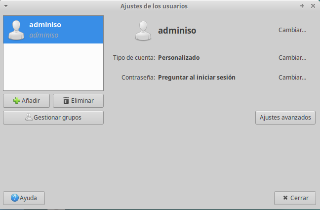
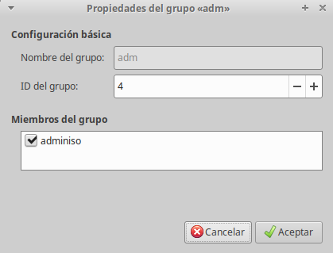

\newpage

## Usuarios y Grupos en GNU/LinuX

### Usuarios

LinuX es un sistema multiusuario, y se utilizan diferentes usuarios para gestionar de manera segura las capacides y los permisos de las aplicaciones y servicios que ejecuta el SO.

Ya hemos visto que podemos tener varios usuarios logados a la vez en el sistema (*multiusuario*), estos logins pueden ser a través de las consolas normales (*tty[1-6]*), la gráfica (*tty7*) o via logins remotos (*ssh*).

Para iniciar sesión cada usuario tiene dos elementos indispensables:

 * login
 * password

No hay que confundir el login con el *Nombre Completo*, este puede ser con mayusculas, minúsculas, espacios...
Además hay una serie de carpetas y datos que tienen que ver con la creación de un usuario. Esto lo vamos a ver más adelante.

El usuario con más privilegios en LinuX es aquel cuyo login es **root** (Raiz). Este es el único con derechos suficientes para crear o eliminar a otros usuarios, además de acceder a todo el sistema de ficheros sin ninguna restricción. Es el **superusuario** en GNU/LinuX.

En Ubuntu la cuenta de **root** está deshabilitada, por motivos de seguridad. La idea principal es que si intentamos un ataque por fuerza bruta, si sabemos al menos una de las dos partes de la clave necesaria, es más sencillo conseguir entrar que si tenemos que probar. Sin embargo en otras distribuciones lo que se hace es que se deshabilita el login de root via remota (**ssh**), de esta manera podemos logarnos en el equipo con **root** en un equipo, pero si nos estamos conectando via *ssh*, primero tendremos que pasar por un *usuario desconocido*. Como veis son soluciones muy similares en su conclusión final.

Para crear un usuario desde la terminal se puede usar el comando **adduser**.

\newpage

### Grupos

En Linux además existen grupos de usuarios también administrados por root o por un usuario designado por este. Los grupos permiten otorgar los mismos privilegios a un conjunto de usuarios.

Siempre que se añada un usuario al sistema se creará un grupo con su mismo nombre, llamado grupo primario. Durante la creación o posteriormente, se podrá incorporar el usuario a otros grupos secundarios.

Tanto los usuarios como los grupos se identifican por el sistema a través de un identificador (*ID*) numérico. El usuario root siempre tiene el ID cero. Cada usuario cuando se conecta al sistema posee un identificador de usuario asociado (uid) y un identificador de grupo (gid).

Para comprobar el uid de nuestro usuario, y el gid del grupo principal al que pertenece, podéis ejecutar la orden

```shell
 id
```

 Al añadir un usuario también se creará un directorio base para el mismo con el nombre de su login.  Este directorio se coloca por defecto en el directorio **/home** excepto para root, cuyo directorio  base es **/root**.

La información asociada a los usuarios en un sistema Linux se guarda en el fichero `/etc/passwd`
y las contraseñas y datos afines en  `/etc/shadow`.

Por su parte la información de los grupos y sus miembros están en `/etc/group`.


## Administración de usuarios y grupos en GNU/LinuX

En nuestro centro tanto el profesorado como el alumnado acostumbran a personalizar su escritorio, incluyendo accesos directos, carpetas y demás vínculos que considera importantes y cómodos en su tarea diaria. Pero todo esto incomoda, en muchas ocasiones, a otros usuarios que también utilizan el mismo equipo. Esta situación es especialmente patente en las aulas de informática, donde parece que el alumnado compite en crear ámbitos de trabajo extravagantes e inútiles, con la pérdida de tiempo en la carga del sistema operativo y que posteriormente repercute en nuestro trabajo al tener que estar reinstalando equipos, eliminando programas, etc.

Para resolver el problema anterior es necesario disponer de una base de datos de usuarios y grupos donde poder asignar o denegar permisos de acceso a los recursos autenticados de nuestro centro. Ello permitirá personalizar los entornos de trabajo de cada usuario, dando solución al problema planteado tanto por el profesorado como por el alumnado.

La administración de usuarios y grupos solamente puede realizarlas el usuario root utilizando los comandos de gestión de usuarios. Las tareas y los comandos para realizarlas son:

| Tarea | Comando|
| ------|--------|
|Creación de usuarios | useradd|
|Modificación de usuarios | usermod|
|Modificacion contrasenyas | passwd,chpasswd|
|Eliminación de usuarios | userdel|
|Creación de grupos | groupadd|
|Modificación de grupos | groupmod|
|Eliminación de grupos | groupdel|
|Añadir usuarios a un grupo | adduser|
|Quitar usuarios de un grupo | deluser|

### Creación de usuarios

El comando `adduser` permite añadir un usuario indicando como parámetros la información particular para crear el usuario en la misma líne de comandos. La sintaxis es:

`adduser loginUsuario`

### Establecer la contraseña del usuario

`sudo passwd violin`

Entonces el sistema nos preguntará dos veces la contraseña que queremos asignar a violin.

Se recomienda que el nombre de usuario sea en minúsculas y además de letras también puede contener números y algún signo como guiones normales y guiones bajos. Debemos recordar que unix distingue entre mayúsculas y minúsculas, es decir, Director es distinto de director.

Otra opción es usar `chpasswd` que permite ser **scriptado** ya que acepta de manera *natural* que la contraseña le llegue por entrada estándar.

Ejemplo:

`echo "violin:violinPass123"| chpasswd`

De esta manera podemos incluirlo en el script de generación de usuarios si fuera necesario. 

>**NOTA**: Esto es una práctica peligrosa, ya que el usuario cuenta con una contraseña *conocida* por varias personas, lo correcto sería que en el primer login se la cambiara o que esta técnica solo se usase para usuarios *genericos*.

### Modificación de usuarios

Se utiliza el comando usermod y permite cambiar el nombre del usuario, su carpeta $HOME, su intérprete de comandos, los grupos a los que pertenece y algunos otros parámetros.

`sudo usermod -d /home/primer_violin violin`

### Eliminación de usuarios

Se realiza con el comando `userdel` seguido del nombre del usuario. Con la opción -r eliminará también su carpeta home, ejemplo:

`sudo userdel -r viola`

Eliminaría el usuario viola y su carpeta $HOME.

### Creación de grupos

El comando `groupadd` permite añadir un grupo indicando como parámetro el nombre del grupo.

Ejemplo, si deseamos crear un grupo llamado 'metal' ejecutaremos:

`sudo groupadd metal`

### Modificación de grupos

El comando groupmod permite modificar el nombre de un grupo o el gid del mismo.

La sintaxis es: `sudo groupmod [-g nuevo-gid] [-n nuevo-nombre] nombre-grupo`

### Eliminación de grupos

Se realiza con el comando groupdel seguido del nombre del grupo, ejemplo:

`sudo groupdel metal`

Eliminaría el grupo metal. Si algún usuario tuviera dicho grupo como grupo primario, el comando groupdel no eliminará el grupo.

### Añadir usuarios a un grupo

Se utiliza el comando adduser seguido del nombre del usuario y del nombre del grupo al que queremos añadirle, ejemplo:

`sudo adduser trompa metal`

### Quitar usuarios de un grupo

Se utiliza el comando `deluser` seguido del nombre del usuario y del nombre del grupo del que queremos quitarle, ejemplo:


`sudo deluser trompa metal`

Para más información de todos estos comandos se puede consultar la ayuda del manual ejecutando man seguido del nombre del comando, ejemplo man adduser.

\newpage

### Herramienta gráfica de administración de usuarios

Ubuntu y Debian disponen de una herramienta gráfica de administración de usuarios que es *'users-admin'*.


\ 

Gestión de los miembros de cada uno de los grupos que encontramos en el equipo


\
