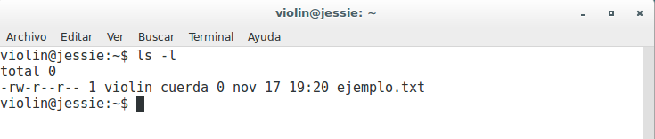
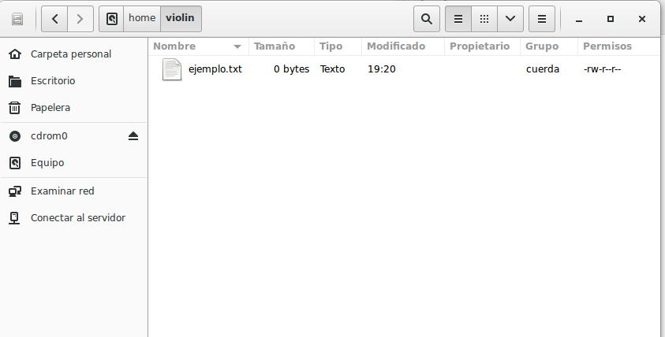
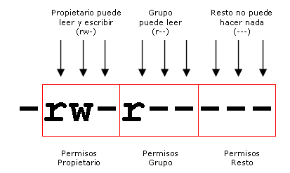
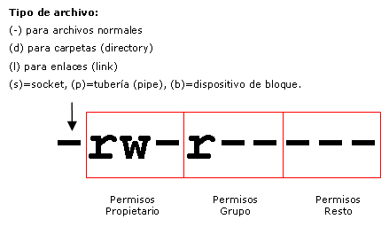
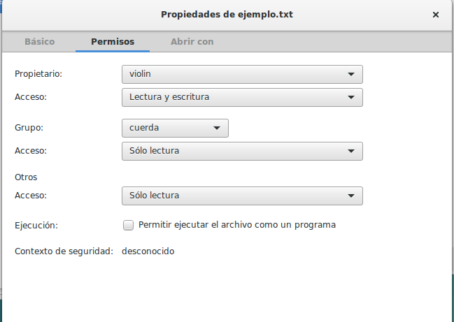

\newpage

# Permisos de archivos y carpetas en GNU/LinuX

## Usuario propietario y grupo propietario de un archivo

Anteriormente se ha comentado que en Unix todos los archivos pertenecen obligatoriamente a un usuario y a un grupo. Cuando un usuario crea un nuevo archivo, el propietario del archivo será el usuario que lo ha creado y el grupo del archivo será el grupo principal de dicho usuario. Existe la posibilidad de que el grupo sea **nogroup** y el usuario **nobody**, pero incluso estos son usuarios y grupos (especiales, eso sí) que se encuentran en el sistem

Ejemplo, si un usuario llamado 'violin' cuyo grupo principal es el grupo 'cuerda' crea un nuevo archivo, el propietario del archivo será 'violin' y el grupo propietario del archivo será 'cuerda', o lo que es lo mismo, el archivo pertenecerá al usuario violin y al grupo cuerda. Obligatoriamente, todos los archivos del sistema pertenecen a algún usuario y a algún grupo.

Con el comando ls añadiendo la opción -l (formato largo) podemos visualizar el usuario propietario y el grupo propietario del archivo, ejemplo:



\

Comprobamos que el usuario propietario es violin y el grupo propietario es cuerda. La misma información podemos verla desde el administrador de archivos si vamos a la carpeta /home/violin y mostramos las columnas correspondientes:


\

## Tipos de permisos

En los Sistemas Unix, la gestión de los permisos que los usuarios y los grupos de usuarios tienen sobre los archivos y las carpetas, se realiza mediante un sencillo esquema de tres tipos de permisos que son:

* Permiso de lectura
* Permiso de escritura
* Permiso de ejecución

El significado de estos permisos difiere si se tienen sobre archivos o sobre carpetas. A continuación veremos el significado para cada uno de los casos:

### Permiso de lectura

Cuando un usuario tiene permiso de lectura de un archivo significa que puede leerlo o visualizarlo, bien sea con una aplicación o mediante comandos. Ejemplo, si tenemos permiso de lectura sobre el archivo examen.txt, significa que podemos ver el contenido del archivo. Si el usuario no tiene permiso de lectura, no podrá ver el contenido del archivo.

Cuando un usuario tiene permiso de lectura de una carpeta, significa que puede visualizar el contenido de la carpeta, es decir, puede ver los archivos y carpetas que contiene, bien sea con el comando 'ls' o con un explorador de archivos como natilus, thunar,...  

Si el usuario no tiene permiso de lectura sobre la carpeta, no podrá ver lo que contiene.

El permiso de lectura se simboliza con la letra 'r' del inglés 'read'.


### Permiso de escritura

Cuando un usuario tiene permiso de escritura sobre un archivo significa que puede modificar su contenido, e incluso borrarlo. También le da derecho a cambiar los permisos del archivo mediante el comando chmod así como cambiar su propietario y el grupo propietario mediante el comando chown. Si el usuario no tiene permiso de escritura, no podrá modificar el contenido del archivo.

Cuando un usuario tiene permiso de escritura sobre una carpeta, significa que puede modificar el contenido de la carpeta, es decir, puede crear y eliminar archivos y otras carpetas dentro de ella. Si el usuario no tiene permiso de escritura sobre la carpeta, no podrá crear ni eliminar archivos ni carpetas dentro de ella.

El permiso de escritura se simboliza con la letra 'w' del inglés 'write'.


\newpage
### Permiso de ejecución

Cuando un usuario tiene permiso de ejecución de un archivo significa que puede ejecutarlo. Si el usuario no dispone de permiso de ejecución, no podrá ejecutarlo aunque sea una aplicación.

Los únicos archivos ejecutables son las aplicaciones y los archivos de comandos (scripts). Si tratamos de ejecutar un archivo no ejecutable, dará errores.

Cuando un usuario tiene permiso de ejecución sobre una carpeta, significa que puede entrar en ella, bien sea con el comando 'cd' o con un explorador de archivos como Konqueror. Si no dispone del permiso de ejecución significa que no puede ir a dicha carpeta.

El permiso de ejecución se simboliza con la letra 'x' del inglés 'eXecute'.


## ¿A quién se puede otorgar permisos?

Los permisos solamente pueden ser otorgados a tres tipos o grupos de usuarios:

* Al usuario propietario del archivo
* Al grupo propietario del archivo
* Al resto de usuarios del sistema (todos menos el propietario)

Se pueden dar permisos de lectura, escritura, ejecución ó combinación de ambos al usuario propietario del archivo, al grupo propietario del archivo o al resto de usuarios del sistema. En Unix no existe la posibilidad de asignar permisos a usuarios concretos ni a grupos concretos, tan solo se puede asignar permisos al usuario propietario, al grupo propietario o al resto de usuarios.

Ejemplo, si disponemos de un archivo llamado 'examen.txt' cuyo propietario es 'violin' y cuyo grupo propietario es 'cuerda', se pueden dar permisos de lectura, escritura, ejecución ó combinación de ambos al usuario 'violin', al grupo 'cuerda' y al resto de usuarios, pero no podremos dar permisos a otros usuarios distintos de violin (trompa, viola, violonchelo,...) ni a otros grupos (instrumentos, metal, percusión,...) ya que el esquema Unix no lo permite.

Supongamos que la siguiente figura representa los permisos de examen.txt:



El usuario propietario (violin) podrá leer y escribir en el documento. Los pertenecientes al grupo cuerda podrán leerlo y el resto no podrá hacer nada.

Si deseamos que otros usuarios tengan algún permiso sobre el archivo 'examen.txt', no me quedará más remedio que incluirlos en el grupo cuerda u otorgar el permiso al resto de usuarios pero si hacemos esto último, absolutamente todos los usuarios del sistema gozarán del permiso, por eso no se recomienda salvo que eso sea nuestra intención.

Para poder cambiar permisos sobre un archivo, es necesario poseer el permiso de escritura sobre el mismo. El usuario root puede modificar los permisos de cualquier archivo ya que tiene acceso total sin restricciones a la administración del sistema.

## Visualizar los permisos de un archivo o carpeta

Con el comando ls -l podemos visualizar los permisos de los archivos o carpetas. Al ejecutar el comando aparecen todos los archivos, uno por línea. El bloque de 10 caracteres del principio simboliza el tipo de archivo y los permisos.



El primer carácter indica de qué tipo de archivo se trata. Si es un guión '-' significa que se trata de un archivo normal, la letra 'd' significa que se trata de una carpeta (*directory*), la letra 'l' significa que se trata de un enlace (*link*). Otros valores son s, p, b que se refieren a *sockets*, tuberías (*pipe*) y dispositivos de bloque respectivamente.

Los 9 caracteres siguientes simbolizan los permisos del usuario propietario (3 caracteres), los permisos del grupo propietario (3 caracteres) y los permisos del resto de usuarios (3 caracteres). Vienen codificados con las letras r, w y x que se refieren a los permisos de lectura, escritura y ejecución. Si en lugar de aparecer dichas letras aparecen guiones significa que se carece de dicho permiso. Ejemplo, si los diez primeros caracteres son -rw-r----- significa que es un archivo normal, que el usuario propietario dispone de permisos de lectura y escritura pero no de ejecución, que el grupo propietario dispone tan solo de permiso de lectura y el resto de usuarios no dispone de ningún permiso. Veámoslo en la siguiente imagen:


En el siguiente ejemplo vemos que violin tiene permiso de lectura y escritura y que el resto solo tiene permiso de lectura tanto sobre el archivo 'apuntes.doc' como sobre el archivo 'examen.txt'.

```shell
ls -l
total 8
-rw-r--r--  1 violin cuerda 359 2011-09-28 18:02 apuntes.doc
-rw-r--r--  1 violin cuerda  11 2011-09-27 19:26 examen.txt
```

## Cambio de permisos

Para cambiar los permisos de un archivo o una carpeta es necesario disponer del permiso de escritura (w) sobre dicho archivo o carpeta. Para hacerlo, se utiliza el comando chmod. La sintaxis del comando chmod es la siguiente:

`chmod [opciones] permiso nombre_archivo_o_carpeta`

Los permisos se pueden representar de dos formas. La primera es mediante las iniciales de a quién va dirigido el permiso (usuario=u, grupo=g, resto=o (other)), seguido de un signo *+* si se quiere añadir permiso o un signo *-* si se quiere quitar y seguido del tipo de permiso (lectura=r, escritura=w y ejecución=x).

Ejemplos:

Dar permiso de escritura al usuario propietario sobre el archivo 'examen.txt'

`chmod u+w examen.txt`

Quitar permiso de escritura al resto de usuarios sobre el archivo 'examen.txt'

`chmod o-w examen.txt`

Dar permiso de ejecución al grupo propietario sobre el archivo `/usr/bin/games/monkey_island`

`chmod g+x /usr/bin/games/monkey_island`

Dar permiso de lectura al grupo propietario sobre el archivo 'examen.txt'

`chmod g+r examen.txt`

Se pueden poner varios permisos juntos separados por comas

`chmod u+w,g-r,o-r examen.txt`

Se pueden poner varios usuarios juntos

`chmod ug+w examen.txt`

La segunda forma de representar los permisos es mediante un código numérico cuya transformación al binario representaría la activación o desactivación de los permisos. El código numérico está compuesto por tres cifras entre 0 y 7. La primera de ellas representaría los permisos del usuario propietario, la segunda los del grupo propietario y la tercera los del resto de usuarios.

En binario, las combinaciones representan el tipo de permisos. El bit más a la derecha (menos significativo) se refiere al permiso de ejecución (1=activar y 0=desactivar). El bit central se refiere al permiso de escritura y el bit más a la izquierda se refiere al permiso de lectura. La siguiente tabla muestra las 8 combinaciones posibles:

|Cód| Binario |  Permisos efectivos|
|---|---------|--------------------|
|0  |   0 0 0 |      - - -|
|1   |   0 0 1 |      - - x|
|2   |   0 1 0  |     - w -|
|3   |   0 1 1   |    - w x|
|4   |    1 0 0   |    r - -|
|5   |    1 0 1   |    r - x|
|6  |     1 1 0   |    r w -|
|7 |      1 1 1   |    r w x|

Si deseamos otorgar sólo permiso de lectura, el código a utilizar es el 4. Si deseamos otorgar sólo permiso de lectura y ejecución, el código es el 5. Si deseamos otorgar sólo permiso de lectura y escritura, el código es el 6. Si deseamos otorgar todos los permisos, el código es el 7. Si deseamos quitar todos los permisos, el código es el 0. Ejemplos:

Dar todos los permisos al usuario y ninguno ni al grupo ni al resto

`chmod 700 examen.txt`

Dar al usuario y al grupo permisos de lectura y ejecución y ninguno al resto

`chmod 550 examen.txt`

Dar todos los permisos al usuario y lectura y ejecución al grupo y al resto

`chmod 755 /usr/bin/games/monkey_island`

Dar todos los permisos al usuario y de lectura al resto, sobre todos los archivos

`chmod 744 *`

Cambiar permisos a todos los archivos incluyendo subcarpetas

`chmod -R 744 *`

Existe la posibilidad de cambiar los permisos utilizando el explorador de archivos. Para ello tan solo hay que seleccionar los archivos o carpetas y haciendo clic sobre la selección con el botón derecho del ratón > Propiedades, nos aparecerá la ventana de propiedades. Haciendo clic en la pestaña Permisos podremos establecer los permisos de una forma sencilla y haciendo clic en 'Permisos avanzados' de una forma avanzada. Esto último varia dependiendo del navegador de ficheros que estamos usando.



## Bits SUID y SGID

El bit *SUID* es una extensión del permiso de ejecución. Se utiliza en escasas ocasiones y sirve para que cuando un usuario ejecute una aplicación, ésta se ejecute con permisos del usuario propietario en lugar de hacerlo con los del usuario que ejecuta la aplicación, es decir, es equivalente a que sea ejecutada por el propietario.

Para activar el bit *SUID*, se puede ejecutar el comando chmod u+s nombre_archivo o sumar 4000 al número en octal si utilizamos dicho sistema. También se puede hacer lo mismo para el grupo, es el denominado bit *SGID* sumando 2000 al número en octal. Activar los bits *SUID* ó *SGID* puede ocasionar problemas de seguridad sobre todo si el propietario es **root**.

Si aplicamos el bit *SGID* a una carpeta, todas las subcarpetas y archivos creados dentro de dicha carpeta tendrán como grupo propietario el grupo propietario de la carpeta en lugar del grupo primario del usuario que ha creado el archivo. Es una ventaja cuando varias personas pertenecientes a un mismo grupo, trabajan juntas con archivos almacenados en una misma carpeta. Si otorgamos permisos de lectura y escritura al grupo, los archivos podrán ser modificados por todos los miembros del grupo y cuando cualquiera de ellos cree un archivo, éste pertenecerá al grupo.


## Máscaras

Cuando se crea un archivo, los permisos originales por defecto son `666` y cuando se crea una carpeta, los permisos por defecto son `777`. Dichos permisos por defecto pueden modificarse con el comando `umask`.

Con `umask` podemos definir la máscara de permisos, cuyo valor original es `000`. El permiso por defecto será el resultado de restar del permiso original, el valor de la máscara. Si deseamos que los archivos se creen con permisos `644` (lo más habitual), pondremos máscara `022` ya que 666-022=644. 

En el caso de las carpetas, el permiso efectivo será `755` ya que 777-022=755. Si analizamos el valor de la máscara en binario, cada bit a '1' desactiva un permiso y cada bit a '0' lo activa, es decir, si tiene un valor `022` (000 010 010) cuando creemos una carpeta, tendrá permisos `rwxr-xr-x` y cuando creemos un archivo tendrá permisos `rw-r--r--` ya que el permiso de ejecución para archivos hay que fijarle con `chmod` al tener los archivos el permiso original `666`.

Cada usuario tiene su máscara. Se puede fijar la máscara por defecto para todos los usuarios en el archivo `/etc/login.defs` o para cada usuario en el archivo `/home/USUARIO/.bashrc`

>**NOTA**: La modificación con `umask` de la mascara por defecto no afecta a los archivos y carpetas existentes sino solo a los nuevos que cree ese usuario a partir de ese momento.

Tenéis información de Umask en Ubuntu aquí:

[Umask en Ubuntu](http://askubuntu.com/questions/44542/what-is-umask-and-how-does-it-work)

## Grupos privados de usuario

Para hacer más flexible el esquema de permisos Unix, se recomienda utilizar grupos privados de usuario. Consiste en crear un nuevo grupo con el mismo nombre del usuario, cada vez que se crea un nuevo usuario y hacer que el grupo principal del nuevo usuario sea el nuevo grupo.

Ejemplo, si creamos un usuario violin, crearemos también un grupo llamado violin y haremos que el grupo primario del usuario violin sea el grupo violin.

En el siguiente ejemplo observamos que el UID del usuario violin es 1002 y que su grupo principal es el 1003 que corresponde al GID del grupo violin. También vemos que si creamos un nuevo archivo, pertenecerá al usuario violin y al grupo violin.

Aunque parezca inservible, la creación de un grupo personal para cada usuario, permitirá crear otros grupos mediante los cuales, diferentes personas puedan trabajar de forma colaborativa sobre los archivos dentro de una carpeta concreta. Veamoslo mejor con un ejemplo:

Supongamos que creamos una carpeta llamada `examenes` que pertenezca al grupo cuerda. Si establecemos el bit SGID en dicha carpeta con el comando `chmod g+s examenes`, todos los archivos que se creen dentro de dicha carpeta tendrán como grupo propietario el grupo cuerda. Si todos los usuarios utilizan máscara 002, los permisos de los archivos serán 664 con lo cual, cualquier integrante del grupo cuerda podrá visualizar y modificar los archivos.

El problema de usar la máscara 002 es que cualquiera que pertenezca al grupo principal de un usuario, tendría acceso de escritura sobre sus archivos, pero esto no sucederá nunca ya que cada usuario tiene su propio grupo principal y nadie más pertenece a él.

## Cambiar usuario propietario y grupo propietario

Para poder cambiar el usuario propietario y el grupo propietario de un archivo o carpeta se utiliza el comando `chown  (change owner)`. Para ello hay que disponer de permisos de escritura sobre el archivo o carpeta. La sintaxis del comando es:

`chown nuevo_usuario[:nuevo_grupo] nombre_archivo`

En el siguiente ejemplo vemos una secuencia de comandos en la que inicialmente comprobamos que el archivo `examen.txt` pertenece al usuario violin y al grupo cuerda. Posteriormente hacemos que pertenezca al usuario viola y luego hacemos que pertenezca al usuario violonchelo y al grupo instrumentos:

```shell
chown viola:viola examen.txt
chown violonchelo:instrumentos examen.txt
```
