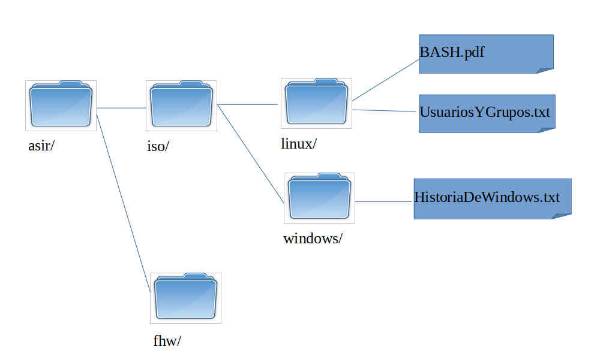

# Tarea: Creación de enlaces en Windows

Todos estos ejercicios se realizan con la máquina virtual de Windows 10.

## Ejercicio 1

Crear la siguiente estructura de carpetas y ficheros en el sistema (Hacerlo desde `/`): 

Las rutas han de quedar así:

Ej:

`C:\asir\iso\linux\UsuariosYGrupos.txt
`

>NOTA: TODOS LOS FICHEROS Y DIRECTORIOS HAN DE PERTENECER AL USUARIO : `adminiso`

## Ejercicio 2

Crear un fichero con espacios en el nombre en la carpeta fhw que se llame:

`Temario de FHW.pdf` ← ¡Atención a los espacios!

## Ejercicio3

Crear un enlace simbólico en la carpeta Windows  que apunte al fichero `UsuariosYGrupos.txt` cuya ruta se absoluta y tenga el nombre: `UsuariosYGrupos.lnk`

## Ejercicio 4

Crear un enlace simbólico en la carpeta Linux que apunte al fichero `Temario de FHW.pdf` cuya ruta sea relativa y tenga el nombre `FHW.lnk`

## Ejercicio 5

Crear un enlace simbólico a la carpeta personal del usuario alumno (`%USERPROFILE%`) dentro de la carpeta fhw cuyo nombre sea: `CarpetaPersonal`.

## Ejercicio 6

Crear un enlace duro al fichero `BASH.pdf` en la carpeta windows cuyo nombre sea: `POWERSHELL.pdf`

## Ejercicio 7

Crear un enlace simbólico a la carpeta `C:\Users\` en la carpeta linux cuyo nombre sea: `Usuarios`.

## Ejercicio 8

Crear un enlace simbólico al fichero `Usuarios` creado en el ejercicio anterior en la carpeta windows, cuyo nombre sea: `enlaceAUsuarios`.

## Ejercicio 9

Crea un carpeta en `C:\asir\` que se llame `resultados`.

## Ejercicio 10

Crea en la carpeta `resultados` el listado de los ficheros que son enlaces que podemos encontrar en la carpeta `asir` con el nombre `enlaces.txt`.

## Ejercicio 11

Crea en la carpeta `resultados`  el listado de los ficheros y directorios que están en asir comienzan por la letra : `U` con el nombre `ficheros_U.txt`.

## Ejercicio 12

Crea en la carpeta `resultados` el listado de los directorios que están en asir con el nombre: `directorios_en_asir.txt`
