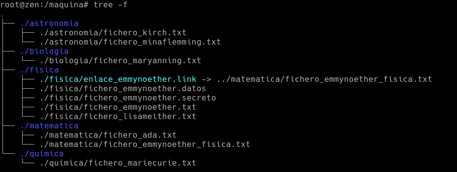
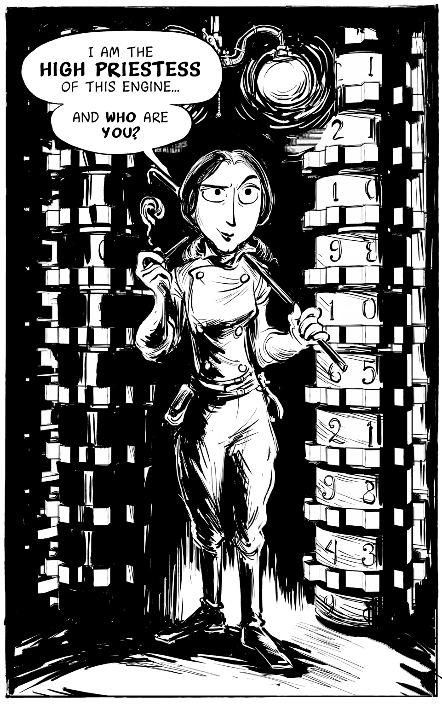

# Tarea: 11 de Febrero - Parte I

# _¡Atención Navegantes!_
Se deben realizar las tareas descritas en el ejercicio de manera que se demuestre que se sabe hacer, no se trata tan solo de «Presentar» un trabajo, sino de la evaluación de como se realiza y si el alumnado ha adquirido la destreza necesaria.

Nos encontramos cerca de la semana del 11 de Febrero, día Internacional de la Mujer y la Niña y en la Ciencia. Vamos a trabajar los conceptos vistos a lo largo de estos meses con la ayuda inestimable de nuestra investigadora favorita...Ada Lovelace (Ada Byron, Condesa de Lovelace). 
Ada Lovelace fue una maravillosa matemática que junto a Charles Babbage estableció las bases del Software y del Hardware. Le debemos la informática tal y como la conocemos hoy en día. Ha llegado el momento de que le ayudemos en una serie de problemas que tiene.

Por supuesto asumiremos que disponemos de la capacidad de viajar a los diferentes universos de bolsillo que se plantean en la actividad. Un poco de imaginación no nos viene mal.

----

# Misión 1 : ¡Muchos usuarios y grupos!

Ada tiene que organizar muchos ficheros, carpetas y preparar las invitaciones para todos los asistentes al evento de la puesta marcha de su famosa máquina de las diferencias.
Ada es ordenada y necesitará que los usuarios puedan ir entrando en su computadora con su usuario y contraseña y además deberemos asegurarnos de que no son capaces de hacer lo que no deben hacer, ya que hay reputad@s científicas que no desean que sus ficheros sean leídos por cualquiera.

\ 

Ada piensa que lo deberemos preparar son una serie de usuarios y grupos para poder gestionar más adelante los permisos.
A continuación se presenta la tabla de usuarios y los grupos a los que debe pertenecer.

|       | fisica | astronomia | matematicas | biologia | quimica |
| ----- | ------ | ---------- | ----------- | -------- | ------- |
|adalovelace | x | x | x  | x | x | 
|emmynoether | x |  | x  |  |  |
|kirch |  | x |   |  |  |
|mariecurie |  |  |   |  | x |
|maryanning |  |  |   | x |  |
| lisameitner | x | |  | |  | |
| minafleming| | x | | | |

Todas deben pertenecer a un grupo llamado: `cientificas` además de los mostrados.
Todos los nombres de las científicas están escritos en minúsculas (mejor para los ordenadores) y los grupos sin acentos ni caracteres fuera de ASCII-7. Ruego mantener la nomenclatura o no se dará por bueno. 
Para la creación de las usuarias…: `adduser`

# Misión 2: La máquina y sus ficheros

¡Debemos preparar una serie de ficheros y carpetas en nuestro sistema para permitir trabajar con ellos a nuestras invitadas!
Para ello debemos generar en /maquina la estructura de ficheros siguiente:

\ 

Requisitos:

* Los ficheros deben llamarse **EXACTAMENTE** como aparecen en la captura.  Y deben estar situados en `/maquina`. (RAIZ).
* La carpeta `/maquina` debe ser de `ada` y grupo `cientificas`.
* Cada una de las carpetas de las diferentes ciencias debe pertenecer al grupo y tan solo dejar pasar a aquellas que son de ese grupo.
* Si se comete un fallo de seguridad (por exceso o por defecto) la máquina no podrá trabajar y la evaluación se corromperá hasta notas increíblemente bajas.

\ 

# Misión 3: ¡Un poquito de orden!

Debido a que las científicas son personas muy ordenadas y cuidadosas necesitamos preparar los ficheros de la máquina de tal manera que nos aseguremos de que cada uno de los ficheros y carpetas se comporta de la manera esperada.

Los nombres de las carpetas indican el grupo y los ficheros contienen la usuaria que los utilizará. 

En este problema nos prepararemos para los ejercicios siguientes…

Se requiere que cada uno de los ficheros (no directorios) sea del usuario que se indica y grupo al que pertenece la carpeta. Además los miembros de grupo podrán SOLO leer y los propietarios leer, escribir y ejecutar. Otros no podrán hacer nada.

## Submisión: Emmy Noether

Emmy Noether es una persona muy trabajadora y le gusta tener sus ficheros en perfectas condiciones en todas las máquinas analíticas en las que trabaja. Antes de que empiece a trabajar, lanza un proceso que se asegura de que todos los permisos y ficheros están donde deben estar y además son como deben ser.
La misión consiste en crear un script que se llamará “workspace_emmy.sh” que lo que hará será lo siguiente:

* Comprobar que `/maquina/fisica` es una carpeta
* Comprobar que existen los ficheros y SI NO existen, crearlos (los ficheros de Emmy)
* En el caso del enlace, comprobar que no esta roto, pero no crearlo  si no existe el destino del mismo.
* El fichero `fichero_emmynoether.datos` ha de ser leído y escrito solo por ella y el grupo solo ha de poder leer.
* El fichero `fichero_emmynoether.secreto` solo ha de ser leído por ella.
* El fichero `fichero_emmynoether.txt` debe tener los permisos habituales.

El script debe comprobar todo e ir indicando al usuario las comprobaciones que va realizando, indicando los errores que encuentre y mostrando como arreglarlos.

>¡Suerte a tod@s!