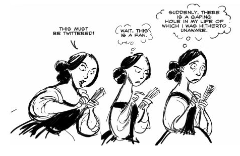

# Tarea: 11 de Febrero - Parte II

# _¡Atención Navegantes!_
Se deben realizar las tareas descritas en el ejercicio de manera que se demuestre que se sabe hacer, no se trata tan solo de «Presentar» un trabajo, sino de la evaluación de como se realiza y si el alumnado ha adquirido la destreza necesaria.

Nos encontramos cerca de la semana del 11 de Febrero, día Internacional de la Mujer y la Niña y en la Ciencia. Vamos a trabajar los conceptos vistos a lo largo de estos meses con la ayuda inestimable de nuestra investigadora favorita...Ada Lovelace (Ada Byron, Condesa de Lovelace). 
Ada Lovelace fue una maravillosa matemática que junto a Charles Babbage estableció las bases del Software y del Hardware. Le debemos la informática tal y como la conocemos hoy en día. Ha llegado el momento de que le ayudemos en una serie de problemas que tiene.

Por supuesto asumiremos que disponemos de la capacidad de viajar a los diferentes universos de bolsillo que se plantean en la actividad. Un poco de imaginación no nos viene mal.

----

# Misión 4 : Particiones y gestión de ficheros

Ada se ha dado cuenta de que la cantidad de información de la que dispone en /maquina comienza a ser muy elevada. Ha pensado en añadir un  nuevo disco duro y preparar unas particiones para las distintas usuarias de la máquina. 

\ 

Añadiremos 1 disco duro a la máquina virtual de Ada de tamaño 10 Gigas. En el crearemos 5 particiones primarias (uso de GPT) y a continuación lo que haremos será montar esas 5 particiones en 5 carpetas que situaremos en: 

`/ada/`

De esta manera:

| Punto de Montaje | Tamaño | Sistema de ficheros |
|------------------|--------|---------------------|
| `/ada/fisica`    | 2 Gigas |(ext4) | 
| `/ada/astronomia`|  2 Gigas | (ext4) |
| `/ada/matematica`| 2 Gigas | (ext4) |
| `/ada/biologia`  |2 Gigas | (ext4) |
| `/ada/quimica`   | 2 Gigas | (ext4) |

Cada una de estas particiones han de montarse DIRECTAMENTE con el grupo correspondiente. Para ello deberemos indicarlo en  el fichero de configuración del sistema de ficheros.

# Misión 5: El Usb de Marie Curie

Nos encontramos con una situación curiosa. Ha llegado Marie Curie con su USB (formateado en Fat32) y lo ha conectado como disco duro a nuestra máquina. Sin hacer nada ha aparecido en el equipo, pero los permisos están “extraños”. Nos pide hacer un script que:

* Haga copia de los ficheros que hay en el USB en nuestra carpeta `/root/`.
* Formatee el USB en `ext4` y a continuación lo monte en `/mnt/marie `.
* Restablezca los ficheros salvados.
* A continuación se les cambiará el propietario a `marie:marie` y además se aplicarán los siguientes permisos:
  * Todos los ficheros : 644.
  * Todos los directorios: 755.

El script aceptará como parámetro la partición que está en FAT32.

Ejemplo:

`./marie-usb.sh /dev/sdd1 `

>¡Suerte a tod@s!