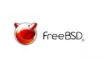

# Tarea: Instalación SO (Ampliación)

En la empresa *Administración Aguacates para Titanes* están pensando en contratar a un@ nuev@ técnic@ para cubrir una plaza permanente a 1200 € bruto mes.
En vez de realizar entrevistas, los de Sistemas han preparado unas pequeñas pruebas acerca de como funcionan los diferentes SO y Máquinas que administran y mantienen en la empresa.

Cuentan con las siguientes máquinas:

Un pequeño sistema cuyo hostname es : karateka que tiene instalada una distribución de LinuX llamada Alpine.

\ 

Una estación de trabajo cuyo hostname es : norris que tiene instalada una FreeBSD con entorno gráfico y el GIMP.

\ 

Un escritorio con puppy cuyo hostname es : karthus que tienen preparada para recambio en caso de que el FreeBSD no les arranque.

\ 

En el concurso se pide:

La instalación de 3 Máquinas virtuales con 5 Gigas de disco duro cuyos
Hostnames sean:

* `ApellidoAlumn@-karateka`
* `ApellidoAlumn@-norris`
* `ApellidoAlumn@-karthus`

Y una documentación de extensión 1 página, que describa los pasos más relevantes o que hayan resultado más difíciles para conseguir instalar.

Además, para comprobar que los aspirantes son capaces de realizar tareas de mantenimiento relacionadas con *Puntos de Montaje* y *Particiones*, se pide que se rellene la siguiente tabla además de la documentación.

| Distribución | Partición | Punto de montaje raiz |
| ------------ | ----------| --------------------- |
| Ubuntu       | /dev/sda1 | /                     |
| Alpine       |           |                       |
| FreeBSD      |           |                       |
| Puppy        |           |                       |

>NOTA: Ubuntu es el EJEMPLO. Necesitais averiguar el punto de montaje y la partición donde está instalado el sistema operativo (Raiz). 

Describe también en un párrafo como has obtenido la información necesaria para elaborar la tabla. 

A medida que vayáis presentando máquinas, avisar al profesor para que valide
las instalaciones.

## Pistas relacionadas

* El fichero /etc/hostname contiene el nombre de la máquina
* El fichero /etc/hosts puede contener el nombre de la máquina
