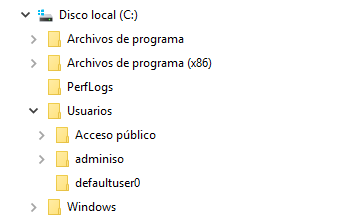
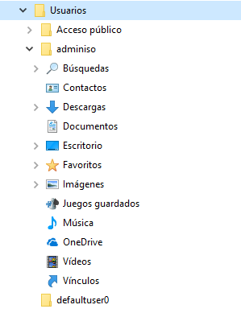

\newpage

# Estructura de ficheros en Windows

En los sistemas Windows la Raiz del árbol de directorios suele ser la Unidad `C:\`  que podemos encontrar en el explorador de ficheros. A partir de esta unidad vamos estructurando las carpetas y los ficheros para adaptarlos a nuestras necesidades.


\ 

A continuación veremos algunas de las carpetas más habituales y su contenido.

## C:\\

Unidad principal en los sistemas Windows. Suele indicar la `partición` donde está instalado el Sistema Operativo.

## Medios extraibles

Unidades tales como `D:\` , `F:\` aparecen en Windows cuando insertamos una unidad extraible o un disco duro USB. Se crean al mismo nivel que `C:\` y pueden se accedidas de la misma manera.

## Archivos de programa

La carpeta que contiene los ficheros y librerías pertenecientes a todo el software que instalamos de manera adicional al sistema Operativo y que está disponible para todos los usuarios.

La variable para acceder a esta carpeta es:

```
%PROGRAMFILES%
```

o mediante PowerShell:

```PowerShell
Write-Host $Env:Programfiles
```

## Archivos de programa (x86)

Tiene la misma función que Archivos de programa pero para aquel software que tiene 32bits.

## Usuarios

Esta carpeta contiene los ficheros de todos los usuarios que han iniciado sesión en el equipo. Dentro podremos encontrar las carpetas de los usuarios, en ella se guardan (entre otras):

* Documentos del usuario.
* Configuraciones LOCALES del usuario.
* Software que pertenece tan solo a un usuario.

Se trata de una de las carpetas que más operaciones de "rescate" puede necesitar, ya que normalmente los usuarios guardan todos los datos en esas carpetas.


\ 

Algunas de las variables que hacen referencia a carpetas que se encuentran dentro de esta carpeta son:

| Variable |  Descripción |
| -------- |  ------------ |
| `%APPDATA%` | Una de las variables más utilizadas, carpeta oculta donde guardan sus datos las aplicaciones, se encuentra dentro de la carpeta de usuario.|
|  `%PATH%`   |Contiene una lista separada por punto y coma de directorios en los cuales se buscarán los archivos ejecutables que no se invocan con una ruta explícita. |
| `%PROGRAMFILES%`  | Devuelve la carpeta donde se instalan los programas, normalmente: `C:\Archivos de Programa`. |
| `%USERPROFILE%` |Devuelve la ruta del directorio donde están los archivos del usuario actual, normalmente: `C:\Users\NombreDeUsuario`. |
| `%HOMEDRIVE%` |Devuelve la unidad en la que está el directorio en el que estás actualmente|
|  `%HOMEPATH%` |Devuelve la ruta completa a dicho directorio. |

## Windows

Carpeta que contiene los ejecutables y bibliotecas  que necesita el sistema operativo para funcionar.

Estas carpetas con más profundidad en las tareas.
