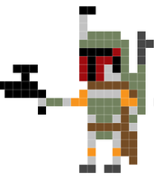
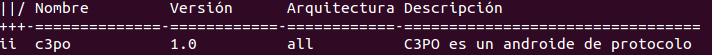
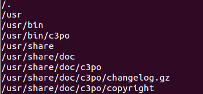
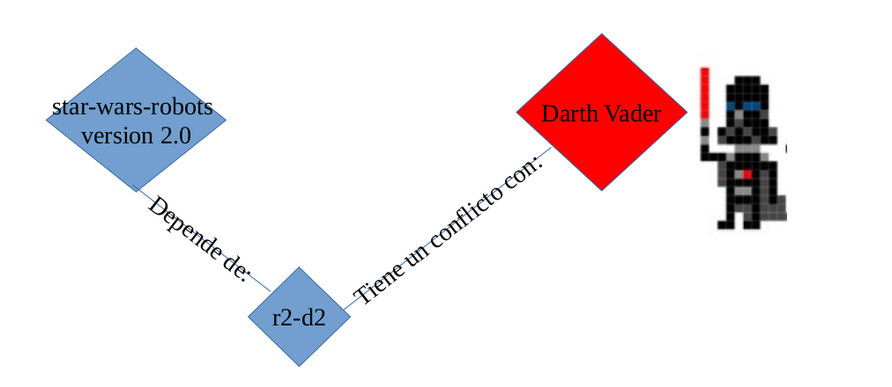

# Tarea: Episodio 3.3 : La fuerza de AsiR


\ 

\newpage


\ 

Bienvenidos jóvenes Padawans a la academia de ASIR de la fuerza y el orden. Estamos aquí para mantener la paz en la galaxia y conseguir que todo el software de la Alianza Rebelde funcione como tiene que funcionar.

Ya hemos visto en clase los conceptos de :

- Software
- Librería
- Dependencias
- Versiones
- Gestor de paquetes
- Gestor de descargas de paquetes

En esta práctica, aprenderemos a usar las herramientas de la fuerza para la instalación y mantenimiento del Software en la Alianza. También veremos algunos ejemplos de como el lado oscuro es poderoso y nos tienta a usar las herramientas mediante el reverso tenebroso.

Antes de continuar con la práctica, es importante que os descarguéis el fichero comprimido que tenéis en el Moodle cuyo nombre es:

```shell
star-wars-robots-1.0.zip
```

Lo descomprimimos y nos situamos mediante el terminal en la carpeta que acabamos de descomprimir:

``` shell
cd \~/Descargas/star-wars-robots-1.0/
ls -1 \*.deb**
```

La segunda orden nos deberia de mostrar algo parecido a esto:

```shell
c3po_1.0_all.deb
lib-antigua-r2-d2_1.0_all.deb
lib-r2-d2_1.0_all.deb
r2-d2_1.0_all.deb
star-wars-robots_1.0_all.deb
star-wars-robots-doc_1.0_all.deb
```


\ 

Una vez tenemos todo vamos a proceder a extraer información mediante el uso de los midiclorianos para poder instalar el software necesario para la configuración de nuestros robots favoritos. ¿He dicho midiclorianos?
Quería decir *COMANDOS*.

La fuerza es poderosa, y nos ofrece un gestor de paquetes que nos permite la instalación/desinstalación/obtención de información y un sinfín de posibilidades más:

| Comando | Descripción |
| --------| ----------- |
| $ dpkg -I c3po_1.0_all.deb  | Nos muestra información del paquete c3po|
| # dpkg -i c3po_1.0_all.deb   | Instala el paquete c3po |
|# dpkg -r c3po |                Desinstala el paquete c3po |

**dpkg** tiene normalmente una opción "larga" por cada una de las cortas, si os es más fácil podéis recordar las largas:

| Comando | Descripción |
| --------| ----------- |
| $ dpkg --info c3po_1.0_all.deb  | Nos muestra información del paquete c3po|
| # dpkg --install c3po_1.0_all.deb   | Instala el paquete c3po |
|# dpkg --remove c3po |                Desinstala el paquete c3po |

Vamos a ver un ejemplo de estos comandos:

```shell
dpkg -I c3po_1.0_all.deb
```

Nos devuelve algo parecido a esto:

```auto
paquete debian nuevo, versión 2.0.
tamaño 2036 bytes: archivo de control= 532 bytes.
361 bytes, 11 líneas control
176 bytes, 3 líneas md5sums


Package: c3po
Source: star-wars-robots
Version: 1.0
Architecture: all
Maintainer: El Caballero Jedi Angel \<aberlanas\@protonmail.com\>
Installed-Size: 30
Section: utils
Priority: optional
Homepage: https://github.com/aberlanas/ImplantacionSistemasOperativos
Description: C3PO es un androide de protocolo (standalone)
  Este paquete no tiene ninguna libreria

```


\ 

Si nos damos cuenta, este paquete NO TIENE dependencias, y podemos
instalarlo sin problemas, para ello:

```shell
sudo dpkg -i c3po_1.0_all.deb
```

El sistema nos dirá algo parecido a esto

```shell
(Leyendo la base de datos ... 387865 ficheros o directorios instalados
actualmente.)
Preparing to unpack c3po_1.0_all.deb ...
Unpacking c3po (1.0) ...
Configurando c3po (1.0) ...
```

Todo parece haber ido bien, para ver si tenemos el paquete instalado podemos pedir ayuda (de nuevo) al gestor de paquetes:

```shell
dpkg -l c3po
```

Y nos mostrará el estado del paquete en el sistema:


\ 

Además, si ejecutamos la orden:

```shell
dpkg -L c3po
```

Nos mostrará el listado de los ficheros que PERTENECEN a c3po.


\ 

>> Nota para curiosos : Si nos damos cuenta, aparecen básicamente dos rutas: /usr/bin/ y /usr/share/doc/c3po ¿Os acordais Padawans de qué había en /usr/bin?


\ 

Bueno, pues ya tenemos el ejemplo resuelto..¡ahora os voy a contar la
misión que tenéis!


\ 

## Misión 1 : instalar la versión 1.0 de nuestros robots. 


\ 

Para ello, deberemos:

1. Obtener información del paquete star-wars-robots
2. Instalar las dependencias (en orden)
3. Comprobar que star-wars-robots está correctamente instalado

> **Entrega**: AVISAR al profesor cuando lo hayáis logrado para comprobar el resultado

# Ficheros de Configuración

Los programas (software) no siempre se comportan igual, normalmente
tienen algún mecanismo de configuración. En windows esto suele estar en
el registro de Windows o en archivos de configuración. En GNU/LinuX es
mucho más habitual que la configuración esté en archivos de
configuración que en "dconf" (que sería un equivalente del registro de
Windows).

En cursos posteriores se verán todos estos conceptos más en profundidad,
pero por ahora lo que haremos será configurar el paquete _droide_, para
que se adapte a nuestras necesidades.

Y veremos también como funcionan los ficheros de configuración.


\ 

Tabla de Comandos:

Comando| Descripción |
---------|-----------|
`dpkg-reconfigure  <paquete>` | Vuelve a configurar y a preguntar (si se precisa) los campos/opciones al usuario que lo está instalando. |

## Misión 2 : Configurar el paquete droide

Pasos a seguir:

1. Instalar el paquete droide.
2. Responder a los valores.
3. Encontrar el fichero de configuración y editarlo.
4. Comprobar que todo funciona.
5. Reconfigurar el paquete via gestor de paquetes.


\ 

> **Entrega**: AVISAR al profesor cuando lo hayáis logrado para comprobar el resultado

# Resolución de conflictos

Los sistemas de paquetería (`dpkg` en _Debian_ y derivados) nos ayudan a lidiar con los problemas que puedan surgir en las actualizaciones de paquetes, y en las instalaciones, cuando las dependencias de los paquetes no se pueden instalar o tienen conflicto con otros paquetes.

Para la realización ah de esta parte de la práctica, descargaremos la versión 2.0 de los paquetes de StarWars que encontraremos en el Moodle del módulo. Y efectuaremos los pasos que hemos realizado en la tarea anterior para ir  actualizando de uno en uno los paquetes (de la versión 1 a la 2).

Al intentar actualizar todos los paquetes, fallará la instalación de _darthvader_

El motivo se visualiza en este gráfico:


\ 

¿Qué soluciones se te ocurren? Redáctalas y avisa al profesor para que lo evalúe.

## Misión: Instalación y actualización de los mismos programas mediante repositorios.

Para realizar esta práctica, utilizar la máquina virtual que está preparada en la carpeta del servidor de la asignatura y añadir el siguiente repositorio a sus orígenes del software, tal y como hemos visto en la teoria.


```auto
deb http://172.29.0.254/iso/pool bionic main
```

Una vez añadido el repositorio, actualizar el catálogo de software disponible e instalar el paquete star-wars-robots mediante apt.

¿Qué diferencias observas respecto a la instalación mediante dpkg?
Escribe al menos 5 líneas.

Entrega el documento en la tarea que se llama:

* _Star-Wars-Robots : Instalacion desde repositorios_

-----
>**NOTA**: Hacer esta última parte cuando lo diga el profesor:

Ahora lo que haremos será comprobar como se actualiza desde repositorios.

* ¿Qué ordenes debes utilizar?
* ¿Qué diferencias encuentras respecto a la actualización manual?
  
Escribe al menos 10 líneas contando tanto las órdenes como las diferencias.

Contestalo en la tarea que se llama:

* _Star-Wars-Robots : Actualización desde los repositorios_
