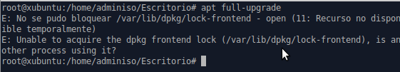

# Tarea: Deshabilitando apt-daily 

Cuando iniciamos una máquina Ubuntu que hace varios dias que no hemos lanzado, si una de las primeras operaciones es la de intentar utilizar el gestor de paquetes (`apt`) nos aparece un mensaje como el siguiente:


\

Al buscar por Internet, obtenemos una receta desde **StackOverflow** que nos indica que si realizamos estos pasos, ya no obtendremos ese mensaje.

Sin embargo, tal vez nos interese saber ¿**qué** és lo que está ocurriendo cuando ejecutemos el script?.

```shell
    #!/bin/bash

    systemctl stop apt-daily.timer
    systemctl disable apt-daily.timer
    systemctl mask apt-daily.service
    systemctl daemon-reload

```

Describe qué acción realiza cada una esa de esas líneas, y escribe un script que _deshaga_ las acciones que realiza este.

