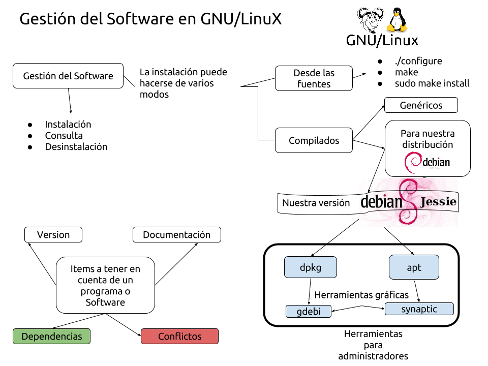
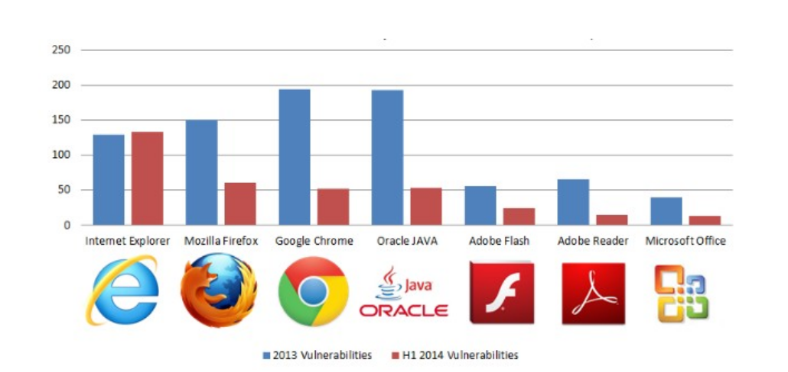
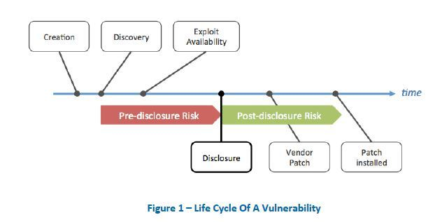

\newpage 

# Características del Software

En esta unidad veremos conceptos de instalación de Software y configuraciones relacionados con el Software que se instala posteriormente al sistema operativo, pero que serán las aplicaciones que más utilicen los usuarios de nuestro Sistema Informático.

## Diagrama

\ 

\newpage

## ¿Qué son las dependencias?

Un Software normalmente no funciona si no tiene una serie de librerias o programas de apoyo que el propio software usa para no tener que implementar él mismo todas las funciones, librerias de dibujado, de acceso a base de datos...

> **Importante**: Es tarea de los programadores del Software indicar cuales son las dependencias del mismo, sin embargo al igual que hay errores en el código, a veces ocurren errores en la definición de las dependencias y será tarea de los administradores de sistemas hacer que el Software funcione en los sistemas. 

Las dependencias suelen estar especificadas en ficheros *Readme.txt*, en las instrucciones de instalación o en el caso de los compilados y preparados para su distribución estas dependencias pueden ser consultadas via los gestores de paquetes, tal y como veremos más adelante en el tema.

Si una dependencia no está instalada, el software puede no funcionar correctamente o sencillamente no funcionar en absoluto. Es totalmente indispensable que las dependencias estén instaladas, a la acción de instalar las dependencias y las dependencias de las mismas en cierto orden se le llama **Resolución de dependencias**.

\newpage
## La versión de un Software (versionado)

El versionado de software es el proceso de asignación de un nombre, código o número único, a un software para indicar su nivel de desarrollo. Generalmente se asigna dos números, mayor.menor (en inglés: major.minor), que van incrementando conforme el desarrollo del software aumente y se requiera la asignación de un nuevo nombre, código o número único. Aunque menos habituales, también puede indicarse otro número más, micro, y la fase de desarrollo en que se encuentra el software.

Se aumenta el número cuando:

* mayor: el software sufre grandes cambios y mejoras.
* menor: el software sufre pequeños cambios y/o correcciones de errores.
* micro: se aplica una corrección al software, y a su vez sufre pocos cambios.
* fase: se indica si se encuentra en una fase de desarrollo que no sea la final o estable, es decir, una fase inestable o en pruebas. Se suele indicar con un guion seguido de la fase correspondiente en minúsculas, o un espacio seguido de la fase. Puede haber varias versiones de una misma fase, para indicar el avance en el desarrollo del software pero manteniendo la fase para indicar que todavía es inestable, indicándose añadiendo un número al final del nombre de la fase que va incrementando conforme se publiquen nuevas versiones de esta fase.

# Seguridad y actualizaciones

Las versiones del software son siempre “crecientes” en el tiempo, y es tarea de los administradores de sistemas mantener el software instalado actualizado y operativo. Esto es especialmente importante en servidores y estaciones de trabajo críticas, ya que un software desactualizado, es un software vulnerable. Los virus, hackers, y en general aquel software que trata de aprovecharse de fallos del software se apoyan en “fallos conocidos” del software que se encuentra instalado para poder lograr sus objetivos.
A continuación se muestra una gráfica (2014) que muestra los errores detectados en el dia “0” del lanzamiento de cada paquete de software y los bugs que todavia persisten en el año siguiente. Nos damos cuenta en seguida que si no actualizamos el software, todos los errores que existen pueden ser utilizados por los atacantes para comprometer la seguridad.

\ 

Es tarea de los administradores de sistemas mantener los equipos actualizados, ya que tener sistemas desactualizados y expuestos en nuestro sistema informático puede comprometer todos los datos.

A continuación se muestra un pequeño gráfico que explica el ciclo de vida de una vulnerabilidad:

\

## Parches

¿Qué es un parche? Un parche es un pequeño `trozo` de código que modifica un software ya previamente instalado, arreglando un error, ampliando funcionalidad, o sencillamente modificando su comportamiento.

Cuando una vulnerabilidad (`vector de ataque`) es descubierta, los desarrolladores del software vulnerable realizan un parche, una modificación que aplicada sobre el software instalado, solventa la vulnerabilidad.

Este parche puede llegar a nosotros de múltiples maneras, como administradores de sistemas:

* Como código fuente, que deberemos compilar e incluir en el software.
* Como revisión de un software (Versión menor). **Actualización**
* Como ServicePacks o Releases. **Actualización**

Debemos **mantener nuestros sistemas actualizados**, ya que debemos vencer el famoso eslogan de la informática:

>**Si funciona, no se toca.**

Ya que antes o después deberemos actualizar, y la migración de datos y sistemas desde versiones muy viejas no será más que un peligroso dolor de cabeza.

