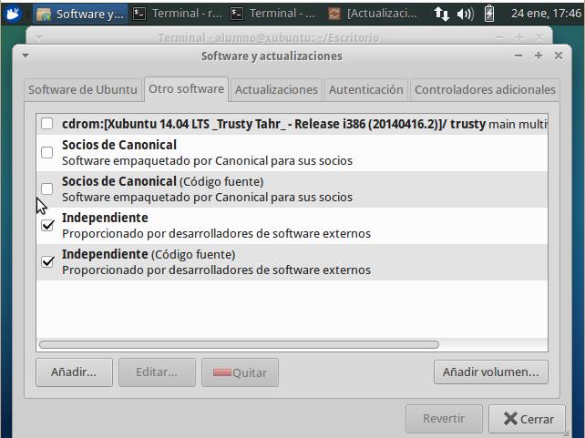
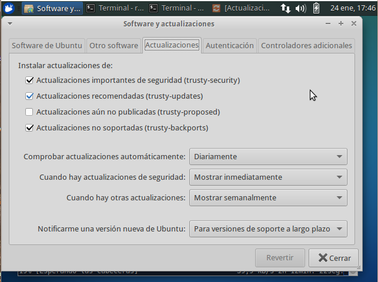
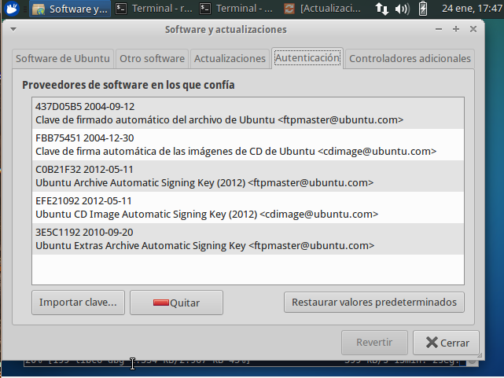

\newpage
## apt

### ¿Qué es APT?

Apt es una herramienta de administración que encontraremos en todos los sistemas que están basados en Debian,
 es el que se encarga de buscar los paquetes que queremos instalar en los repositorios,
 obtener la versión que se desee (típicamente la más alta, pero esto no tiene que ser así de manera obligada), 
 resolver las dependencias, instalarlas antes que el paquete que hemos pedido y a continuación instalarlo.
 
Un ejemplo de uso de apt sería:

`apt install scite`

Esta orden buscaría en nuestros repositorios la versión más alta de scite, la descargaría y a continuación la instalaria, previamente habiendo instalado todas las dependencias.

*Nota*: Cuando apt realiza una operación de consulta sobre la base de datos de paquetes disponibles no es necesario que tengamos
 privilegios de administración, pero sí lo són para efectuar tareas de instalación/desinstalación de paquetes. 
 
¿Como sabe que paquete tenemos que instalar? ¿Y donde buscarlo? Para solucionar esos problemas Apt dispone de unos repositorios (*pools*) de paquetes que las diferentes distribuciones se encargan de mantener y además otros organismos públicos como Universidades, fundaciones, etc. también mantienen en sus páginas públicas para la creación de réplicas de los mismos. (Esto lo veremos en ASO). Un poco más adelante en el tema tenemos como se configura y los errores más comunes que pueden ocurrir cuando se manipula sin saber muy bien lo que estamos haciendo.

`apt` proporciona una serie de comandos para la gestión de software que veremos a continuación:

| Acción | Comando |
| :------|:------|
| instalación | apt install *nombre_paquete* |
| re-instalación | apt install --reinstall *nombre_paquete* |
| desinstalación | apt remove *nombre_paquete* | 
| desinstalación (incluyendo configuración) | apt purge *nombre_paquete* | 
| actualización del catálogo | apt update |
| comprobar que no hay dependencias incumplidas | apt check |
| búsqueda en el catálogo | apt-cache search *patron* | 
| mostrar información de un paquete  | apt-cache show *nombre_paquete* | 
| mostrar información acerca de las versiones | apt-cache policy *nombre_paquete* |
| actualizar el sistema (completa) | apt full-upgrade |
| actualizar el sistema (cobarde) | apt upgrade |
| limpiar el sistema de paquetes innecesarios | apt autoremove |
| limpiar el catalogo | apt clean |

### ¿Qué es un repositorio?

Un Repositorio es un sitio donde se almacenan y mantienen los paquetes de aplicaciones y librerías o dependencias, o sea, es una biblioteca de software.
Cada vez que instalamos una aplicación, el sistema busca en los repositorios los paquetes necesarios para instalarla, que pueden ser de distintos tipos: imágenes, librerías, código fuente, documentación, traducciones, ... y el programa en sí.
El software se almacena en distintos repositorios separados, según sean sus características o procedencia, de este modo se puede dar acceso o restringirlo a un determinado software.
Por regla general, los repositorios son servidores ftp o http, aunque también pueden ser locales y estar disponibles en un dispositivo físico (DVD-Rom). Por todo el mundo hay repartidos servidores espejo, para no saturar los servidores principales y poder utilizar aquellos que estén más cerca de nuestra ubicación para una descarga más rápida.

En Debian y Ubuntu tenemos repositorios separados por origen (uno oficial y otro mantenido por la comunidad) y por tipo (libres, privativos o con licencias restringidas), además de los correspondientes a las actualizaciones (updates, security, backports)

Los ficheros de configuración que se muestran en esta parte son los de Ubuntu, no los de Debian, por varios motivos, pero principalmente porque se trata de los ficheros
 de configuración y repositorios que veremos en las máquinas virtuales que estamos trabajando en clase.

\newpage 
### Gestión y configuración de repositorios (software-properties-gtk)

En Xubuntu, el gestor de Orígenes del Software gráfico no viene instalado por defecto, para instalarlo, basta con usar *apt" para instalarlo:

`sudo apt install software-properties-gtk`
 
Una vez instalado, lo podemos ejecutar mediante la orden:

`sudo software-properties-gtk`

Se nos abrirá una ventana con las siguientes pestañas:

\newpage

#### Software de Ubuntu:

\

Nos encontraremos con los siguientes repositorios oficiales y los mantenidos por la comunidad que deben de estar siempre activados (con una "v"):

 * **main**.  software libre soportado por Canonical (Ubuntu)
 * **universe**. software libre mantenido por la comunidad
 * **restricted**. controladores privativos para dispositivos
 * **multiverse**. software restringido por copyright o cuestiones legales

Algunas cosas a tener en cuenta:

* No es necesario activar la casilla de Código Fuente.
* No activar la casilla de CD-ROM/DVD ya que, al actualizarse el sistema, buscará en el Disco de instalación de Ubuntu y al no encontrarlo, dará error.

Tenemos la opción Descargar desde, donde elegiremos los servidores a utilizar (principal, España y Otro). Si seleccionamos "Otro", se abrirá una nueva ventana con un listado de servidores espejo de los distintos países y un botón para Seleccionar el mejor servidor

\newpage
#### Otro Software:

\ 

Aquí se almacena otro tipo de software proporcionado por Ubuntu:

* Socios de Canonical (**partner**). software propietario (No libre) que ha llegado a un acuerdo con Ubuntu para tener acceso a ciertas aplicaciones. Mantenerlo desactivado y solo activarlo si lo vamos a utilizar (en la actualidad, parece que no contiene nada).
* Independiente (**extras**). Proporcionado por desarrolladores de software de terceros. Mantenerlo activado.

Aquí aparecerán también, los repositorios que nosotros añadamos. (Lo veremos más adelante)

\newpage
#### Actualizaciones:

\ 

Aquí configuramos todo lo relacionado con las actualizaciones (tipo, tiempo, versiones):

* Actualizaciones importantes de seguridad (security). Siempre debe de estar activada.
* Actualizaciones recomendadas (updates) por los desarrolladores de los paquetes. Siempre activada.
* Actualizaciones aún no publicadas (proposed) de paquetes que aún se están probando y pueden hacer inestable el sistema. Siempre desactivada, a menos que seas un usuario experto.
* Actualizaciones no soportadas (backports) da acceso a las últimas versiones de paquetes no soportados por Ubuntu. Si añadimos repositorios de terceros es recomendable mantenerla activada. Si quieres utilizar solo paquetes oficiales y anteponer la estabilidad a nuevas versiones, puedes dejarla desactivada.

También podemos configurar cuando y como se realizan las actualizaciones y si queremos que nos avise cuando salga una versión nueva de Ubuntu

\newpage
#### Autenticación:

Aquí se muestran las llaves o claves de las firmas de autenticación de los repositorios. Todo repositorio debe de tener una llave para que el sistema lo reconozca y sepa que puede confiar de los paquetes almacenados en él.

\newpage
#### Controladores Adicionales:

Si el Hardware tiene disponible algún controlador privativo, aparecerá aquí.

Si deseas utilizarlo, en lugar del controlador libre que Ubuntu te instala por defecto, selecciónalo y pulsa en Aplicar cambios.

\newpage
### Archivo /etc/apt/sources.list

Es el archivo donde vienen los repositorios que los Sistemas GNU/LinuX basados en Debian/Ubuntu traen por defecto y cuando modificamos algo en "Software y actualizaciones", se modifica este archivo.

Se puede editar el fichero mediante cualquier editor de texto (por ej. mousepad):

`mousepad /etc/apt/sources.list`

Pero si se quiere modificarlo directamente, debe de hacerse como superusuario:

`sudo mousepad /etc/apt/sources.list`

Mucho ojo con borrar ni siquiera una letra de las líneas de repositorios, ya que esto provocará que el sistema no los encuentre y dará error al actualizar. Si lo vamos a tocar, mejor hacer antes una copia de seguridad del archivo.

#### Añadir/Quitar repositorios de terceros

Los repositorios de terceros o PPA (Personal Package Archive) son repositorios de software alojados en Launchpad que se pueden utilizar para instalar (o actualizar) paquetes que no están disponibles en los repositorios que trae por defecto Ubuntu.
Estos PPAs son específicos para una versión de Ubuntu en concreto, por lo que no es recomendable usarlos en otras distribuciones ni usar los de otra versión de Ubuntu.

La nomenclatura de los PPA es: "ppa:creador/nombre". Por ejemplo, "ppa:webupd8team/java" es el PPA para java (nombre del PPA) de webupd8team (creador y mantenedor de dicho PPA)

A lo largo del curso hemos visto como se añadia para solucionar problemas y configuraciones el ppa del IES:

ppa:ticsenia/ppa

##### Como añadir un PPA

Un PPA se pueden añadir desde la línea de comandos (terminal) o mediante una interfaz gráfica (Software y actualizaciones):

Para añadirlo desde la terminal se utiliza el comando "add-apt-repository", seguido del PPA. Ejemplo:

`sudo add-apt-repository ppa:webupd8team/java`

Nos pedirá confirmación: "Pulse [Intro] para continuar o ctrl-c para cancelar". Pulsamos Enter

Después de añadirlo, es necesario actualizar la lista de repositorios, para que los paquetes disponibles de dicho PPA pueda ser "encontrado" por el sistema. Para ello ejecutamos el siguiente comando:

`sudo apt update`

Para añadirlo desde la interfaz gráfica, buscamos la aplicación de Orígenes del Software.

Una vez abierto, vamos a la pestaña "Otro software", pulsamos en el botón "Agregar" y escribimos el PPA. Por ejemplo: ppa:webupd8team/java.

El sistema nos pedirá actualizar la lista de software (lo que hicimos antes con "sudo apt update").

##### Como quitar (borrar) un PPA

Desde la terminal, podemos quitar el PPA y elegir si queremos mantener los paquetes instalados o actualizados desde dicho repositorio:

* Para quitar un PPA de nuestro sistema, sin necesidad de desinstalar los paquetes que hayamos instalado o actualizado desde dicho PPA, se utiliza el comando "add-apt-repository --remove", seguido del PPA. Ejemplo:

`sudo add-apt-repository --remove ppa:webupd8team/java`

* Para quitar un PPA de nuestro sistema y además desinstalar los paquetes que hayamos instalado o actualizado desde dicho PPA, dejando el sistema como antes de añadirlo, se utiliza el comando "ppa-purge", seguido del PPA. Pero no viene instalado por defecto, así que hay que instalarlo antes con:

`sudo apt install ppa-purge`

Y ya podemos eliminar el PPA con "ppa-purge" seguido del PPA. Ejemplo:

`sudo ppa-purge ppa:webupd8team/java`

En ambos casos, después actualizar con:

`sudo apt update && sudo apt full-upgrade`
