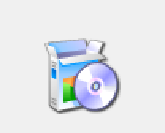

# Instalación de software en Windows

El procedimiento de instalación de Software en Windows es diferente del de los Sistemas GNU/LinuX, sin embargo a medida que se incorpora y extiende el uso de _Stores_, los conceptos son muy similares y se trabaja con ellos de manera parecida.

## Páginas oficiales del Software

Siempre es recomendable conseguir el software desde la página oficial del mismo, ya que de esta manera nos aseguramos que no se hayan introducido virus, troyanos o demás herramientas de ataque que pueden estar incrustadas en los instaladores.

La distribución de los binarios de instalación (o incluso el programa ya preparado) en medios de soporte extraíble esta cada vez más en desuso, sin embargo podemos encontrar todavía bastante software que se debe instalar a través de CDs y DVDs. Los pasos a seguir serían los mismos.

## Archivos con extensión .exe

Los archivos con extensión `.exe` son archivos binarios (ejecutables) que suelen contener el instalador del software o bien el ejecutable del programa si se trata de un programa "_standalone_".

## Archivos con extensión .msi

MicroSoft Installer (`.msi`), son instaladores que contienen la información necesaria para automatizar su instalación, minimizando la intervención manual del usuario. Haciendo una comparativa con lo visto anteriormente en GNU/LinuX serían los paquetes `.deb`.

\ 

## Enlaces de interés

* [Crear un msi (Inglés)](https://www.wikihow.com/Make-an-Exe-File)
