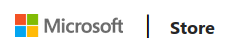
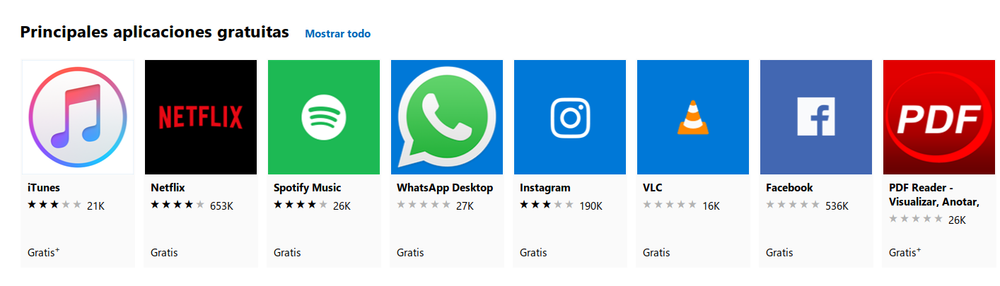

## Microsoft Store

Microsoft Store (anteriormente _Windows Store_) es la plataforma de distribución digital de software desarrollada por Microsoft como parte de Windows 8, Windows Server 2012, Windows 10 y Windows Server 2016 para proveer un catálogo de aplicaciones centralizado y seguro. Al igual que en GNU/LinuX hemos visto los repositorios, Microsoft implementó este mecanismo para proveer a los usuarios de un repositorio de software confiable.

La tienda de Windows es el único medio de distribución de aplicaciones oficial para Windows 8 y superiores.

Microsoft Store tiene un reparto de beneficios del 30% para Microsoft y 70% para el desarrollador.

### Funcionamiento

Para usar activar la tienda la primera vez se requiere el uso de una Cuenta Microsoft y con esto llevar un historial de aplicaciones compradas. Por lo tanto, Microsoft siempre sabe qué aplicaciones ha obtenido cualquier persona. Fuera de los 120 países en los que trabaja Microsoft Store, los usuarios no pueden desarrollar ni tener tal software. Microsoft Store centraliza todo lo relacionado en instalación, actualización o desinstalación de estas aplicaciones. Además en Windows 10 tiene secciones para comprar películas y series de Tv.

Las aplicaciones estilo Metro pueden desaparecer de la computadora si la app fue retirada de la tienda por deseo del desarrollador. Por eso es prácticamente imposible hacer respaldos de los ejecutables de las apps _Metro/modernas_ del mismo modo que los `.exe` o `.msi` de un programa de escritorio.

En las prácticas trabajaremos con software de la tienda.
