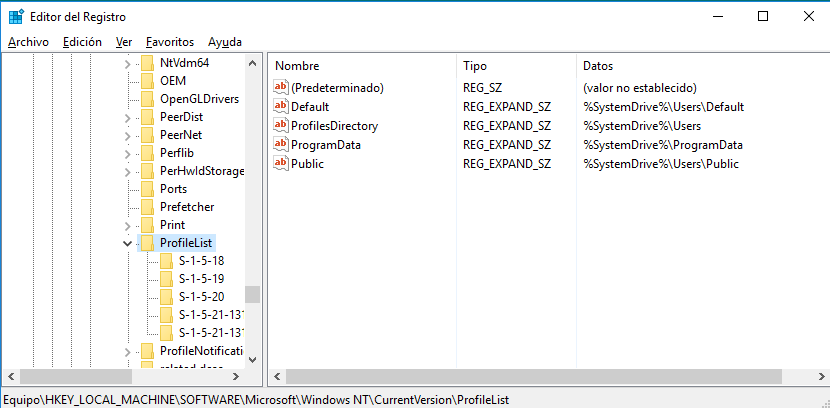

# Registro de Windows

## ¿Qué es el Registro de Windows?

El registro de Windows es una base de datos jerárquica que almacena los ajustes de configuración y opciones en los sistemas operativos Microsoft Windows.

Esta base de datos estructurada almacena configuraciones y datos de todas las aplicaciones y servicios de Windows.

Entre los que utilizan el registro podemos destacar:

* El núcleo (`kernel`).
* Los drivers.
* Los servicios.
* El SAM.
* La interfaz de usuario.
* Aplicaciones de terceros.
  
El registro también proporciona un medio de acceso a los contadores para generar un perfil del rendimiento del sistema. Esto lo veremos más adelante en el módulo.

## Un poco de historia

Antes de que apareciera el Registro de Windows, los datos de las aplicaciones se almacenaban en ficheros de tipo `.INI`, ficheros de texto que mediante cabeceras delimitaban claves y valores referentes a programas que las modificaban y consultaban.

Problemas de acceso concurrente, incapacidad de guardar datos diferentes a texto, etc. Hicieron necesario el desarrollo del Registro, que al funcionar como una base de datos se preocupa de la integridad de las claves y valores almacenados.

## Claves y Valores

El registro contiene dos elementos básicos: _claves_ y _valores_.

Las _claves_ del registro son parecidas a las carpetas que encontramos en el explorador de ficheros, siendo a su vez posibles contenedores para otras claves (al igual que las carpetas y subcarpetas del sistema de ficheros).

Tenemos una serie de claves predefinidas que almacenan la información de todas las claves de manera estructurada y jerárquica.

A las claves, al igual que hemos visto con los ficheros, podemos aplicarles `ACLS` de tal manera que podemos restringir el acceso a determinados programas y a determinados privilegios.

Los _valores_ del registro son pares de nombres y datos almacenados dentro de las claves. Los valores del registro se referencian separados de las claves de registro. Cada valor de registro almacenado en una clave de registro posee un nombre único, sin distinguir entre mayúsculas y minúsculas (_case-sensitive_).

## Claves más importantes

### HKLM

`HKEY_LOCAL_MACHINE`, abreviado como `HKLM`, almacena configuraciones específicas del equipo local

Contiene cuatro subclaves: `SAM`, `SECURITY`, `SYSTEM` y `SOFTWARE`, las cuales se cargan en el tiempo de arranque en sus respectivos archivos ubicados en la carpeta
```cmd 
%SystemRoot%\System32\config
```

Hay una quinta subclave, `HARDWARE`, que es volátil y se crea dinámicamente y, como tal, no se almacena en un archivo (muestra una vista de todos los dispositivos _Plug-and-Play_ detectados en ese momento) al igual que `/dev/` en los Sistemas GNU/LinuX.

#### HKLM\\SAM

Se utiliza para referenciar todas las bases de datos _administrador de cuentas de seguridad_ (`SAM`) para todos los dominios en los cuales el sistema local ha sido autorizado o configurado administrativamente.

#### HKLM\\SECURITY

Contiene la base de datos de seguridad del dominio en el que ha iniciado sesión el usuario.

#### HKLM\\SYSTEM

Solo accesible para el administrador y contiene información acerca de la instalación del sistema.

#### HKLM\\SOFTWARE

Contiene ajustes de software y de Windows, se ordena por vendedor de software (con una subclave para cada uno), pero también contiene una subclave "Windows" para algunas configuraciones de la interfaz de usuario de Windows.

Una de las claves que se alojan en esta, es la que nos indica la ruta a las carpetas personales de los usuarios.

`HKEY_LOCAL_MACHINE\SOFTWARE\Microsoft\Windows NT\CurrentVersion\ProfileList`

Esta clave puede ser interesante cambiarla en entornos de red, donde todos los usuarios tienen sus carpetas personales montadas a través de un sistema de ficheros en red.



### HKCR

`HKEY_CLASSES_ROOT`,  contiene información acerca de las aplicaciones y las asociaciones de archivo conocidos.

### HKCU

`HKEY_CURRENT_USER`, abreviado como `HKCU`, almacena configuraciones específicas del usuario que tiene la sesión iniciada en esos momentos.

### HKEY_PERFORMANCE_DATA

Proporciona información del tiempo de ejecución de datos de rendimiento proporcionados por el propio _Kernel_ o por controladores del sistema, programas y servicios en funcionamiento que proporcionen datos de rendimiento.

Es visible a través de las funciones de registro en el API de Windows, en una vista simplificada a través de la pestaña Rendimiento del Administrador de tareas (únicamente para algunos datos de rendimiento del sistema local) o a través de paneles de control más avanzados (como el Monitor de rendimientos o el Analizador de rendimientos, los cuales permiten recoger y registrar esta información, incluyendo la de sistemas remotos).

Esto lo veremos más adelante en el módulo.

En las prácticas veremos como acceder al registro de Windows mediante herramientas gráficas y de consola.
