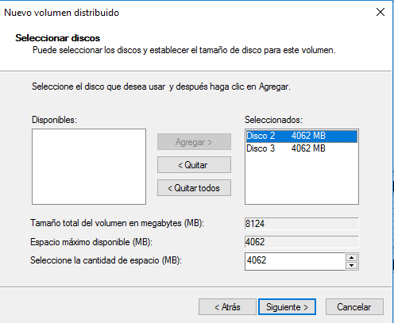
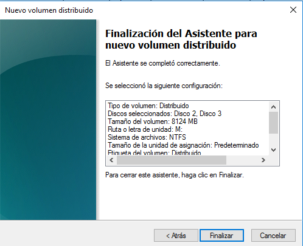
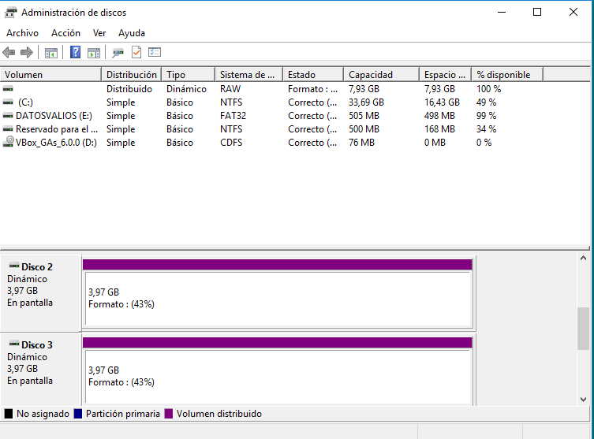
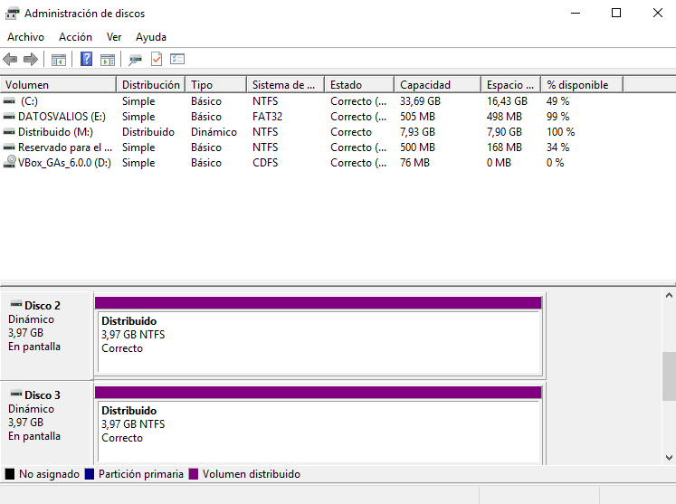
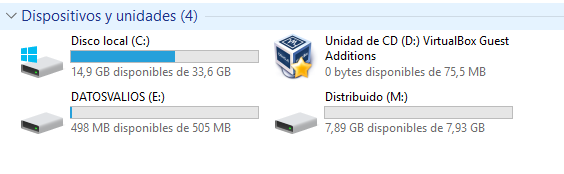

# Tarea: Creación de un Volumen Distribuido

Para la creación de un volumen distribuido en Windows vamos a utilizar la máquina virtual con Windows 10 que tenemos preparada.

## Añadir los discos

Primero añadiremos los discos a la máquina Virtual con los siguientes parámetros:

2 Discos de Tamaño Fijo de 4GBs en formato VDI.

Nombres:

    * WindowsRAID01.vdi
    * WindowsRAID02.vdi

## Administración de discos

En el Administrador de discos, seleccionaremos la opción:

`Nuevo volumen distribuido`

Y en el asistente añadiremos los dos discos.

\ 

Seleccionaremos que se formatee en NTFS y le asignaremos la letra `M`.

\ 

A continuación veremos el progreso del formateo en el administrador de discos:

\ 

Cuando haya finalizado se nos indicará mediante colores que discos pertenecen al mismo volumen.

\ 

En el Equipo podremos ver la unidad, así como su capacidad que es la SUMA de ambos discos.

\ 

## Ejercicio 1

Realiza un breve manual del proceso, describiendo qué estamos haciendo en cada paso. Adjunta capturas.

## Ejercicio 2

Describe 3 situaciones en las que esta solución puede ser útil en una empresa.