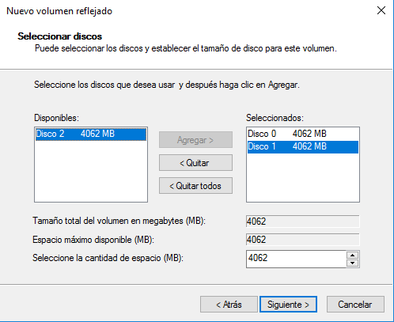
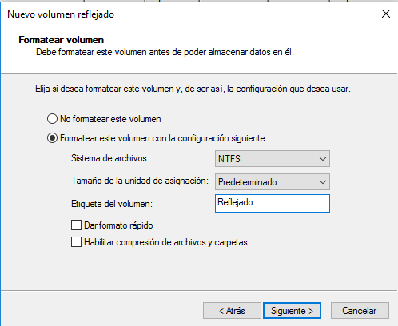
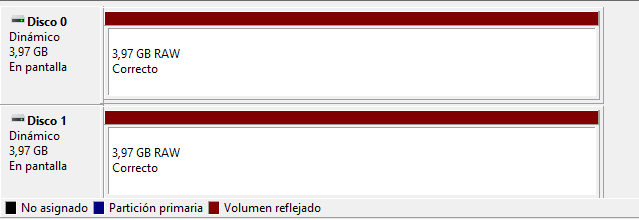
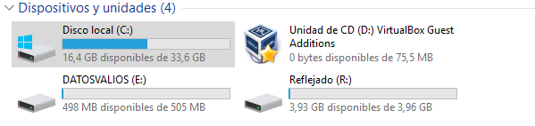
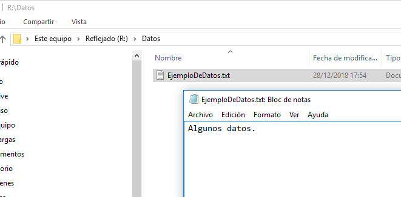
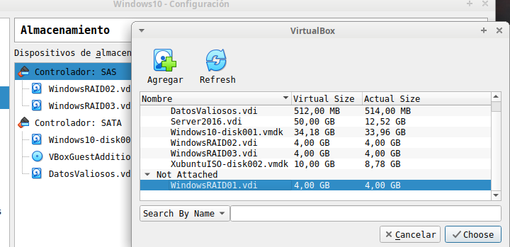
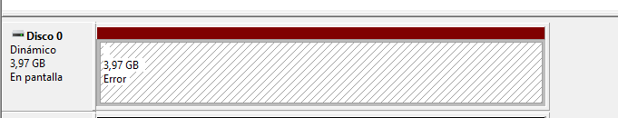

# Tarea: Creación de un Volumen Reflejado (RAID 1)

Para la creación de un volumen reflejado en Windows vamos a utilizar la máquina virtual con Windows 10 que tenemos preparada.

## Añadir los discos

Utilizaremos los discos de la práctica anterior de volumenes distribuidos.

## Administración de discos

En el Administrador de discos, seleccionaremos la opción:

`Nuevo volumen reflejado`

Y en el asistente añadiremos los dos discos.

\ 

Seleccionaremos que se formatee en NTFS y le asignaremos la letra `R` y con la etiqueta _Reflejado_.

\ 

A continuación veremos el progreso del formateo en el administrador de discos:

\ 

En el Equipo podremos ver la unidad, así como su capacidad que es la  capacidad del disco más pequeño.

\ 

Vamos ahora a crear unos datos y vamos a comprobar que el espejo está funcionando, es decir que seguimos pudiendo acceder a los datos, tal y como vimos en teoria.

\ 

Crea un fichero de texto dentro del volumen y escribe algo.

Apaga el equipo y **desconecta** uno de los discos (en el ejemplo se ha desconectado el disco llamado : WindowsRAID01.vdi)

\ 

Al arrancar la máquina veremos en el administrador de discos que tenemos un error en el disco 0.

\ 

Sin embargo podemos comprobar que los datos siguen estando accesibles para las aplicaciones y el usuario.

## Ejercicio 1

Realiza un breve manual del proceso, describiendo qué estamos haciendo en cada paso. Adjunta capturas.

## Ejercicio 2

Describe 3 situaciones en las que esta solución puede ser útil en una empresa.

## Ejercicio 3

Hemos dicho en teoría que un RAID no es una copia de seguridad, pero que mejora el UPTIME. Describe con tus palabras que significa esa frase.
