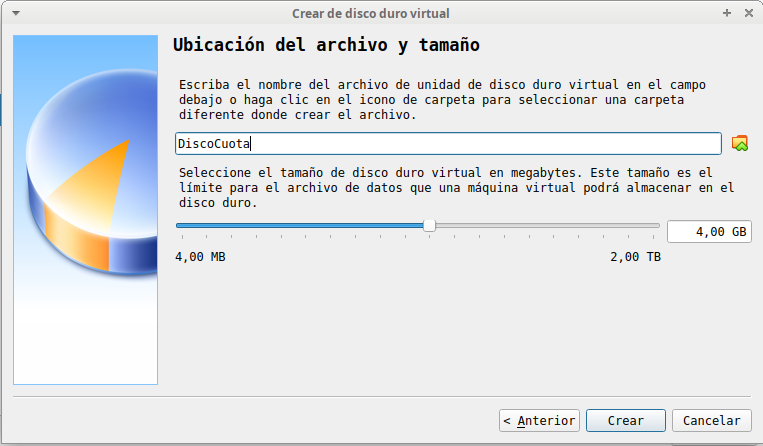
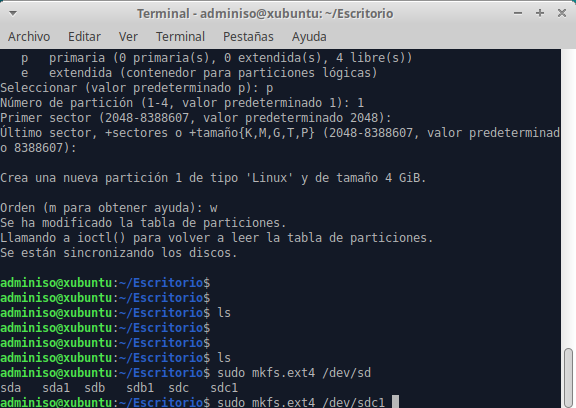
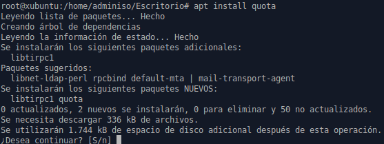
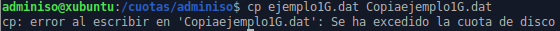
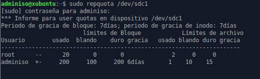

# Tarea: Cuotas de Disco con quota

Vamos a configurar una carpeta en un disco duro adicional que tenga dos cuotas, una de bloque (tamaño máximo) y otra de archivo (número de archivos). Para ello utilizaremos la máquina virtual con Xubuntu que hemos estado utilizando.

## Conexión de un nuevo disco

En primer lugar crearemos un nuevo disco y lo conectaremos a la máquina virtual.


\

Una vez conectado, utilizaremos herramientas gŕaficas o de consola para crear una partición en ext4 en el disco.

Si optamos por las herramientas gráficas podemos utilizar `gparted`, si lo hacemos mediante terminal, en la captura se muestra la traza de la ejecución de `fdisk` + `mkfs.ext4`.


\

## Instalación de disquota

Utilizaremos `apt` para instalar tanto `quota` como `quotatool`.


\

## Configuración de fstab

Añadiremos las opciones `usrquota` y `grpquota` a la partición en el fichero de montaje:

`/etc/fstab`


Y lo montaremos en la carpeta : `/quota` que habremos creado previamente.

Es conveniente reiniciar o comprobar mediante la orden `mount -a` que las opciones que hemos establecido en el fichero `/etc/fstab` estan correctamente configuradas.

## Creación de las cuotas

Estableceremos mediante comandos que una carpeta dentro de `/cuotas` que se llamará `adminiso` pertenece al usuario y al grupo `adminiso`.

Una vez realizado este paso, estableceremos la cuota de disco:


\ 

Y crearemos mediante dd un fichero de 2Gigas:

```shell
dd if=/dev/zero of=ejemplo1G.dat bs=1G count=1
```

Reiniciamos e intentamos efectuar una copia del fichero:


\

Nos debe aparecer un mensaje como el de la imagen.

## Reinicio y repquota

Al ejecutar el comando:

`repquota /dev/sdc1`

Debe aparecer un mensaje similar a este:



## Ejercicio 1

Realiza todos los pasos descritos en la practica y avisa al profesor cuando finalices.

## Ejercicio 2

Cuando se han establecido las cuotas se han indicado mediante 4 números, explica el significado de cada uno de ellos con lo aprendido en clase.


\ 

## Ejercicio 3

¿Qué periodo de cuota blanda tenemos por defecto? ¿Qué opción nos permitiría extenderlo?