# Tarea: Copias de Seguridad en Windows

En esta tarea configuraremos las copias de seguridad en Windows Server 2016 y utilizaremos la copia generada para restaurar un fichero que el usuario ha modificado.

## Configuración de la copia de seguridad

En el panel de control del servidor (`Dashboard`) nos aparece en la primera pestaña una serie de opciones que nos permiten acceder directamente a acciones comunes que deben realizarse en un servidor.

Entre estas opciones encontramos : _Configurar copia de seguridad del servidor_. Esto nos permitirá a través de un asistente, poner en marcha una planificación de copias de seguridad.

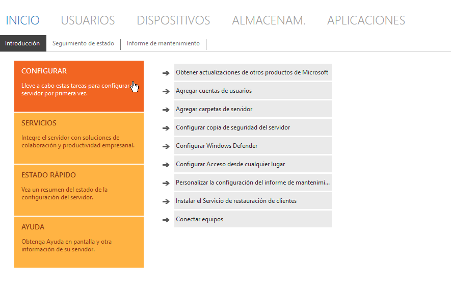
\ 

Cuando pulsamos en la opción de configurar copias, el sistema escanea el equipo en busca de espacios de almacenamiento que nos permitan crear y almacenar las copias.


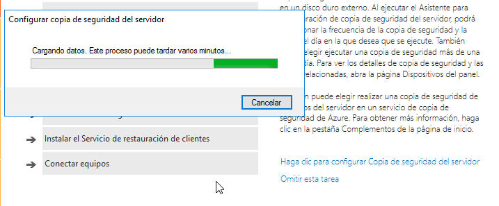
\ 

A lo largo del proceso estableceremos:

* El **destino** de la copia.
* **Qué** vamos a copiar.
* **Cuando** haremos la copia.

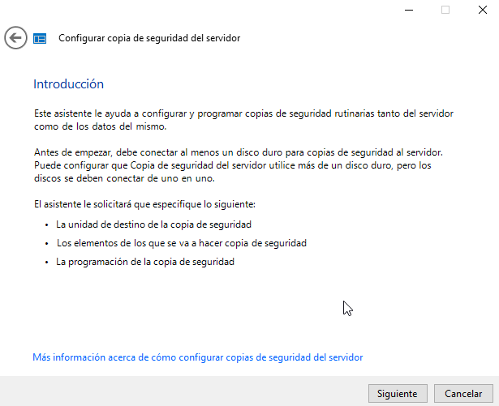
\ 

Hagamos una pausa en el proceso, para añadir a la máquina virtual un disco duro que utilizaremos, tras formatearlo en ReFS, como almacenamiento para las copias de seguridad.

## Configuración del destino

Conectaremos un disco duro de 50GB a nuestra máquina de Windows 2016 Server.


\ 

Y lo formatearemos desde Windows en el `Administrador de Discos`, utilizando GPT y el Sistema de Ficheros utilizaremos ReFS.

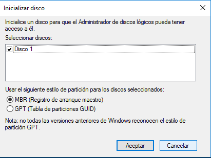
\ 

---

Una vez formateado, al entrar de nuevo al asistente de Copias de Seguridad, en la ventana siguiente, marcaremos la opción:

>Mostrar todas las unidades que se pueden utilizar como unidades de copia de seguridad.

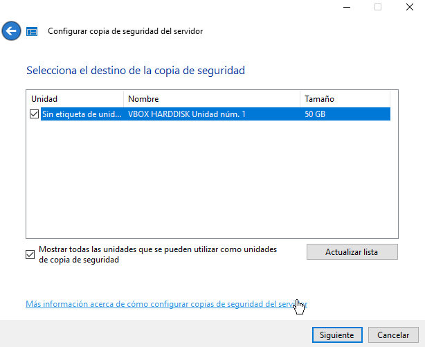
\ 

Etiquetaremos la unidad, esto es porque es posible configurar más de un destino y más de una copia de seguridad, con lo que podríamos tener nombres como:

* CopiaRemotaSemanal
* CopiaRemotaMensual
* ...

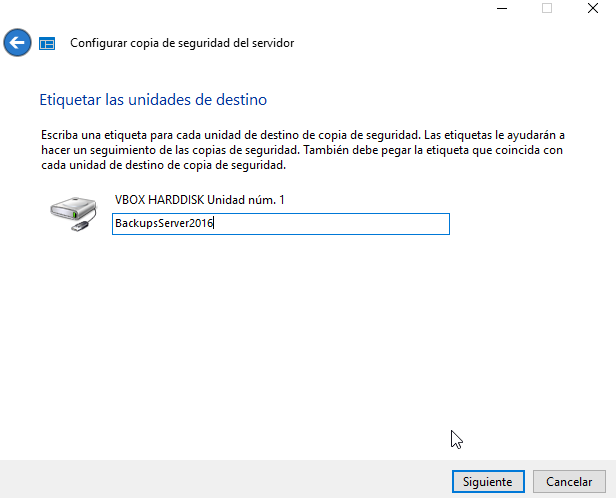
\ 

## Cuando realizar la copia

A continuación deberemos especificar la frecuencia y temporalización de las copias de seguridad.

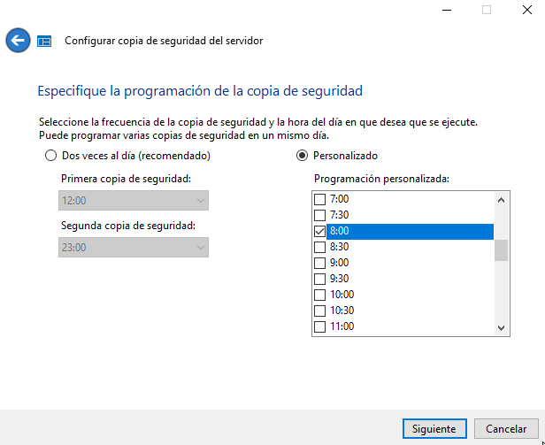
\ 

Marcaremos una hora a la que vayamos a estar en clase y podamos ir realizando cambios para comprobar el funcionamiento.

## Datos

En un un primer momento nos aparece todo marcado y debemos realizar una copia completa del sistema. Si intentamos desmarcar alguna opción, el sistema nos avisa de que debemos crear una copia inicial para luego poder ir haciendo las copias incrementales a partir de esta.

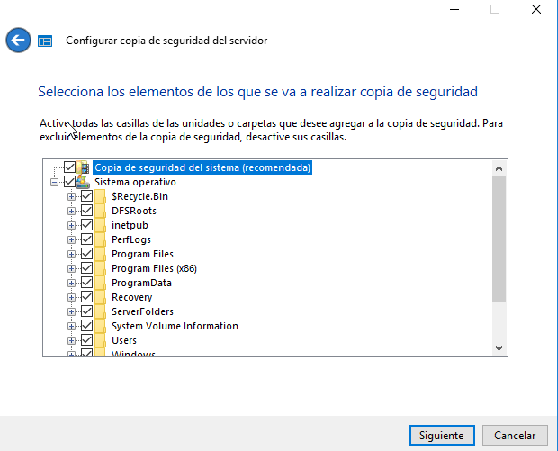
\ 

Aviso de intento de desmarcado:

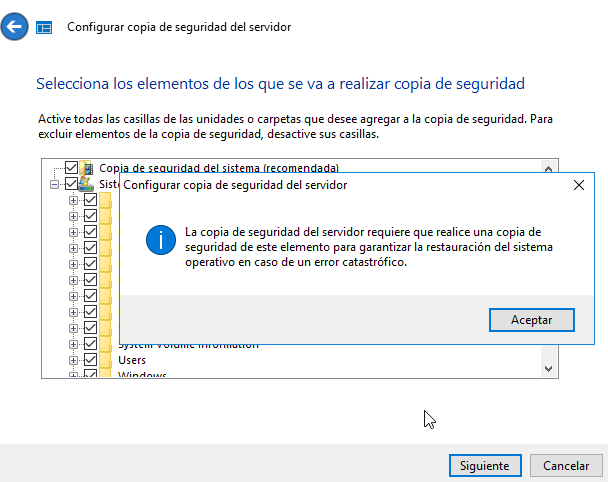
\ 

Una vez tengamos todo seleccionado se nos muestra un resumen de la configuración de la copia de seguridad.

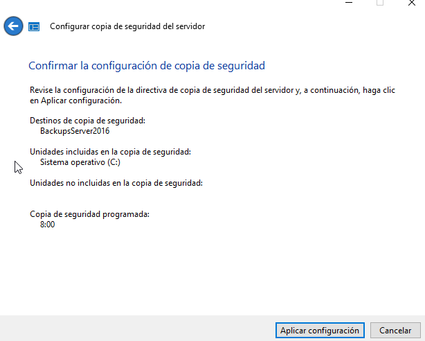
\ 

Y _Aplicaremos la configuración_

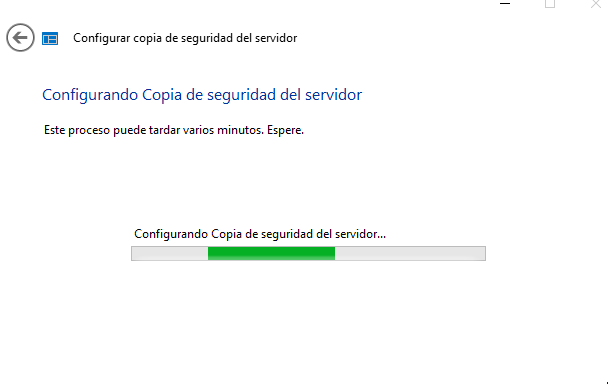
\ 

Tal y como hemos visto en Teoría, Windows Server nos ofrece posibilidades de almacenamiento de copias de seguridad en la nube.

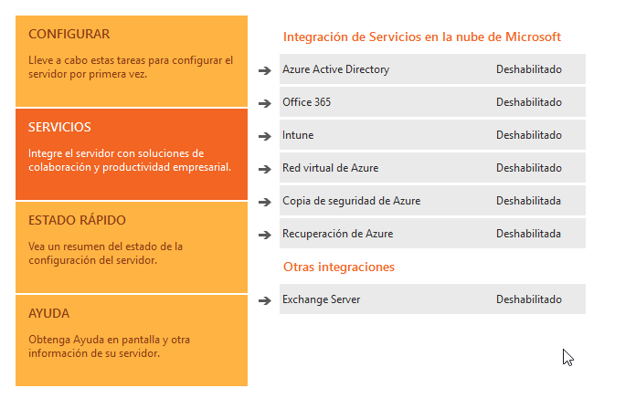
\ 

---

## Ejecución de la copia

En las herramientas de adminstración del servidor, podemos ver las diferentes copias de seguridad que hemos configurado. Ahora vamos a generar esa copia incial, forzando el inicio.

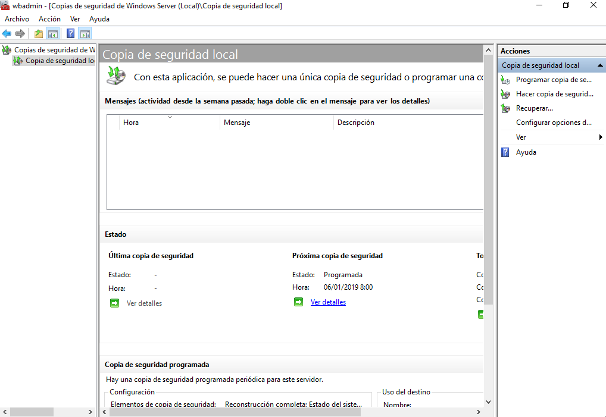
\ 

En el panel de la derecha aparecen las acciones que podemos realizar sobre la copia configurada, en este caso lo que haremos será realizar la copia de seguridad ahora, sin esperar a que el tiempo haya transcurrido.

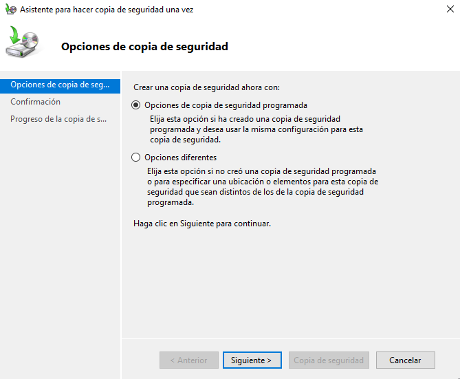
\ 

Utilizaremos las opciones de la copia programada, _simulando_ su ejecución.

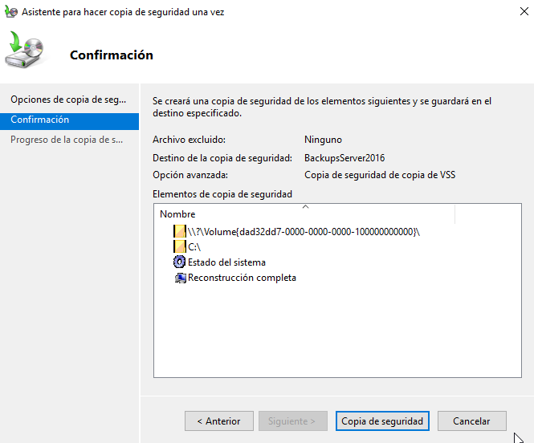
\ 

Se nos muestra el progreso de la copia

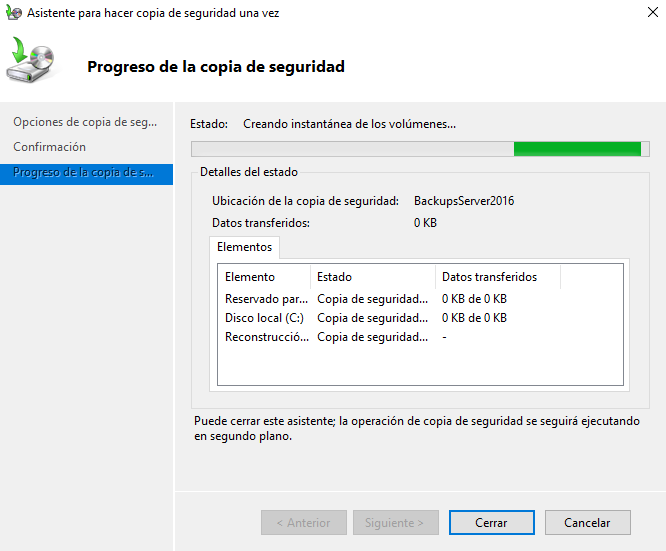
\ 

Y un resumen cuando ha finalizado.

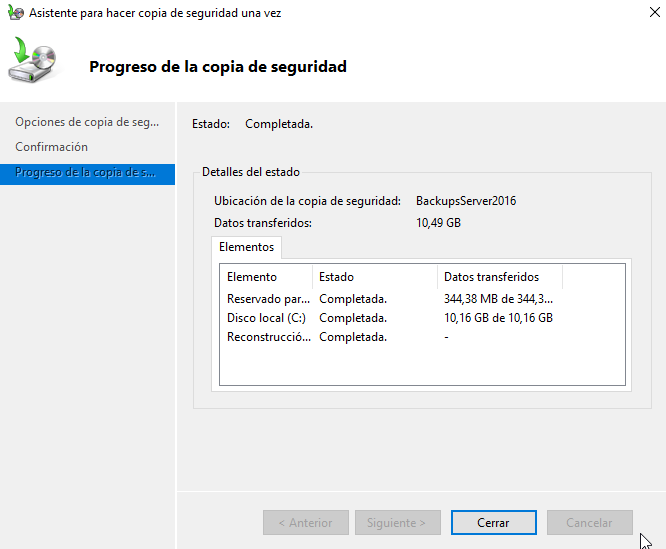
\ 

En este momento avisar al profesor para que compruebe que se ha relizado todo correctamente, sin cerrar la ventana de "_resumen_".

## Recuperación de copias de seguridad

Vamos a realizar ahora una recuperación utilizando la copia de  seguridad creada en el primer paso.

Tal y como hemos visto en teoria, tan importante es generar las copias, como asegurarlas y restaurarlas. Vamos realizar una pequeña acción de restauración de ficheros utilizando la copia generada.

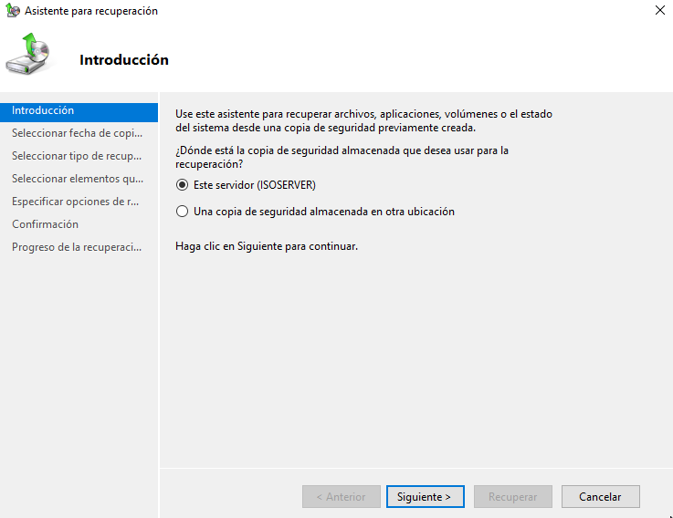
\ 

Seleccionaremos el origen de la copia a restaurar.

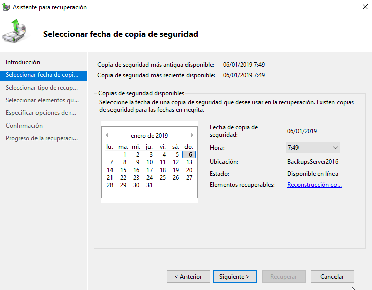
\ 

Seleccionaremos la fecha de la copia, para restaurar el fichero _perdido_.

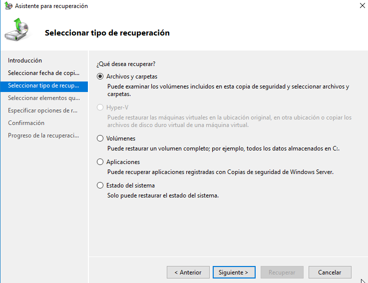
\ 

Vamos a restaurar un fichero, suponiendo que el usuario ha perdido un fichero o lo ha borrado por error.

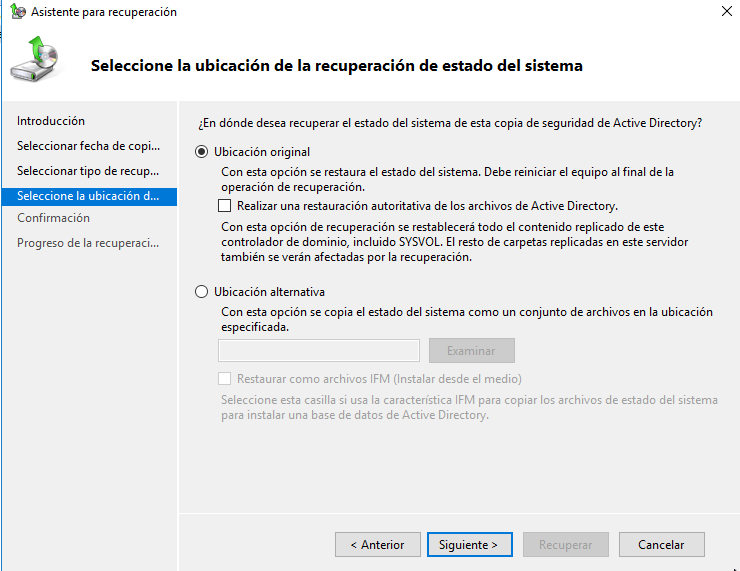
\ 

Estableceremos el destino de la restauración, en este caso podemos recuperar la copia en otra carpeta por ejemplo, o _exactamente_ donde estaba el fichero o carpeta.

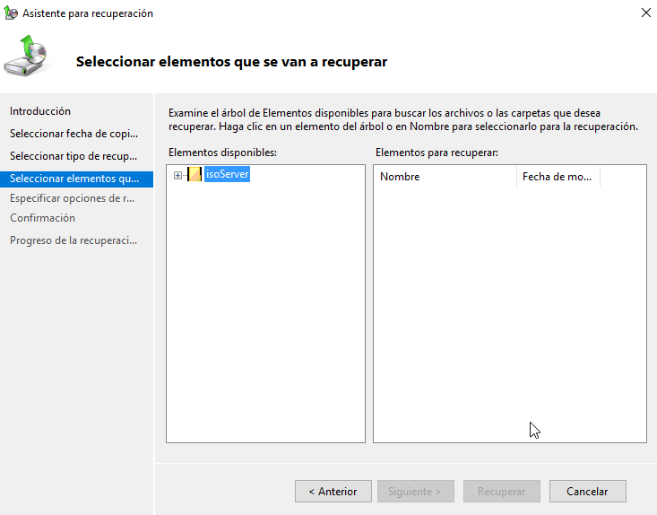
\ 

Seleccionaremos el fichero que queremos restaurar.

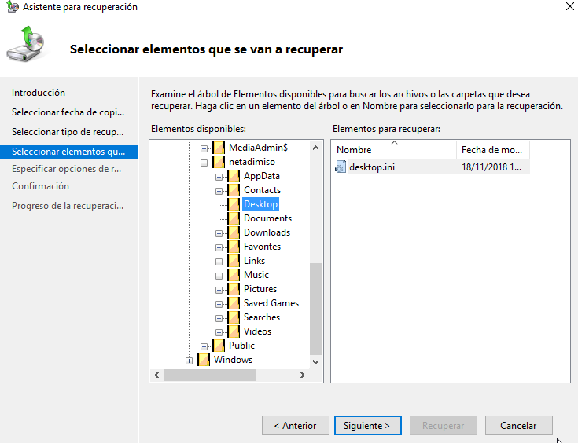
\ 

En este caso seleccionaremos el fichero `desktop.ini` del Escritorio del usuario `netadminiso`.

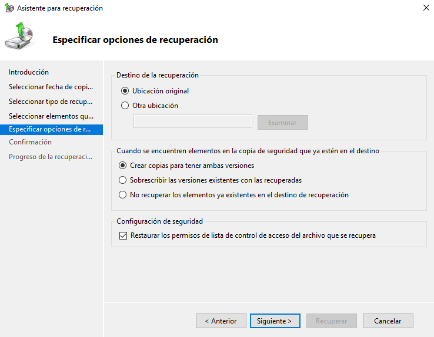
\ 

Nos permite generar copias al lado de los originales, para que el usuario pueda ver ambas versiones y elegir la que decida.

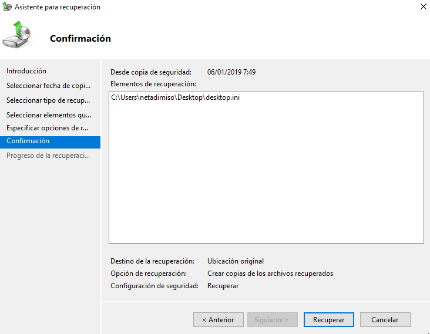
\ 

Antes de realizar la restauración nos muestra un resumen de lo que se va a recuperar y donde.

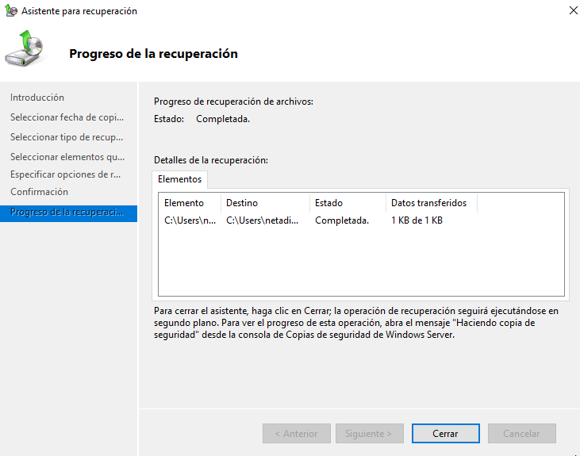
\ 

Si todo ha ido bien veremos algo similar a esto.

## Ejercicio 1

Realiza todos los pasos que se describen en la práctica para conseguir realizar la copia. Documenta los pasos más importantes que has realizado.

## Ejercicio 2

Realiza los pasos de la restauración de ficheros. Avisa al profesor cuando lo hayas realizado.

## Ejercicio 3

Busca información en Internet acerca de ReFS. ¿Porqué crees que es buena idea utilizarlo en un servidor?.

## Ejercicio 4

Crea un fichero en el escritorio de netadminiso que se llame : "claves.txt" y guarda en él lo siguiente:

```PowerShell
Write-Host "Algunas claves son"
Write-Host "amazon.es:laDeAmazon"
Write-Host "paypal.es:laDePaypal"
```

Realiza una copia de seguridad de nuevo.

Modifica el fichero para que la línea 2 contenga:
```PowerShell
Write-Host "amazon.es:laDeAmazonMasSegura"
```

Utilizando la herramienta de recuperación,restaura la versión anterior y muestra las diferencias.

Documenta el proceso realizado.

