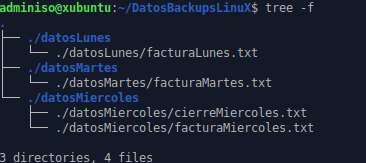

# Tarea: Copias de Seguridad en GNU/LinuX

Hemos visto en Windows como hacerlo mediante interfaz gráfica, vamos ahora a realizar una serie de pequeños scripts que nos permitan realizar tareas de copias de seguridad en GNU/LinuX.

## Ejercicio 1

Crea en la carpeta personal del usuario `adminiso` la siguiente estructura de ficheros:


\ 

Cada uno de los ficheros debe contener una frase diferente, ejemplo:


\ 

## Ejercicio 2

La orden siguiente realiza una copia de seguridad:

```Shell
tar --create --file=datosBackup.1.tar
             --listed-incremental=datos.log 
             /home/adminiso/DatosBackupsLinuX
```

Rellena la siguiente tabla:

| Opcion | Acción |
| ------ | ------ |
| --file| Especifica la ruta al fichero de Backup |
|--create ||
|--listed-incremental | |

## Ejercicio 3

Lee el fichero `datos.log` con un editor de texto plano y comprueba su contenido.

¿Qúe contiene?¿Para que se utiliza el número que precede a cada ruta?

## Ejercicio 4

* ¿Que tamaño tiene el fichero `datosBackup.1.tar`? 
* ¿Cómo lo has obtenido?

## Ejercicio 4

Añade la carpeta siguiente a la estructura:


\ 

Y crea un backup Incremental mediante la orden siguiente:

```Shell
tar --create --file=datosBackup.2.tar
             --listed-incremental=datos.log 
             /home/adminiso/DatosBackupsLinuX
```

¿Que contiene el fichero `datos.log`?

## Ejercicio 5

Utilizando la opción de `tar` : `--list` muestra el contenido de `datosBackup.2.tar`.

¿Qué contiene?

## Ejercicio 6

Crea un Shell Script que genere una copia de seguridad incremental cuyo nombre contenga la FECHA del dia en el que se ejecuta y nos almacene la ruta:

```Shell
/home/adminiso/DatosBackupsLinuX
```

Ejemplo:

`datosBackup.20190101.tar`

## Ejercicio 7

¿Qué tipo de compresión es el más adecuado para ficheros de texto plano?

Modifica el Script del ejercicio 6 para que comprima en ese formato los archivos que se crean.

## Ejercicio 8

Utilizando `systemd`, realiza un _Timer_ que ejecute la copia de seguridad que has programado en el ejercicio 7 cada dia.

[Wiki De ArchLinuX](https://wiki.archlinux.org/index.php/Systemd/Timers#As_a_cron_replacement)

