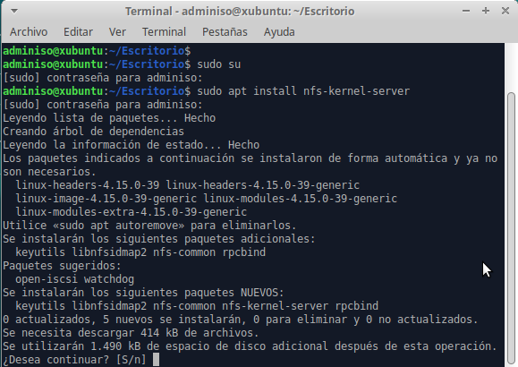

# Tarea: Configuración de NFS

En esta practica trabajaremos por parejas, el objetivo es que cada una de las máquinas Xubuntu sea **cliente** de NFS de la de vuestro compañer@ y **servidor** de NFS para vuestro compañer@.

Para  lograr esto, lo primero que tenemos que configurar es que ambas máquinas sean capaces de contactar entre ellas. Para ello cambiaremos la configuración de la red de ambas máquinas a _Adaptador Puente_ de tal manera que sean accesibles desde la otra máquina. 

Antes de realizar cualquier paso de esta práctica es importante que comprobeis que se puede realizar un `ping` sin problemas entre ambas máquinas.

## Paso 1 : Instalación del servicio NFS

`sudo apt install nfs-kernel-server`


\ 

## Paso 2 : Creación de la carpeta compartida

Crearemos una carpeta en `/srv` que compartiremos utilizando NFS.

`sudo mkdir -p /srv/exportfs/`

Le asignaremos una serie permisos especiales:

```shell
sudo chown nobody:nogroup /srv/exportfs
sudo chmod 777 /srv/exportfs
```

## Paso 3 : Configuración del servicio NFS

En el fichero `/etc/exportfs` se establecen los diferentes puntos de exportación que se ofrecen en el sistema. Cada uno de ellos en una línea.

Por ejemplo:

```shell
/srv/exportfs clienteIP(rw,sync,no_subtree_check)
```

Exportaría a una única IP la carpeta `/srv/exportfs` con las opciones: `rw,sync, no_subtree_check`.

* **ro** : Lectura solamente
* **sync** : Ejecuta la acción sobre el disco sin usar cache
* **no_subtree_check** : No se permite.


Otra opción sería dar permisos a toda una red:

```shell
/srv/exportfs 10.0.2.0/24(rw,sync,no_subtree_check)
```

Todas las máquinas que se encontraran en esa red serían capaces de montar la carpeta compartida.

Para comprobar que las opciones son correctas, podemos ejecutar el comando:

```shell
sudo exportfs -a
```

Si todo esta correcto (no hay ningún error) reiniciamos el servicio NFS.

`sudo systemctl restart nfs-kernel-server`

## Paso 4 : Instalación del cliente

Ahora pasaremos a instalar el cliente de NFS para poder montar la carpeta que nos está sirviendo nuestro compañer@.

`sudo apt install nfs-common`

## Paso 5 : Creación del punto de montaje

Al igual que hicimos en unidades anteriores, es necesario establecer un punto de montaje para las carpetas que montamos a través de la red.

Para esta práctica la crearemos en `/mnt/clienteNFS/`

Y montaremos la carpeta utilizando el comando `mount`.

`sudo mount 10.0.2.15:/srv/exportfs/ /mnt/clienteNFS/`

Comprobaremos ejecutando `mount` que la carpeta aparece montada.

## Paso 6 : Persistencia del punto de montaje

Añadir al fichero /etc/fstab la línea correspondiente para que realice el montaje de manera automática en el arranque.

## Ejercicio 1

Documentar todo el proceso realizado, adjuntar capturas de ambas máquinas accediendo y compartiendo la carpeta para el otro.

## Ejercicio 2

Añadir una línea al fichero `/etc/exportfs` para la IP del ordenador del profesor y aplicarle los permisos de `rw`.

## Ejercicio 3

Desactivar la línea del **fstab** para que en próximos arranques no tengáis problemas.

## Ejercicio Ampliación

Busca en Internet acerca de esta orden: 

```PowerShell
Install-WindowsFeature NFS-Client
```

Ejecútala en la instalación de Windows y configura una unidad remota (`L:`) usando la carpeta compartida en la práctica.
