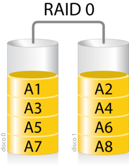
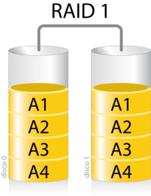
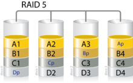
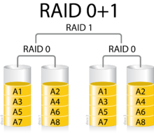
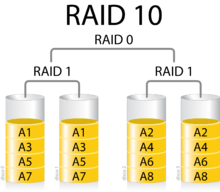

\newpage

# RAID

## ¿Qué es un RAID?

Un grupo/matriz redundante de discos independientes1​ (también, RAID, del inglés _redundant array of independent disks_) hace referencia a un sistema de almacenamiento de datos que utiliza múltiples unidades (discos duros o SSD), entre las cuales se distribuyen o replican los datos.

Dependiendo de su configuración (a la que suele llamarse nivel), los beneficios de un RAID respecto a un único disco son uno o varios de los siguientes: mayor integridad, tolerancia frente a fallos, tasa de transferencia y capacidad. En sus implementaciones originales, su ventaja clave era la habilidad de combinar varios dispositivos de bajo coste y tecnología más vieja en un conjunto que ofrecía mayor capacidad, fiabilidad, velocidad o una combinación de éstas que un solo dispositivo de última generación y coste más alto.

En el nivel más simple, un RAID combina varios discos duros en una sola unidad lógica. Así, en lugar de ver varios discos duros diferentes, el sistema operativo ve uno solo. Los RAID suelen usarse en servidores y normalmente (aunque no es necesario) se implementan con unidades de disco de la misma capacidad. Debido al descenso en el precio de los discos duros y la mayor disponibilidad de las opciones RAID incluidas en los chipsets de las placas base, los RAID se encuentran también como opción en las computadoras personales más avanzadas. Esto es especialmente frecuente en las computadoras dedicadas a tareas intensivas y que requiera asegurar la integridad de los datos en caso de fallo del sistema. Esta característica está disponible en los sistemas RAID por hardware (dependiendo de que estructura elijamos). Por el contrario, los sistemas basados en software son mucho más flexibles y los basados en hardware añaden un punto de fallo más al sistema (la controladora RAID).

>Fuente: _Wikipedia_

Se trata de un mecanismo que aporta una nueva capa de abstracción entre las aplicaciones y el lugar donde van a ser almacenados los datos. Es importante que tengamos esto presente, ya que nos permitirá luego poder administrar de manera más precisa aquellos servicios que utilicemos para este propósito.

Añadir un RAID por software añade complejidad a nuestro Sistema Operativo, ya que tiene que encargarse él, pero prescindimos de la controladora RAID por Hardware, que nos aporta otro punto de fallo. Si bien es verdad que en servidores y sistemas de alto rendimiento, son las controladoras hardware las que suelen realizar esta tarea.

Sin embargo si existe algún problema, en los `RAIDs` por Software el proceso es independiente de la placa o controladora, al usarse discos llamados _Dinámicos_. Para recuperar un RAID en otra instalación, placa o controladora de Windows o GNU/LinuX, solo tendrás que 'Importar' el sistema de discos, lo cual lo hace mucho mas versátil.

## Tipos de RAID

Al igual que hemos visto con los sistemas de ficheros, existen multitud de opciones que resuelven configuraciones de RAID diferentes, vamos a ver aquí las más habituales y en las prácticas trabajaremos con ellas.

Cada una de estas configuraciones tiene una serie de características que la hacen más o menos adecuada para la resolución de un problema.

### Volumen distribuido

Se trata de la asociación de varios discos en una única partición lógica, el resultado de la capacidad es la suma de las capacidades de los discos que la forman, sin embargo no tenemos control sobre donde se almacenan exactamente los datos, pudiendo quedar datos en un disco solamente, o en ambos.

### RAID 0

También conocido como volumen divido o seccionado, se trata de una configuración en la que los datos se guardan en todos los discos a la vez. Obteniendo la suma del espacio de todos los discos en caso de que sean del mismo tamaño. Si **No** fueran del mismo tamaño obtendríamos la capacidad del disco más pequeño por cada uno de los discos. Ejemplos:

* Si 2 discos son iguales en tamaño, se aprovecha el 100% de cada disco.

2 HDD de 1TB -> Reales 930GBs -> RAID 0 -> 930GB + 930GB -> 1860 GB

* Si un disco es mayor que el otro, se usará el 100% del disco menor y el % correspondiente del grande hasta igualar el espacio, quedando el resto del disco inutilizado.

1 HDD de 500GB (reales 465GB) y 1 HDD de 1TB (reales 930GB) -> se usara el 100% del disco de 465GB y el 50% del disco de 930GB, resultando en una partición de 465GB , y quedando los otros 465GB sin uso

\

En esta configuración los datos se escriben en _paralelo_ pero a la velocidad del más lento. Si 2 HDD son iguales, siempre hay una minima diferencia, que no se va a notar, pero si se usan 2 discos distintos (en velocidad, independientemente del espacio) el disco mas rápido trabajará 'esclavo' de la velocidad del disco de menor velocidad, dando como resultado un rendimiento mejor que si fuese un solo disco siempre que contemos con la velocidad del mas lento.

 * Si un HDD 'A' permite hasta 100MB/s de escritura, y un HDD 'B' permite 140MB/s, la tasa de escritura combinada seria (teoricamente) de 200MB/s, aprovechando los 100MB/s del 'A' y hasta 100MB/s del 'B'.

### RAID 1

También conocido como volumen reflejado. Los datos se escriben en ambos discos obteniendo una mejora en el tiempo de lectura (ya que podemos leer de ambos a la vez) pero no de la escritura, ya que deberemos escribir los datos en ambos discos.

Si uno de los discos falla, el sistema avisa, pero podemos seguir trabajando con los datos. Un RAID 1 no es una copia de seguridad, pero si mejora el UPTIME de los servicios, ya que nos permite trabajar con datos durante más tiempo.

\ 

### RAID 5

Un RAID 5 (también llamado distribuido con paridad) es una división de datos a nivel de bloques que distribuye la información de paridad entre todos los discos miembros del conjunto. El RAID 5 ha logrado popularidad gracias a su bajo coste de redundancia. Generalmente, el RAID 5 se implementa con soporte hardware para el cálculo de la paridad. RAID 5 necesitará un mínimo de 3 discos para ser implementado. Guardando la paridad de ambos discos en el tercero. Esta paridad se calcula de muchas maneras, pero una de las más famosas es la XOR exclusiva:

\ 

Ejemplo:

Si quisiéramos guardar la siguiente secuencia de bits en un RAID 5, suponiendo que cada byte va separado obtendríamos lo siguiente:

Datos: 0001, 0111, 1111, 1110, 1011, 0000.

| DATOS D1 | DATOS D2 | DATOS D3 (paridad) |
| ------- | ------- |-------------------|
| 0001    | 0111    | 0110 |
| 1111    | 1110    | 0001 |
| 1011    | 0000    |1011|

De esta manera en caso de que se dañara cualquiera de los discos podríamos reconstruirlos a partir de los almacenados en los otros dos discos.

### RAID 0+1

Un RAID 0+1 (o 01) es un RAID usado para replicar y compartir datos entre varios discos. La diferencia entre un RAID 0+1 y un RAID 1+0 es la localización de cada nivel RAID dentro del conjunto final: un RAID 0+1 es un espejo de divisiones.

\ 

Primero se crean dos  RAID 0 (dividiendo los datos en discos) y luego, sobre los anteriores, se crea un conjunto RAID 1 (realizando un espejo de los anteriores).

### RAID 1+0

Un RAID 1+0, a veces llamado RAID 10, es parecido a un RAID 0+1 pero con los niveles RAID en el orden inverso:
 el RAID 10 es una división de espejo

\ 

El problema de esta configuración es que si un disco falla y no se cambia rápidamente, el restante de la división pasa a ser el único punto de fallo y si se pierde no serán recuperables los datos.

Esta configuración es habitual el bases de datos de alto rendimiento, ya que no incluye coste de cálculo de CRC (paridad).

### Otros tipos de RAID

Existen más tipos de RAID, pero se trata de asociaciones y configuraciones de los vistos hasta ahora, si los conceptos están aprendidos, la comprensión y puesta en marcha de los otros tipos de RAID están a nuestro alcance.

## ¿Que nos proporciona un RAID?

### Un RAID puede mejorar el uptime

Los niveles RAID 1, 0+1 o 10, 5 y otros niveles permiten que un disco falle mecánicamente y que aun así los datos del conjunto sigan siendo accesibles para los usuarios. Un RAID permite que los datos se recuperen en un disco de reemplazo a partir de los restantes discos del conjunto, mientras al mismo tiempo permanece disponible para los usuarios en un modo degradado. Esto es muy valorado por las empresas, ya que el tiempo de no disponibilidad suele tener graves repercusiones.

### RAID puede mejorar el rendimiento de ciertas aplicaciones

Los niveles RAID 0, 5 y 6 usan variantes de división (stripping) de datos, lo que permite que varios discos atiendan simultáneamente las operaciones de lectura lineales, aumentando la tasa de transferencia sostenida. Las aplicaciones de escritorio que trabajan con archivos grandes, como la edición de vídeo e imágenes, se benefician de esta mejora. Las lecturas simultáneas también se ven beneficiadas por estructuras de RAID, ya que se pueden leer de varios discos a la vez.

## Lo que RAID NO puede hacer

### RAID no protege los datos

Un conjunto RAID tiene un sistema de archivos, lo que supone un punto único de fallo al ser vulnerable a una amplia variedad de riesgos aparte del fallo físico de disco, por lo que RAID no evita la pérdida de datos por estas causas. RAID no impedirá que un virus destruya los datos, que éstos se corrompan, que sufran la modificación o borrado accidental por parte del usuario ni que un fallo físico en otro componente del sistema afecten a los datos.
  
### RAID no simplifica la recuperación de un desastre

Cuando se trabaja con un solo disco, éste es accesible normalmente mediante un controlador ATA o SCSI incluido en la mayoría de los sistemas operativos. Sin embargo, las controladoras RAID necesitan controladores software específicos. Las herramientas de recuperación que trabajan con discos simples en controladoras genéricas necesitarán controladores especiales para acceder a los datos de los conjuntos RAID. Si estas herramientas no los soportan, los datos serán inaccesibles para ellas.

### RAID no mejora el rendimiento de todas las aplicaciones

Esto resulta especialmente cierto en las configuraciones típicas de escritorio. La mayoría de aplicaciones de escritorio y videojuegos hacen énfasis en la estrategia de _buffering_ y los tiempos de búsqueda de los discos. Una mayor tasa de transferencia **sostenida** supone poco beneficio para los usuarios de estas aplicaciones, al ser la mayoría de los archivos a los que se accede muy pequeños. Para estos usos, lo mejor es comprar un disco más grande y rápido, en lugar de dos discos más lentos y pequeños en una configuración RAID 0.

### RAID no facilita el traslado a un sistema nuevo

Cuando se usa un solo disco, es relativamente fácil trasladar el disco a un sistema nuevo: basta con conectarlo, si cuenta con la misma interfaz. Con un RAID no es tan sencillo: si tenemos una controladora Hardware la BIOS RAID debe ser capaz de leer los _metadatos_ de los miembros del conjunto para reconocerlo adecuadamente y hacerlo disponible al sistema operativo. Esta limitación puede obviarse con el uso de RAID por software, que a su vez añaden otras diferentes (especialmente relacionadas con el rendimiento).
